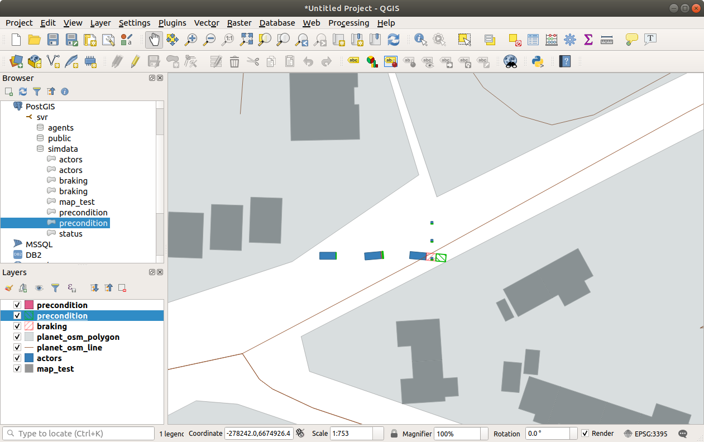
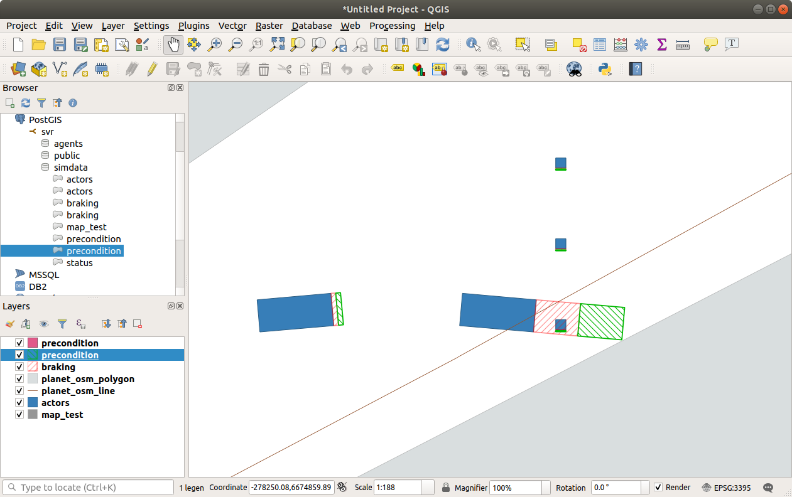
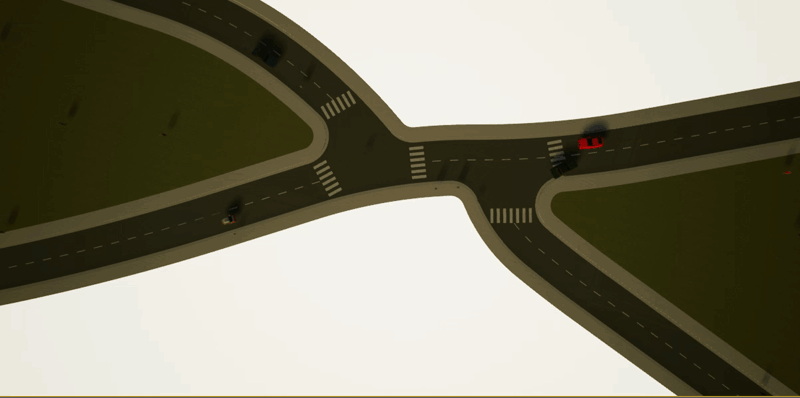

# CAV-Database

This program will read a Carla simulation log and convert the actors to postgis geometry. Shapes are based on an actor lookup table.

OSM maps can be imported. GeoJSON data can also be included but is currently a manual step. Additional dynamic data is being added, including braking and thinking distances.

QGIS rendering of a test map in south glos. showing vehicles and pedestrians.

The red hashed area is the braking distance and the green area could be considered thinking distance.

This code runs in QTcreator.

Below is a simulation snapshot of a junction manoeuvre where a vehilce close passes other road users and pedestrians.

By reading the simulation logs into the database code we can generate an abstracted version of the scenario. This abstracted view allows assertion testing to be undertaken using environmental information from map data for example.

Another example of a pedestrian crossing scenario and the corresponding database view

