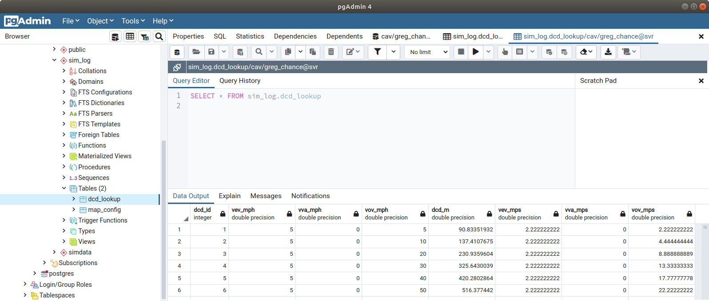

# Uploading CSV data to an SQL table

Let's generate a static lookup table that can be used to access some data. We will create a schema, then a table in that schema and then import a csv file into the table.

Create a schema called "sim_log"

``` sql
CREATE SCHEMA sim_log;
```

Create a table called "dcd_lookup" under the "sim_log" schema with the correct headings and set the variable, include an ID

``` sql
create table sim_log.dcd_lookup
(dcd_id serial,
vEV_mph float,
vVA_mph float,
vOV_mph float,
DCD_m float,
vEV_mps float,
vVA_mps float,
vOV_mps float);
```

Copy the csv data into the table using the copy command and using a delimiter. The header command prevents the first row being copied over. For example here I point to my Download folder where I have my data saved in the right format.

``` sql
copy sim_log.dcd_lookup
from '/home/is18902/Downloads/DCD_calculations.csv'
DELIMITER ','
CSV HEADER;
```

Looking in pgAdmin we can see the data by selecting all rows from the lookup table that we created

``` sql
SELECT * FROM sim_log.dcd_lookup
```

Here is how it should look in the table view of pgAdmin.

