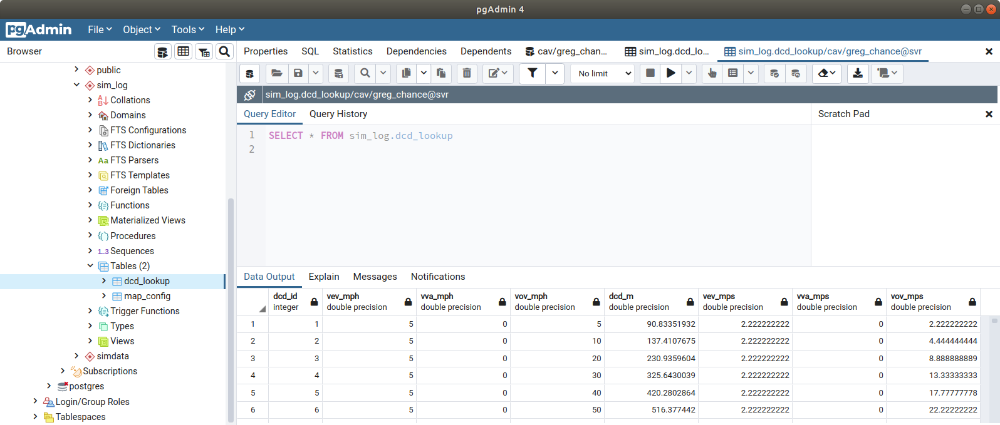

# Backup and Restore

Access the backup utility 'pg_dump' through the linux command line. For example, type the following to make a backup of a database called 'cav' to your download folder. You can find a pgsql backup file in the samples folder.

``` linux
pg_dump -U greg_chance cav > ~/Downloads/dbexport.pgsql
```


