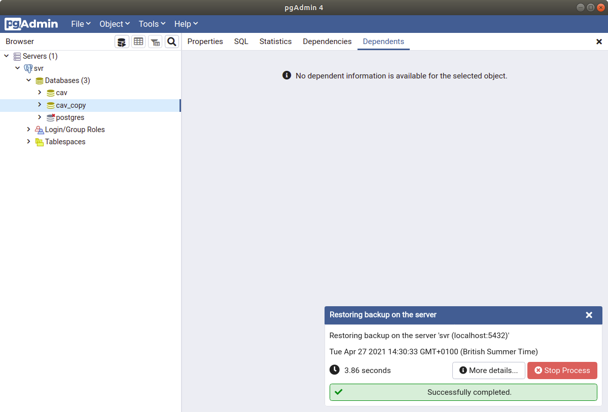

# Backup and Restore

## Linux Command Line

Access the backup utility 'pg_dump' through the linux command line. For example, type the following to make a backup of a database called 'cav' to your download folder. You can find a pgsql backup file in the samples folder.

``` linux
pg_dump -U greg_chance cav > ~/Downloads/dbexport.pgsql
```

To restore from previous backup file then use the 'psql' program accessed from the linux command line.

``` linux
psql -U greg_chance cav < ~/Downloads/dbexport.pgsql
```

## pgAdmin

This process can also be done using pgAdmin. To backup right-click on the 'cav' database icon in the left panel and choose backup.


Edit the parameters setting the save location, the encoding and the role. I used this for the file directory: home/is18902/Downloads/pgadmin_export.backup. 


Hit the backup button and wait for the process to complete.


To restore from a backup right click on your server and click Create then Database, give it a name eg. cav_copy. Right-click on the new database and select restore.


Then select the pgadmin backup file and the same user role. Note that this is not compatible with the 'Linux Command Line' backup file.



Now expand the tree to see the tables, then select 'actors' and right click then select 'view data' and 'all rows'. Then click the 'eye' icon in the geometry column to see the geospatial data.

