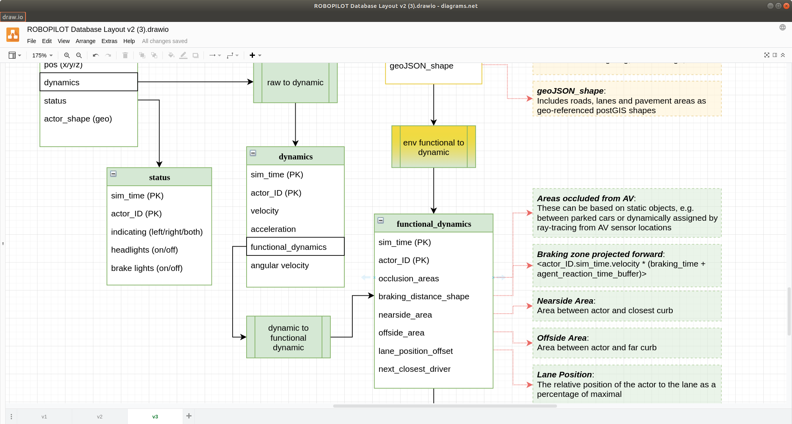

# Assertion Test

Here we will perform an assertion test using the database and functions within postgis. We will look at a pedestrian safety test and look to see if the simulated ego vehicle collided with a pedestrian or if there was a near miss event. To start we will need to generate some dynamic layer data, namely the brazing zone of the vehicle.



If not done already then create the top level schema.

``` sql
CREATE SCHEMA sim_log;
```

Create a table called "braking_distance" and another for "thinking_distance" under the "sim_log" schema. The braking distance can be thought of as the physics related to how quickly the vehicle could stop at maximum deceleration, whereas thinking distance is the distance within the ego vehicle can change behaviour, e.g. stop or swerve. 

``` sql
create table sim_log.braking_distance
(agent_id int, agent_type int, sim_time float,
PRIMARY KEY (agent_id,sim_time), geom geometry(POLYGON));

create table sim_log.thinking_distance
(agent_id int, agent_type int, sim_time float,
PRIMARY KEY (agent_id,sim_time), geom geometry(POLYGON));
```

Now lets load some sample simulation data into the database to visualise these dynamic layers, take a look at "ped_simdata.txt" in the samples folder. Using the "testQT.pro" project file load up Qt Creator and read the sim data by using the following (access near line 700 at main.cpp).

``` cpp
...
std::ifstream simLogFile ("lboro_static_tests_short.txt");
testLog.read_file_testbench (simLogFile, true); 
...
```

Further in the script there is section for dynamic shape generation (line 869 main.cpp) which will analyse the speed of each actor and maximum deceleration
