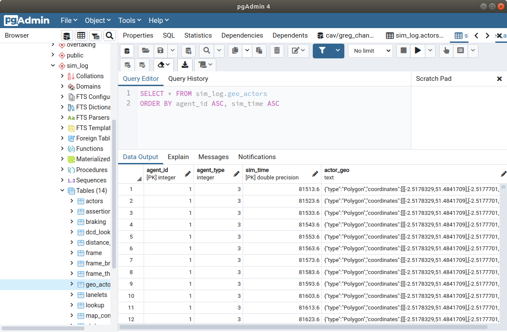

# Convert data to geoJSON

For some plotting routines such as [plotly](https://plotly.com/python/mapbox-county-choropleth) you can use geoJSON data to plot some nice graphs. The geoJSON format data is also used in many CAV development projects such as roadrunner.

First create a table that we can store the new data in, call this "geo_actors". We can use the IF NOT EXISTS to some use in development. 

``` sql 
CREATE TABLE IF NOT EXISTS sim_log.geo_actors(
	agent_id int, agent_type int, sim_time float, 
	PRIMARY KEY (agent_id,sim_time), actor_geo text);
```

We can delete the contents of the table without losing the symbolic reference within the database itself by just using delete from.

``` sql 
DELETE FROM sim_log.geo_actors;
```

The geoJSON can be generated from points, shapes and geometries as you can [find in the documentation](https://postgis.net/docs/ST_AsGeoJSON.html). Here we use the geom data from the actors table. I have commented out an additional filter line if you just wanted a particular time. Note the ST_MULTI converts polygons to multi-polygons that are more commonly used for plotting.

``` sql
INSERT INTO sim_log.geo_actors (agent_id, agent_type, sim_time, actor_geo)
SELECT g1.agent_id, g1.agent_type, g1.sim_time,
ST_AsGeoJSON(ST_MULTI(g1.geom)) AS actor_geo 
FROM sim_log.actors g1
-- WHERE g1.sim_time=81513.6
```

You can see the geoJSON data below. It is not given special recognition as a type in the database and seen only as a string.


