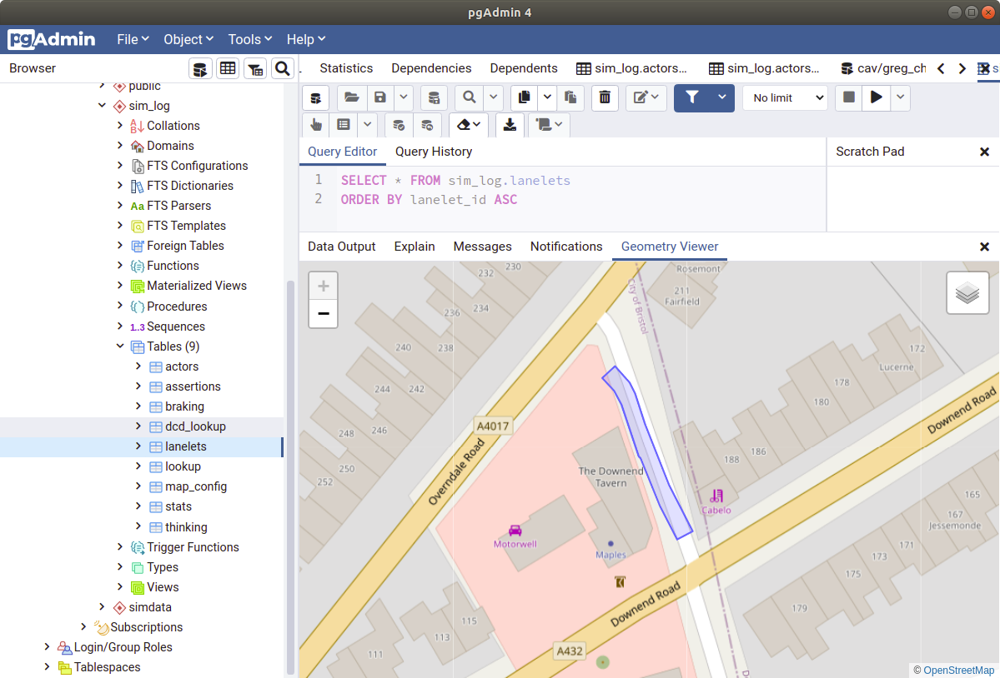
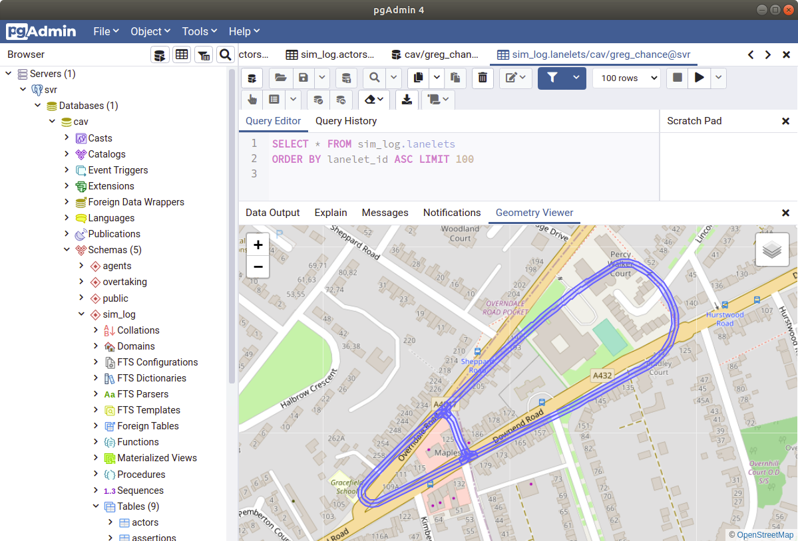

# Adding Lanelets

A manual process to add lanelets to the database. First remove any existing table if you need to or if you are getting errors with primary key duplicates.

``` sql
DROP TABLE IF EXISTS  sim_log.lanelets
```

Then create the table including an id and the geom colum for the polygon data.

``` sql
create table sim_log.lanelets (lanelet_id int, geom geometry(polygon, 4326), PRIMARY KEY(lanelet_id));
```

This example we will use the T_Junction_lanelets_bounds.txt file in the matlab folder to generate the lanelet data. Use the plot_laneletes.m matlab code to generate the SQL_query in the final code block.

``` matlab
unique_IDs = unique(lanelet.lanelet_id);

for id_index = 1: numel(unique_IDs)
    
    laneletID = unique_IDs(id_index);
    sel = lanelet(laneletID==lanelet.lanelet_id,:);
    left_x = sel.x(sel.bound=='leftBound',:);
    left_y = sel.y(sel.bound=='leftBound',:);
    righ_x = sel.x(sel.bound=='rightBound',:);
    righ_y = sel.y(sel.bound=='rightBound',:);
    run('plot_func');

    % Coordinates for easy debugging
    coords = [left_x, left_y;flip(righ_x), flip(righ_y); left_x(1), left_y(1)];

    lat_long_convert %get the conversion ratios
    GPS = zeros(numel(coords(:,1)),2);
    GPS_str = '';
    %assuming XY data is in meters
    for index=1:numel(coords(:,1))
        x = coords(index,1);
        y = coords(index,2);
        GPS(index,1) = x/m_per_deg_lon + minlon;
        GPS(index,2) = y/m_per_deg_lat + minlat;
        if index < numel(coords(:,1))
            GPS_str = strcat(GPS_str,sprintf(' %15.12f %15.12f,',GPS(index,1),GPS(index,2)));
        else
            GPS_str = strcat(GPS_str,sprintf(' %15.12f %15.12f' ,GPS(index,1),GPS(index,2)));
        end
    end
    
    SRID = 4326;
    h1 = "insert into sim_log.lanelets (lanelet_id, geom) VALUES ("
    
    lane_id = sprintf("%d, ",laneletID);
    top = "ST_GeomFromText('POLYGON((";
    tail = sprintf("))', %4.0f)",SRID);
    SQL_query = strcat(h1, lane_id, top, GPS_str, tail,")")
    print("pause to copy data...")

end
```

This should output a string that looks like this.

``` sql
insert into sim_log.lanelets (lanelet_id, geom) VALUES ( 100, ST_GeomFromText('POLYGON(( -2.516768552178 51.484952663441, -2.516763527209 51.484949361248, -2.516758502097 51.484946059056, -2.516753477128 51.484942756773, -2.516748478274 51.484939439391, -2.516743632351 51.484936035094, -2.516738960136 51.484932537862, -2.516734466245 51.484928951109, -2.516730155296 51.484925278251, -2.516726031327 51.484921522973, -2.516722098379 51.484917688960, -2.516718360492 51.484913779988, -2.516714821127 51.484909799920, -2.516711483893 51.484905752621, -2.516708352106 51.484901642138, -2.516705428798 51.484897472513, -2.516702716853 51.484893247791, -2.516700219012 51.484888972198, -2.516697937441 51.484884649867, -2.516695838666 51.484880291583, -2.516693738449 51.484875933570, -2.516691599133 51.484871582927, -2.516689420430 51.484867239923, -2.516687202773 51.484862904470, -2.516684946017 51.484858576925, -2.516682650162 51.484854257381, -2.516680315497 51.484849945925, -2.516677942022 51.484845642648, -2.516675529737 51.484841347820, -2.516673078787 51.484837061441, -2.516670589170 51.484832783781, -2.516668061032 51.484828514838, -2.516665494372 51.484824254794, -2.516662889480 51.484820003828, -2.516660256597 51.484815759602, -2.516657614049 51.484811517624, -2.516654962411 51.484807277893, -2.516652301540 51.484803040318, -2.516649631579 51.484798805081, -2.516646952384 51.484794572091, -2.516644263956 51.484790341257, -2.516641566439 51.484786112761, -2.516638859687 51.484781886601, -2.516636143847 51.484777662599, -2.516633418917 51.484773440934, -2.516630684754 51.484769221605, -2.516627941501 51.484765004523, -2.516625189015 51.484760789779, -2.516622429314 51.484756576832, -2.516619668749 51.484752364244, -2.516616885243 51.484748157409, -2.516614065669 51.484743959921, -2.516611210025 51.484739771871, -2.516608318313 51.484735593527, -2.516605390965 51.484731424801, -2.516602427692 51.484727265872, -2.516599428783 51.484723116919, -2.516596394238 51.484718978033, -2.516593324058 51.484714849304, -2.516590218673 51.484710730911, -2.516587077798 51.484706622854, -2.516583901574 51.484702525402, -2.516580690436 51.484698438647, -2.516577443951 51.484694362587, -2.516574162695 51.484690297403, -2.516570846525 51.484686243274, -2.516567495440 51.484682200200, -2.516564125599 51.484678163238, -2.516560755758 51.484674126276, -2.516557385917 51.484670089314, -2.516554016076 51.484666052352, -2.516550646091 51.484662015390, -2.516547276250 51.484657978428, -2.516543906409 51.484653941466, -2.516540536568 51.484649904504, -2.516585337259 51.484635390585, -2.516588707100 51.484639427547, -2.516592076941 51.484643464509, -2.516595446782 51.484647501471, -2.516598816767 51.484651538433, -2.516602186608 51.484655575395, -2.516605556449 51.484659612357, -2.516608926290 51.484663649319, -2.516612301469 51.484667692662, -2.516615776486 51.484671885387, -2.516619215435 51.484676089615, -2.516622618315 51.484680305259, -2.516625984838 51.484684532137, -2.516629314859 51.484688770161, -2.516632608522 51.484693019330, -2.516635865684 51.484697279374, -2.516639086200 51.484701550204, -2.516642269781 51.484705831729, -2.516645416717 51.484710123861, -2.516648526573 51.484714426329, -2.516651599495 51.484718739222, -2.516654635339 51.484723062183, -2.516657633959 51.484727395299, -2.516660595356 51.484731738303, -2.516663519242 51.484736091103, -2.516666405760 51.484740453611, -2.516669180898 51.484744688309, -2.516671949976 51.484748915547, -2.516674728143 51.484753169659, -2.516677496933 51.484757426018, -2.516680256633 51.484761684804, -2.516683007099 51.484765945837, -2.516685748188 51.484770209207, -2.516688480187 51.484774474914, -2.516691202953 51.484778742867, -2.516693916341 51.484783013068, -2.516696620495 51.484787285606, -2.516699315415 51.484791560390, -2.516702001102 51.484795837422, -2.516704677556 51.484800116790, -2.516707344775 51.484804398316, -2.516710014447 51.484808701862, -2.516712720477 51.484813117938, -2.516715386831 51.484817543451, -2.516718013077 51.484821978133, -2.516720599358 51.484826421982, -2.516723145530 51.484830874818, -2.516725651450 51.484835336464, -2.516728117261 51.484839806827, -2.516730542531 51.484844285729, -2.516732927548 51.484848773080, -2.516735271879 51.484853268610, -2.516737575813 51.484857772409, -2.516739838917 51.484862284117, -2.516742061480 51.484866803735, -2.516744243213 51.484871330993, -2.516746148658 51.484875293265, -2.516747935221 51.484878678237, -2.516749891451 51.484882026628, -2.516752015330 51.484885335112, -2.516754304548 51.484888600454, -2.516756757230 51.484891819508, -2.516759370635 51.484894989037, -2.516762142454 51.484898105987, -2.516765069658 51.484901167211, -2.516768149650 51.484904169654, -2.516771379255 51.484907110529, -2.516774755444 51.484909986870, -2.516778274610 51.484912795801, -2.516781933579 51.484915534626, -2.516785728599 51.484918200558, -2.516790123661 51.484921114199, -2.516795148774 51.484924416392, -2.516800173742 51.484927718584, -2.516805198711 51.484931020867, -2.516768552178 51.484952663441))', 4326))
```

This text can be dropped directly into and SQL query tool to add the data directly to the database. Now take a look at the lanelets table and view the geometry data, it should look like this.



Do this for each of the lanelet IDs, 100 to 117.

101

    "insert into sim_log.lanelets (lanelet_id, geom) VALUES (101, ST_GeomFromText('POLYGON(( -2.516949575698 51.484958311952, -2.516943955160 51.484961332641, -2.516938080554 51.484964158918, -2.516931950580 51.484966766159, -2.516925586303 51.484969145553, -2.516919009219 51.484971288832, -2.516912242125 51.484973188627, -2.516905308249 51.484974838375, -2.516898231251 51.484976232594, -2.516891035370 51.484977366431, -2.516883745422 51.484978236020, -2.516876386221 51.484978838306, -2.516868983017 51.484979171222, -2.516861561201 51.484979233689, -2.516854146310 51.484979025526, -2.516846763593 51.484978547634, -2.516839438297 51.484977801720, -2.516832195671 51.484976790300, -2.516825060242 51.484975516879, -2.516818056536 51.484973985683, -2.516811208359 51.484972202103, -2.516804539372 51.484970172253, -2.516798072227 51.484967902872, -2.516791829141 51.484965401959, -2.516785831468 51.484962677965, -2.516780099549 51.484959740146, -2.516774653153 51.484956598569, -2.516769487227 51.484953277861, -2.516769019630 51.484952970651, -2.516768552178 51.484952663441, -2.516805198711 51.484931020867, -2.516805666308 51.484931328077, -2.516806133760 51.484931635287, -2.516810028908 51.484934150400, -2.516813308288 51.484936041925, -2.516816759644 51.484937810944, -2.516820371147 51.484939451165, -2.516824130243 51.484940957015, -2.516828024236 51.484942323462, -2.516832039854 51.484943545740, -2.516836163245 51.484944619627, -2.516840380416 51.484945541616, -2.516844676938 51.484946308383, -2.516849037951 51.484946917410, -2.516853448739 51.484947366541, -2.516857894008 51.484947654247, -2.516862357168 51.484947779629, -2.516866822925 51.484947741970, -2.516871277429 51.484947541627, -2.516875705530 51.484947179231, -2.516880091936 51.484946656039, -2.516884421641 51.484945973849, -2.516888679930 51.484945134909, -2.516892852086 51.484944142274, -2.516896923827 51.484942999090, -2.516900881157 51.484941709491, -2.516904710660 51.484940277882, -2.516908399061 51.484938709026, -2.516911933809 51.484937008495, -2.516916170456 51.484934721228, -2.516949575698 51.484958311952))', 4326))"

102

        "insert into sim_log.lanelets (lanelet_id, geom) VALUES (102, ST_GeomFromText('POLYGON(( -2.516763489265 51.485067116684, -2.516768747383 51.485064021755, -2.516774005644 51.485060926825, -2.516779263762 51.485057831806, -2.516784521880 51.485054736877, -2.516789780141 51.485051641948, -2.516795044896 51.485048543064, -2.516800408334 51.485045196740, -2.516805280948 51.485041571069, -2.516809615270 51.485037689240, -2.516813376819 51.485033582171, -2.516816535585 51.485029282490, -2.516819066464 51.485024824530, -2.516820949402 51.485020243704, -2.516822169251 51.485015576593, -2.516822716343 51.485010860228, -2.516822586351 51.485006132358, -2.516821780285 51.485001430463, -2.516820304636 51.484996792114, -2.516818170946 51.484992254161, -2.516815396530 51.484987852825, -2.516812003172 51.484983623070, -2.516808017997 51.484979598602, -2.516803472888 51.484975811506, -2.516798412861 51.484972286501, -2.516792627705 51.484968484755, -2.516786842694 51.484964683009, -2.516781057538 51.484960881353, -2.516775272383 51.484957079607, -2.516769487227 51.484953277861, -2.516769019630 51.484952970651, -2.516768552178 51.484952663441, -2.516805198711 51.484931020867, -2.516805666308 51.484931328077, -2.516806133760 51.484931635287, -2.516811918916 51.484935437033, -2.516817704071 51.484939238689, -2.516823489227 51.484943040435, -2.516829274383 51.484946842181, -2.516835059538 51.484950643926, -2.516842525502 51.484955868743, -2.516849769138 51.484961904188, -2.516856120142 51.484968317848, -2.516861528018 51.484975058761, -2.516865949771 51.484982073179, -2.516869350054 51.484989305286, -2.516871701887 51.484996697380, -2.516872986516 51.485004190679, -2.516873193695 51.485011725413, -2.516872321694 51.485019241721, -2.516870377727 51.485026679744, -2.516867376943 51.485033980070, -2.516863343435 51.485041084728, -2.516858309233 51.485047937092, -2.516852314445 51.485054482516, -2.516845406971 51.485060668960, -2.516837641635 51.485066447168, -2.516829724089 51.485071409175, -2.516824459335 51.485074508059, -2.516819201217 51.485077602988, -2.516813943100 51.485080697918, -2.516808684838 51.485083792937, -2.516803426720 51.485086887866, -2.516798168458 51.485089982795, -2.516763489265 51.485067116684))', 4326))"

103

    "insert into sim_log.lanelets (lanelet_id, geom) VALUES (103, ST_GeomFromText('POLYGON(( -2.516540533538 51.484649900909, -2.516537223427 51.484645771819, -2.516534290164 51.484641533796, -2.516531755389 51.484637197174, -2.516529627471 51.484632776514, -2.516527913335 51.484628286556, -2.516526619040 51.484623742312, -2.516525748626 51.484619159149, -2.516525305268 51.484614552257, -2.516525290263 51.484609937097, -2.516525703612 51.484605329037, -2.516526544161 51.484600743717, -2.516527809024 51.484596196236, -2.516529493872 51.484591702055, -2.516531593224 51.484587276002, -2.516534099720 51.484582932998, -2.516537005427 51.484578687605, -2.516540300245 51.484574554022, -2.516543973208 51.484570546001, -2.516548012199 51.484566677115, -2.516552403654 51.484562960126, -2.516557132714 51.484559407617, -2.516562183796 51.484556031453, -2.516567539732 51.484552842959, -2.516573182632 51.484549852650, -2.516579093885 51.484547070773, -2.516585253291 51.484544506405, -2.516591640508 51.484542168356, -2.516598228412 51.484540056894, -2.516620593121 51.484568261250, -2.516615952358 51.484569740316, -2.516612084046 51.484571156376, -2.516608353661 51.484572709414, -2.516604773610 51.484574394215, -2.516601356014 51.484576205208, -2.516598112270 51.484578136370, -2.516595053343 51.484580181051, -2.516592189187 51.484582332600, -2.516589529614 51.484584583735, -2.516587083424 51.484586926818, -2.516584858842 51.484589354208, -2.516582863368 51.484591857727, -2.516581103641 51.484594428835, -2.516579585575 51.484597059085, -2.516578314220 51.484599739667, -2.516577293760 51.484602461504, -2.516576527802 51.484605215609, -2.516576018798 51.484607992632, -2.516575768336 51.484610783407, -2.516575777426 51.484613578497, -2.516576045922 51.484616368643, -2.516576573105 51.484619144408, -2.516577356953 51.484621896535, -2.516578395015 51.484624615766, -2.516579683827 51.484627293112, -2.516581219062 51.484629919497, -2.516582995525 51.484632486201, -2.516585334229 51.484635386990, -2.516540533538 51.484649900909))', 4326))"

104

    "insert into sim_log.lanelets (lanelet_id, geom) VALUES (104, ST_GeomFromText('POLYGON(( -2.516540536568 51.484649904504, -2.516539295511 51.484648417708, -2.516538054309 51.484646930912, -2.516534417559 51.484642574247, -2.516530780809 51.484638217492, -2.516527144058 51.484633860737, -2.516523507164 51.484629504072, -2.516519868393 51.484625144800, -2.516516363799 51.484621175607, -2.516512366793 51.484617391747, -2.516507888195 51.484613823240, -2.516502958016 51.484610493904, -2.516497608716 51.484607425849, -2.516491875933 51.484604639477, -2.516485797898 51.484602153396, -2.516479415009 51.484599983961, -2.516472769539 51.484598145734, -2.516465904771 51.484596652917, -2.516458860812 51.484595530046, -2.516451688304 51.484594787906, -2.516444439907 51.484594431981, -2.516437169147 51.484594464787, -2.516429929840 51.484594886145, -2.516422775222 51.484595692908, -2.516415758243 51.484596879235, -2.516408930408 51.484598436317, -2.516402333992 51.484600342313, -2.516394947235 51.484602615559, -2.516387548936 51.484604892310, -2.516380150637 51.484607169061, -2.516372752338 51.484609445902, -2.516365354039 51.484611722654, -2.516342989329 51.484583518297, -2.516350387628 51.484581241546, -2.516357785927 51.484578964705, -2.516365184082 51.484576687953, -2.516372582381 51.484574411202, -2.516379969138 51.484572137956, -2.516389551623 51.484569387088, -2.516400452208 51.484566901186, -2.516411655050 51.484565007233, -2.516423077479 51.484563719073, -2.516434635238 51.484563046410, -2.516446242917 51.484562994010, -2.516457815104 51.484563562322, -2.516469266243 51.484564747210, -2.516480511935 51.484566539868, -2.516491363755 51.484568898050, -2.516501772072 51.484571777178, -2.516511769204 51.484575175003, -2.516521288929 51.484579068966, -2.516530267621 51.484583433001, -2.516538645983 51.484588238348, -2.516546368036 51.484593452828, -2.516553382418 51.484599041928, -2.516559642673 51.484604968438, -2.516564669084 51.484610630881, -2.516568307854 51.484614990153, -2.516571944749 51.484619346908, -2.516575581500 51.484623703573, -2.516579218250 51.484628060328, -2.516582855000 51.484632416994, -2.516584096202 51.484633903789, -2.516585337259 51.484635390585, -2.516540536568 51.484649904504))', 4326))"

    105

        "insert into sim_log.lanelets (lanelet_id, geom) VALUES (105, ST_GeomFromText('POLYGON(( -2.516540536568 51.484649904504, -2.516543906409 51.484653941466, -2.516547276250 51.484657978428, -2.516550646091 51.484662015390, -2.516554016076 51.484666052352, -2.516557385917 51.484670089314, -2.516560755758 51.484674126276, -2.516564125599 51.484678163238, -2.516567495440 51.484682200200, -2.516570846525 51.484686243274, -2.516574162695 51.484690297403, -2.516577443951 51.484694362587, -2.516580690436 51.484698438647, -2.516583901574 51.484702525402, -2.516587077798 51.484706622854, -2.516590218673 51.484710730911, -2.516593324058 51.484714849304, -2.516596394238 51.484718978033, -2.516599428783 51.484723116919, -2.516602427692 51.484727265872, -2.516605390965 51.484731424801, -2.516608318313 51.484735593527, -2.516611210025 51.484739771871, -2.516614065669 51.484743959921, -2.516616885243 51.484748157409, -2.516619668749 51.484752364244, -2.516622429314 51.484756576832, -2.516625189015 51.484760789779, -2.516627941501 51.484765004523, -2.516630684754 51.484769221605, -2.516633418917 51.484773440934, -2.516636143847 51.484777662599, -2.516638859687 51.484781886601, -2.516641566439 51.484786112761, -2.516644263956 51.484790341257, -2.516646952384 51.484794572091, -2.516649631579 51.484798805081, -2.516652301540 51.484803040318, -2.516654962411 51.484807277893, -2.516657614049 51.484811517624, -2.516660256597 51.484815759602, -2.516662889480 51.484820003828, -2.516665494372 51.484824254794, -2.516668061032 51.484828514838, -2.516670589170 51.484832783781, -2.516673078787 51.484837061441, -2.516675529737 51.484841347820, -2.516677942022 51.484845642648, -2.516680315497 51.484849945925, -2.516682650162 51.484854257381, -2.516684946017 51.484858576925, -2.516687202773 51.484862904470, -2.516689420430 51.484867239923, -2.516691599133 51.484871582927, -2.516693738449 51.484875933570, -2.516695838666 51.484880291583, -2.516697937441 51.484884649867, -2.516700219012 51.484888972198, -2.516702716853 51.484893247791, -2.516705428798 51.484897472513, -2.516708352106 51.484901642138, -2.516711483893 51.484905752621, -2.516714821127 51.484909799920, -2.516718360492 51.484913779988, -2.516722098379 51.484917688960, -2.516726031327 51.484921522973, -2.516730155296 51.484925278251, -2.516734466245 51.484928951109, -2.516738960136 51.484932537862, -2.516743632351 51.484936035094, -2.516748478274 51.484939439391, -2.516753477128 51.484942756773, -2.516758502097 51.484946059056, -2.516763527209 51.484949361248, -2.516768552178 51.484952663441, -2.516731905645 51.484974306015, -2.516726880532 51.484971003823, -2.516721855564 51.484967701630, -2.516716830595 51.484964399437, -2.516711227948 51.484960678224, -2.516705331123 51.484956535653, -2.516699645662 51.484952280013, -2.516694177191 51.484947915348, -2.516688931337 51.484943445973, -2.516683912860 51.484938876292, -2.516679127101 51.484934210799, -2.516674578385 51.484929454078, -2.516670271620 51.484924610802, -2.516666210700 51.484919685825, -2.516662399664 51.484914683911, -2.516658842410 51.484909610003, -2.516655542254 51.484904469045, -2.516652502659 51.484899266159, -2.516649726368 51.484894006379, -2.516647434120 51.484889252174, -2.516645415562 51.484885063405, -2.516643359205 51.484880881736, -2.516641265192 51.484876707347, -2.516639133666 51.484872540329, -2.516636964486 51.484868380860, -2.516634757793 51.484864229032, -2.516632513878 51.484860085023, -2.516630232450 51.484855948923, -2.516627913944 51.484851820822, -2.516625558071 51.484847700991, -2.516623165119 51.484843589429, -2.516620735233 51.484839486225, -2.516618268411 51.484835391650, -2.516615764512 51.484831305793, -2.516613168420 51.484827120889, -2.516610550542 51.484822918458, -2.516607923720 51.484818718273, -2.516605287664 51.484814520336, -2.516602642518 51.484810324556, -2.516599988283 51.484806131023, -2.516597325103 51.484801939737, -2.516594652690 51.484797750698, -2.516591971331 51.484793563906, -2.516589280739 51.484789379361, -2.516586581202 51.484785197153, -2.516583872575 51.484781017102, -2.516581154859 51.484776839388, -2.516578428198 51.484772664011, -2.516575677876 51.484768465444, -2.516572931593 51.484764274787, -2.516570251100 51.484760223714, -2.516567535837 51.484756181539, -2.516564785947 51.484752148532, -2.516562001432 51.484748124782, -2.516559182290 51.484744110380, -2.516556328667 51.484740105415, -2.516553440850 51.484736109978, -2.516550518551 51.484732124338, -2.516547562059 51.484728148404, -2.516544571519 51.484724182447, -2.516541546929 51.484720226467, -2.516538488434 51.484716280644, -2.516535395891 51.484712345066, -2.516532269731 51.484708419915, -2.516529109811 51.484704505190, -2.516525916419 51.484700601161, -2.516522689410 51.484696707737, -2.516519324908 51.484692677156, -2.516515955067 51.484688640194, -2.516512585226 51.484684603232, -2.516509215385 51.484680566270, -2.516505845400 51.484676529308, -2.516502475559 51.484672492346, -2.516499105718 51.484668455384, -2.516495735877 51.484664418422, -2.516540536568 51.484649904504))', 4326))"

106

    "insert into sim_log.lanelets (lanelet_id, geom) VALUES (106, ST_GeomFromText('POLYGON(( -2.516598239954 51.484540053299, -2.516591546584 51.484542113169, -2.516584853359 51.484544172950, -2.516578159990 51.484546232821, -2.516571466765 51.484548292602, -2.516564773540 51.484550352473, -2.516558080170 51.484552412253, -2.516551682710 51.484554529288, -2.516545607416 51.484556968003, -2.516539887473 51.484559720310, -2.516534564720 51.484562766075, -2.516529677679 51.484566083277, -2.516525261841 51.484569647650, -2.516521349525 51.484573433397, -2.516517968863 51.484577412926, -2.516515144528 51.484581557384, -2.516512897149 51.484585836753, -2.516511243032 51.484590219663, -2.516510194149 51.484594674477, -2.516509758149 51.484599168839, -2.516509938205 51.484603669941, -2.516510732874 51.484608145069, -2.516512136529 51.484612561864, -2.516514138928 51.484616888060, -2.516516725642 51.484621092378, -2.516519869836 51.484625146597, -2.516523507164 51.484629504072, -2.516527144058 51.484633860737, -2.516530780809 51.484638217492, -2.516534417559 51.484642574247, -2.516538054309 51.484646930912, -2.516539295511 51.484648417708, -2.516540536568 51.484649904504, -2.516495735877 51.484664418422, -2.516494494820 51.484662931627, -2.516493253619 51.484661444831, -2.516489616868 51.484657088076, -2.516485980118 51.484652731411, -2.516482343367 51.484648374656, -2.516478706473 51.484644017990, -2.516475069145 51.484639660516, -2.516470387119 51.484633592715, -2.516466259832 51.484626884338, -2.516463064709 51.484619981281, -2.516460824977 51.484612933877, -2.516459556941 51.484605793088, -2.516459269688 51.484598611133, -2.516459965384 51.484591439875, -2.516461639124 51.484584331712, -2.516464278498 51.484577338146, -2.516467864464 51.484570509959, -2.516472370906 51.484563896945, -2.516477765075 51.484557547100, -2.516484007728 51.484551506442, -2.516491053707 51.484545819013, -2.516498851505 51.484540526157, -2.516507344710 51.484535666254, -2.516516471429 51.484531274625, -2.516526165438 51.484527383269, -2.516535715461 51.484524207897, -2.516542408686 51.484522148026, -2.516549101911 51.484520088245, -2.516555795280 51.484518028464, -2.516562488506 51.484515968594, -2.516569181875 51.484513908813, -2.516575875100 51.484511848942, -2.516598239954 51.484540053299))', 4326))"

107

    "insert into sim_log.lanelets (lanelet_id, geom) VALUES (107, ST_GeomFromText('POLYGON(( -2.516365346825 51.484611724901, -2.516371862880 51.484609778189, -2.516378535185 51.484608049976, -2.516385354218 51.484606560663, -2.516392298194 51.484605314926, -2.516399344317 51.484604316988, -2.516406470224 51.484603569815, -2.516413652543 51.484603076014, -2.516420868478 51.484602837113, -2.516428094368 51.484602853831, -2.516435307273 51.484603126257, -2.516442483532 51.484603653314, -2.516449600206 51.484604433472, -2.516456634354 51.484605464127, -2.516463563181 51.484606741951, -2.516470364324 51.484608262901, -2.516477015709 51.484610021944, -2.516483496128 51.484612013506, -2.516489784516 51.484614231116, -2.516495860675 51.484616667674, -2.516501704840 51.484619315180, -2.516507298253 51.484622165186, -2.516512622882 51.484625208525, -2.516517661412 51.484628435308, -2.516522397830 51.484631835110, -2.516526816553 51.484635396966, -2.516530903443 51.484639109461, -2.516534645226 51.484642960552, -2.516538053732 51.484646930193, -2.516539295511 51.484648417708, -2.516540536568 51.484649904504, -2.516495735877 51.484664418422, -2.516494494820 51.484662931627, -2.516493253041 51.484661444112, -2.516490721152 51.484658479509, -2.516488464829 51.484656157368, -2.516486000605 51.484653918816, -2.516483336126 51.484651771042, -2.516480480195 51.484649720969, -2.516477441899 51.484647775246, -2.516474231338 51.484645940165, -2.516470858467 51.484644221658, -2.516467334540 51.484642625209, -2.516463670666 51.484641156030, -2.516459878819 51.484639818795, -2.516455971264 51.484638617908, -2.516451960407 51.484637557233, -2.516447859378 51.484636640097, -2.516443681451 51.484635869556, -2.516439439898 51.484635248125, -2.516435148714 51.484634777693, -2.516430821462 51.484634459877, -2.516426472135 51.484634295666, -2.516422115017 51.484634285510, -2.516417763959 51.484634429588, -2.516413432956 51.484634727360, -2.516409136145 51.484635177839, -2.516404887378 51.484635779676, -2.516400700362 51.484636530803, -2.516396588512 51.484637428885, -2.516392565104 51.484638470954, -2.516387711679 51.484639929257, -2.516365346825 51.484611724901))', 4326))"

108

    "insert into sim_log.lanelets (lanelet_id, geom) VALUES (108, ST_GeomFromText('POLYGON(( -2.516768552178 51.484952663441, -2.516769019630 51.484952970651, -2.516769487227 51.484953277861, -2.516775272383 51.484957079607, -2.516781057538 51.484960881353, -2.516786842694 51.484964683009, -2.516792627705 51.484968484755, -2.516798415169 51.484972287939, -2.516803787120 51.484975627072, -2.516809605892 51.484978661153, -2.516815835993 51.484981359621, -2.516822427937 51.484983700817, -2.516829329063 51.484985666223, -2.516836484258 51.484987240113, -2.516843836245 51.484988409812, -2.516851326447 51.484989166062, -2.516858895280 51.484989502843, -2.516866482147 51.484989419973, -2.516874027751 51.484988920510, -2.516881473228 51.484988008407, -2.516888760580 51.484986690766, -2.516895832961 51.484984977922, -2.516902635258 51.484982882998, -2.516909114523 51.484980422622, -2.516915220114 51.484977615758, -2.516920910625 51.484974493505, -2.516926588007 51.484971219355, -2.516932293234 51.484967963990, -2.516938026162 51.484964727679, -2.516943786791 51.484961510423, -2.516949574832 51.484958312402, -2.516982980362 51.484981903036, -2.516977393729 51.484984989786, -2.516971833499 51.484988095052, -2.516966299960 51.484991218743, -2.516960793400 51.484994360859, -2.516955313675 51.484997521131, -2.516946967775 51.485002078678, -2.516937274920 51.485006534661, -2.516926989093 51.485010440668, -2.516916190366 51.485013766229, -2.516904962709 51.485016485550, -2.516893393985 51.485018577328, -2.516881574221 51.485020025295, -2.516869595322 51.485020818127, -2.516857551066 51.485020949712, -2.516845482571 51.485020412678, -2.516833539020 51.485019206848, -2.516821815921 51.485017341657, -2.516810406765 51.485014832117, -2.516799402735 51.485011698179, -2.516788891549 51.485007964922, -2.516778957177 51.485003662095, -2.516769678825 51.484998824122, -2.516761768636 51.484993930513, -2.516755981172 51.484990127329, -2.516750196017 51.484986325583, -2.516744410861 51.484982523927, -2.516738625705 51.484978722181, -2.516732840694 51.484974920435, -2.516732373097 51.484974613225, -2.516731905645 51.484974306015, -2.516768552178 51.484952663441))', 4326))"

109

    "insert into sim_log.lanelets (lanelet_id, geom) VALUES (109, ST_GeomFromText('POLYGON(( -2.516768555641 51.484952665688, -2.516773519869 51.484956021359, -2.516778181119 51.484959541242, -2.516782510825 51.484963221919, -2.516786494413 51.484967051258, -2.516790118900 51.484971016586, -2.516793372311 51.484975104959, -2.516796243969 51.484979302806, -2.516798724352 51.484983596286, -2.516800805524 51.484987971467, -2.516802480274 51.484992413698, -2.516803743405 51.484996908509, -2.516804590590 51.485001440979, -2.516805019088 51.485005996369, -2.516805027456 51.485010559489, -2.516804615694 51.485015115418, -2.516803785245 51.485019649147, -2.516802538561 51.485024145756, -2.516800880115 51.485028590414, -2.516798815101 51.485032968471, -2.516796350444 51.485037265545, -2.516793494223 51.485041467437, -2.516790255817 51.485045560395, -2.516786645902 51.485049530935, -2.516782676453 51.485053365937, -2.516778360309 51.485057052726, -2.516773712044 51.485060579349, -2.516768746517 51.485063933942, -2.516763493305 51.485067114257, -2.516728814111 51.485044248146, -2.516732620963 51.485041954048, -2.516735622180 51.485039926444, -2.516738431799 51.485037794849, -2.516741040587 51.485035566453, -2.516743439887 51.485033248447, -2.516745621765 51.485030848560, -2.516747579149 51.485028374612, -2.516749305549 51.485025834872, -2.516750795337 51.485023237608, -2.516752043463 51.485020591360, -2.516753045889 51.485017904935, -2.516753799295 51.485015187053, -2.516754301374 51.485012446700, -2.516754550249 51.485009692956, -2.516754545199 51.485006934897, -2.516754286225 51.485004181512, -2.516753774047 51.485001441878, -2.516753010686 51.484998725074, -2.516751998305 51.484996040088, -2.516750740512 51.484993395637, -2.516749241202 51.484990800531, -2.516747505424 51.484988263217, -2.516745538951 51.484985792055, -2.516743348273 51.484983395314, -2.516740940460 51.484981080723, -2.516738323593 51.484978856103, -2.516735506038 51.484976728552, -2.516731909108 51.484974308262, -2.516768555641 51.484952665688))', 4326))"

110

insert into sim_log.lanelets (lanelet_id, geom) VALUES (110, ST_GeomFromText('POLYGON(( -2.516763489265 51.485067116684, -2.516758239227 51.485070206850, -2.516752989333 51.485073296925, -2.516747739439 51.485076387091, -2.516742489401 51.485079477167, -2.516737239507 51.485082567243, -2.516731989613 51.485085657408, -2.516726739575 51.485088747484, -2.516721489681 51.485091837650, -2.516716239643 51.485094927726, -2.516710989749 51.485098017891, -2.516705739855 51.485101107967, -2.516700489817 51.485104198043, -2.516695239923 51.485107288208, -2.516689990030 51.485110378284, -2.516684739991 51.485113468450, -2.516679490098 51.485116558526, -2.516674240204 51.485119648691, -2.516668990166 51.485122738767, -2.516663740272 51.485125828933, -2.516658490234 51.485128919008, -2.516653240340 51.485132009084, -2.516647990446 51.485135099250, -2.516642740408 51.485138189326, -2.516637490514 51.485141279491, -2.516632240620 51.485144369567, -2.516626990582 51.485147459733, -2.516621740688 51.485150549898, -2.516616494257 51.485153642311, -2.516611252731 51.485156737959, -2.516606016255 51.485159836843, -2.516600784684 51.485162939053, -2.516595558018 51.485166044498, -2.516590336546 51.485169153269, -2.516585119980 51.485172265186, -2.516579908319 51.485175380428, -2.516574701852 51.485178498906, -2.516569500291 51.485181620619, -2.516564303779 51.485184745569, -2.516559112172 51.485187873753, -2.516553925760 51.485191005174, -2.516548744252 51.485194139920, -2.516543567939 51.485197277812, -2.516538396531 51.485200418940, -2.516533230317 51.485203563267, -2.516528069008 51.485206710839, -2.516522912893 51.485209861638, -2.516517761684 51.485213015636, -2.516512615668 51.485216172853, -2.516507474702 51.485219333286, -2.516502338786 51.485222496911, -2.516497208063 51.485225663744, -2.516492082246 51.485228833777, -2.516486961768 51.485232007001, -2.516481846194 51.485235183416, -2.516476735815 51.485238363030, -2.516471630485 51.485241545817, -2.516466530349 51.485244731795, -2.516461435262 51.485247920954, -2.516456345370 51.485251113287, -2.516451260527 51.485254308792, -2.516446180878 51.485257507470, -2.516441106423 51.485260709311, -2.516436037018 51.485263914317, -2.516430972951 51.485267122477, -2.516425913789 51.485270333801, -2.516420859966 51.485273548279, -2.516415811192 51.485276765913, -2.516410767756 51.485279986683, -2.516405729225 51.485283210510, -2.516400692138 51.485286435208, -2.516395655050 51.485289659915, -2.516390617963 51.485292884622, -2.516385580875 51.485296109329, -2.516380543932 51.485299334027, -2.516375504680 51.485302557476, -2.516370459369 51.485305777096, -2.516365407421 51.485308992806, -2.516360349124 51.485312204606, -2.516355284480 51.485315412488, -2.516350213488 51.485318616450, -2.516345136003 51.485321816476, -2.516340052170 51.485325012575, -2.516334961989 51.485328204736, -2.516329865460 51.485331392952, -2.516324762439 51.485334577222, -2.516319653213 51.485337757537, -2.516314537640 51.485340933889, -2.516309415718 51.485344106286, -2.516304287449 51.485347274719, -2.516299152831 51.485350439180, -2.516294012009 51.485353599658, -2.516288864839 51.485356756156, -2.516283711322 51.485359908671, -2.516278551600 51.485363057187, -2.516273385530 51.485366201712, -2.516268213256 51.485369342228, -2.516263034634 51.485372478745, -2.516257849809 51.485375611253, -2.516252658779 51.485378739744, -2.516247461546 51.485381864208, -2.516242257964 51.485384984654, -2.516237048323 51.485388101065, -2.516231832334 51.485391213440, -2.516226610141 51.485394321779, -2.516221381745 51.485397426074, -2.516216147288 51.485400526315, -2.516210906628 51.485403622503, -2.516205659620 51.485406714637, -2.516200406552 51.485409802699, -2.516195147424 51.485412886699, -2.516189882093 51.485415966618, -2.516184610558 51.485419042466, -2.516179332963 51.485422114224, -2.516174049164 51.485425181902, -2.516168759306 51.485428245481, -2.516163463388 51.485431304971, -2.516158161267 51.485434360353, -2.516152853086 51.485437411627, -2.516147538845 51.485440458794, -2.516142218545 51.485443501845, -2.516136892185 51.485446540770, -2.516131559765 51.485449575569, -2.516126221286 51.485452606244, -2.516120876748 51.485455632783, -2.516115526150 51.485458655188, -2.516110169636 51.485461673441, -2.516104807063 51.485464687541, -2.516099441316 51.485467699475, -2.516094075569 51.485470711409, -2.516088709822 51.485473723334, -2.516083344075 51.485476735268, -2.516077978328 51.485479747202, -2.516072612581 51.485482759127, -2.516067246834 51.485485771062, -2.516061881087 51.485488782996, -2.516056515340 51.485491794921, -2.516051149593 51.485494806855, -2.516045783846 51.485497818789, -2.516040418099 51.485500830714, -2.516035052352 51.485503842648, -2.516029686605 51.485506854582, -2.516024320858 51.485509866507, -2.516018955111 51.485512878441, -2.516013589364 51.485515890366, -2.516008223617 51.485518902300, -2.516002857870 51.485521914234, -2.515997492123 51.485524926159, -2.515992126376 51.485527938094, -2.515986760629 51.485530950028, -2.515981394882 51.485533961953, -2.515976029135 51.485536973887, -2.515970663388 51.485539985821, -2.515965297641 51.485542997746, -2.515959931894 51.485546009680, -2.515954566147 51.485549021614, -2.515949200400 51.485552033539, -2.515943834653 51.485555045473, -2.515938468906 51.485558057398, -2.515933103159 51.485561069332, -2.515927737412 51.485564081266, -2.515922371665 51.485567093192, -2.515917005918 51.485570105126, -2.515911640171 51.485573117060, -2.515906274424 51.485576128985, -2.515900908676 51.485579140919, -2.515895542929 51.485582152853, -2.515890177182 51.485585164778, -2.515884811435 51.485588176712, -2.515879445688 51.485591188646, -2.515874079941 51.485594200571, -2.515868714194 51.485597212505, -2.515863348447 51.485600224439, -2.515857982700 51.485603236364, -2.515852616953 51.485606248298, -2.515847251206 51.485609260224, -2.515841885459 51.485612272158, -2.515836519712 51.485615284092, -2.515831153965 51.485618296017, -2.515825788218 51.485621307951, -2.515820422471 51.485624319885, -2.515815056724 51.485627331810, -2.515809690977 51.485630343744, -2.515804325230 51.485633355678, -2.515798959483 51.485636367603, -2.515793593736 51.485639379537, -2.515788227989 51.485642391471, -2.515782862242 51.485645403396, -2.515777496495 51.485648415330, -2.515772130748 51.485651427256, -2.515766765001 51.485654439190, -2.515761399254 51.485657451124, -2.515756033507 51.485660463049, -2.515750667760 51.485663474983, -2.515745302013 51.485666486917, -2.515739936266 51.485669498842, -2.515734570519 51.485672510776, -2.515729204772 51.485675522710, -2.515723839025 51.485678534635, -2.515718473278 51.485681546569, -2.515713107531 51.485684558503, -2.515707741784 51.485687570428, -2.515702376037 51.485690582363, -2.515697010290 51.485693594288, -2.515691644542 51.485696606222, -2.515686278795 51.485699618156, -2.515680913048 51.485702630081, -2.515675547301 51.485705642015, -2.515670181554 51.485708653949, -2.515664815807 51.485711665874, -2.515659450060 51.485714677808, -2.515654084313 51.485717689742, -2.515648718566 51.485720701667, -2.515643352819 51.485723713601, -2.515637987072 51.485726725535, -2.515632621325 51.485729737460, -2.515627255578 51.485732749395, -2.515621889975 51.485735761320, -2.515616524228 51.485738773254, -2.515611158481 51.485741785188, -2.515605792734 51.485744797113, -2.515600426987 51.485747809047, -2.515595060230 51.485750820343, -2.515589689145 51.485753828547, -2.515584313155 51.485756833398, -2.515578932403 51.485759834888, -2.515573546746 51.485762833026, -2.515568156328 51.485765827802, -2.515562761149 51.485768819216, -2.515557361064 51.485771807260, -2.515551956218 51.485774791934, -2.515546546612 51.485777773237, -2.515541132099 51.485780751169, -2.515535712971 51.485783725713, -2.515530288936 51.485786696887, -2.515524860141 51.485789664663, -2.515519426584 51.485792629059, -2.515513988411 51.485795590067, -2.515508545332 51.485798547678, -2.515503097493 51.485801501891, -2.515497644892 51.485804452706, -2.515492187674 51.485807400116, -2.515486725695 51.485810344118, -2.515481258956 51.485813284724, -2.515475787455 51.485816221904, -2.515470311337 51.485819155679, -2.515464830314 51.485822086038, -2.515459344818 51.485825012972, -2.515453854417 51.485827936482, -2.515448359400 51.485830856568, -2.515442859765 51.485833773229, -2.515437355369 51.485836686457, -2.515431846357 51.485839596242, -2.515426332583 51.485842502594, -2.515420814193 51.485845405513, -2.515415291185 51.485848304980, -2.515409763417 51.485851201005, -2.515404231032 51.485854093578, -2.515398694030 51.485856982700, -2.515393152411 51.485859868362, -2.515387606031 51.485862750572, -2.515382055179 51.485865629322, -2.515376499566 51.485868504602, -2.515370939480 51.485871376422, -2.515365374633 51.485874244773, -2.515359805313 51.485877109646, -2.515354231376 51.485879971049, -2.515348652679 51.485882828964, -2.515343069509 51.485885683410, -2.515337481866 51.485888534360, -2.515331889462 51.485891381832, -2.515326292586 51.485894225816, -2.515320691093 51.485897066304, -2.515315084983 51.485899903296, -2.515309474401 51.485902736791, -2.515303859346 51.485905566781, -2.515298239674 51.485908393274, -2.515292615386 51.485911216254, -2.515286986625 51.485914035727, -2.515281353391 51.485916851696, -2.515275715685 51.485919664240, -2.515270076680 51.485922475751, -2.515264437675 51.485925287270, -2.515258798671 51.485928098790, -2.515253159522 51.485930910301, -2.515247520517 51.485933721820, -2.515241881512 51.485936533340, -2.515236242508 51.485939344859, -2.515230603503 51.485942156370, -2.515224964498 51.485944967889, -2.515219325494 51.485947779409, -2.515213686489 51.485950590928, -2.515208047484 51.485953402439, -2.515202408480 51.485956213959, -2.515196769475 51.485959025478, -2.515191130470 51.485961836989, -2.515185491466 51.485964648508, -2.515179852461 51.485967460028, -2.515174213456 51.485970271547, -2.515168574452 51.485973083058, -2.515162935447 51.485975894577, -2.515157296442 51.485978706097, -2.515151657438 51.485981517608, -2.515146018433 51.485984329127, -2.515140379284 51.485987140647, -2.515134740280 51.485989952166, -2.515129101275 51.485992763677, -2.515123462270 51.485995575196, -2.515117823266 51.485998386716, -2.515112184261 51.486001198235, -2.515106545256 51.486004009746, -2.515100906252 51.486006821266, -2.515095267247 51.486009632785, -2.515089628242 51.486012444299, -2.515083989238 51.486015255817, -2.515078350233 51.486018067334, -2.515072711228 51.486020878851, -2.515067072224 51.486023690368, -2.515061433219 51.486026501885, -2.515055794214 51.486029313402, -2.515050155210 51.486032124919, -2.515044516205 51.486034936436, -2.515038877200 51.486037747954, -2.515033238196 51.486040559471, -2.515027599191 51.486043370987, -2.515021960042 51.486046182504, -2.515016321037 51.486048994022, -2.515010682033 51.486051805539, -2.515005043028 51.486054617056, -2.514999403446 51.486057428124, -2.514993760113 51.486060236230, -2.514988115482 51.486063043393, -2.514982470850 51.486065850555, -2.514976826363 51.486068657718, -2.514971181732 51.486071464881, -2.514965537100 51.486074272044, -2.514959892469 51.486077079207, -2.514954247838 51.486079886369, -2.514948603351 51.486082693532, -2.514942958719 51.486085500694, -2.514937314088 51.486088307857, -2.514931669456 51.486091115019, -2.514926024969 51.486093922182, -2.514920380338 51.486096729345, -2.514914735706 51.486099536508, -2.514909091075 51.486102343670, -2.514903446588 51.486105150833, -2.514897801956 51.486107957996, -2.514892151698 51.486110760748, -2.514886487445 51.486113552469, -2.514880809054 51.486116333068, -2.514875116667 51.486119102516, -2.514869410286 51.486121860787, -2.514863690054 51.486124607854, -2.514857955828 51.486127343687, -2.514852207895 51.486130068262, -2.514846446256 51.486132781550, -2.514840670911 51.486135483525, -2.514834882004 51.486138174160, -2.514829079391 51.486140853428, -2.514823263361 51.486143521303, -2.514817433913 51.486146177759, -2.514811590903 51.486148822769, -2.514805734763 51.486151456306, -2.514799865207 51.486154078346, -2.514793982521 51.486156688860, -2.514788086562 51.486159287825, -2.514782177618 51.486161875214, -2.514776255545 51.486164451001, -2.514770320487 51.486167015162, -2.514764372588 51.486169567670, -2.514758411705 51.486172108499, -2.514752438126 51.486174637627, -2.514746451706 51.486177155026, -2.514740452590 51.486179660672, -2.514734440922 51.486182154541, -2.514728416558 51.486184636606, -2.514722379786 51.486187106845, -2.514716330606 51.486189565232, -2.514710268874 51.486192011745, -2.514704194879 51.486194446352, -2.514698108621 51.486196869042, -2.514692010243 51.486199279777, -2.514685899602 51.486201678541, -2.514679782180 51.486204070644, -2.514673664903 51.486206462730, -2.514667547481 51.486208854806, -2.514661430059 51.486211246891, -2.514655312781 51.486213638968, -2.514649195359 51.486216031053, -2.514643077937 51.486218423129, -2.514636960659 51.486220815215, -2.514630843237 51.486223207291, -2.514624725816 51.486225599377, -2.514618608538 51.486227991453, -2.514612491116 51.486230383538, -2.514606373694 51.486232775615, -2.514600256416 51.486235167700, -2.514594138994 51.486237559776, -2.514588021717 51.486239951862, -2.514581904295 51.486242343938, -2.514575786873 51.486244736023, -2.514569669595 51.486247128100, -2.514563552173 51.486249520185, -2.514557434751 51.486251912262, -2.514551317474 51.486254304347, -2.514545200052 51.486256696423, -2.514539082630 51.486259088500, -2.514532965352 51.486261480585, -2.514526847930 51.486263872661, -2.514520730508 51.486266264747, -2.514514613230 51.486268656823, -2.514508495808 51.486271048909, -2.514502378386 51.486273440985, -2.514496261109 51.486275833070, -2.514490143687 51.486278225147, -2.514484026409 51.486280617232, -2.514477908987 51.486283009308, -2.514471791565 51.486285401394, -2.514465674288 51.486287793470, -2.514459556866 51.486290185555, -2.514453439444 51.486292577632, -2.514447322166 51.486294969717, -2.514441204744 51.486297361794, -2.514435087322 51.486299753879, -2.514428970045 51.486302145955, -2.514422852623 51.486304538041, -2.514416735201 51.486306930117, -2.514410617923 51.486309322202, -2.514404500501 51.486311714279, -2.514398383223 51.486314106364, -2.514392265801 51.486316498440, -2.514386148379 51.486318890526, -2.514380031102 51.486321282602, -2.514373913680 51.486323674688, -2.514367796258 51.486326066764, -2.514361678980 51.486328458849, -2.514355561558 51.486330850926, -2.514349444136 51.486333243011, -2.514343326859 51.486335635087, -2.514337209437 51.486338027173, -2.514331055224 51.486340382174, -2.514324817044 51.486342649676, -2.514318497636 51.486344828234, -2.514312100465 51.486346916731, -2.514305628558 51.486348914081, -2.514299085523 51.486350819260, -2.514292474680 51.486352631268, -2.514285799345 51.486354349190, -2.514279063125 51.486355972118, -2.514272269340 51.486357499216, -2.514265421740 51.486358929711, -2.514258523500 51.486360262848, -2.514251578514 51.486361497943, -2.514244590246 51.486362634350, -2.514237562302 51.486363671503, -2.514230498289 51.486364608835, -2.514223401958 51.486365445888, -2.514216276917 51.486366182212, -2.514209126771 51.486366817439, -2.514201955273 51.486367351237, -2.514194766173 51.486367783317, -2.514187563223 51.486368113483, -2.514180350029 51.486368341535, -2.514173130488 51.486368467367, -2.514165908060 51.486368490925, -2.514158686787 51.486368412181, -2.514151470131 51.486368231180, -2.514144261987 51.486367948022, -2.514137066106 51.486367562850, -2.514129886096 51.486367075853, -2.514122725707 51.486366487301, -2.514115588546 51.486365797481, -2.514108478509 51.486365006761, -2.514101399203 51.486364115546, -2.514094354234 51.486363124295, -2.514087347210 51.486362033520, -2.514080381882 51.486360843787, -2.514073461711 51.486359555716, -2.514066590306 51.486358169964, -2.514059771273 51.486356687249, -2.514053008074 51.486355108344, -2.514046304317 51.486353434059, -2.514039647593 51.486351688130, -2.514033013954 51.486349908424, -2.514026403543 51.486348095598, -2.514019816649 51.486346249758, -2.514013253849 51.486344371032, -2.514006715431 51.486342459544, -2.514000201829 51.486340515412, -2.513993713475 51.486338538761, -2.513987250802 51.486336529726, -2.513980814387 51.486334488425, -2.513974404230 51.486332415000, -2.513968021197 51.486330309578, -2.513961665432 51.486328172294, -2.513955337512 51.486326003291, -2.513949037582 51.486323802704, -2.513942766362 51.486321570677, -2.513936523998 51.486319307354, -2.513930311066 51.486317012887, -2.513924127854 51.486314687412, -2.513917974941 51.486312331081, -2.513911852469 51.486309944055, -2.513905761017 51.486307526480, -2.513899700872 51.486305078516, -2.513893672511 51.486302600317, -2.513887676266 51.486300092053, -2.513881712555 51.486297553867, -2.513875781739 51.486294985941, -2.513869884207 51.486292388425, -2.513864020349 51.486289761501, -2.513858190541 51.486287105331, -2.513852395141 51.486284420083, -2.513846634541 51.486281705940, -2.513840909101 51.486278963062, -2.513835219211 51.486276191638, -2.513829565216 51.486273391847, -2.513823947477 51.486270563862, -2.513818366385 51.486267707870, -2.513812822270 51.486264824060, -2.513807315494 51.486261912602, -2.513801846431 51.486258973696, -2.513796415414 51.486256007538, -2.513791022803 51.486253014299, -2.513785668944 51.486249994195, -2.513780354184 51.486246947396, -2.513775078854 51.486243874119, -2.513769831067 51.486240782578, -2.513764584232 51.486237690417, -2.513759337397 51.486234598256, -2.513754090547 51.486231506095, -2.513748843712 51.486228413934, -2.513743596862 51.486225321773, -2.513738350027 51.486222229612, -2.513733103192 51.486219137451, -2.513727856342 51.486216045290, -2.513722609507 51.486212953129, -2.513717362657 51.486209860968, -2.513712115822 51.486206768807, -2.513706801841 51.486203637081, -2.513701488682 51.486200505831, -2.513696175523 51.486197374590, -2.513690869723 51.486194238514, -2.513685626639 51.486191061830, -2.513680458535 51.486187837790, -2.513675366536 51.486184567099, -2.513670351724 51.486181250448, -2.513665415168 51.486177888545, -2.513660557905 51.486174482105, -2.513655780989 51.486171031857, -2.513651085430 51.486167538533, -2.513646472224 51.486164002880, -2.513641942365 51.486160425650, -2.513637496821 51.486156807606, -2.513633136515 51.486153149518, -2.513628862399 51.486149452167, -2.513624675383 51.486145716341, -2.513620576345 51.486141942835, -2.513616566181 51.486138132453, -2.513612645713 51.486134286008, -2.513608806573 51.486130407831, -2.513604996331 51.486126518595, -2.513601206606 51.486122621583, -2.513597437454 51.486118716838, -2.513593688904 51.486114804402, -2.513589961015 51.486110884317, -2.513586253800 51.486106956624, -2.513582567318 51.486103021367, -2.513578901612 51.486099078588, -2.513575256695 51.486095128329, -2.513571632641 51.486091170634, -2.513568029478 51.486087205544, -2.513564447220 51.486083233103, -2.513560885940 51.486079253353, -2.513557345652 51.486075266337, -2.513553826414 51.486071272099, -2.513550328255 51.486067270682, -2.513546851203 51.486063262127, -2.513543392907 51.486059247285, -2.513539937496 51.486055231474, -2.513536482071 51.486051215663, -2.513533049586 51.486047192245, -2.513529667986 51.486043152134, -2.513526337561 51.486039095560, -2.513523058513 51.486035022775, -2.513519831058 51.486030934031, -2.513516655368 51.486026829581, -2.513513531661 51.486022709680, -2.513510460124 51.486018574585, -2.513507440944 51.486014424549, -2.513504474325 51.486010259833, -2.513501560423 51.486006080690, -2.513498699441 51.486001887391, -2.513495891553 51.485997680178, -2.513493136931 51.485993459321, -2.513490435749 51.485989225091, -2.513487788166 51.485984977737, -2.513485194339 51.485980717522, -2.513482654457 51.485976444724, -2.513480168649 51.485972159594, -2.513477737089 51.485967862403, -2.513475359921 51.485963553419, -2.513475354582 51.485963543622, -2.513473061065 51.485959274365, -2.513470843018 51.485954989658, -2.513468701408 51.485950689877, -2.513466636524 51.485946375573, -2.513464648582 51.485942047246, -2.513462737870 51.485937705456, -2.513460904591 51.485933350723, -2.513459148990 51.485928983587, -2.513457471255 51.485924604587, -2.513455871630 51.485920214261, -2.513454350289 51.485915813150, -2.513452907419 51.485911401793, -2.513451543209 51.485906980729, -2.513450257830 51.485902550514, -2.513449051414 51.485898111681, -2.513447924132 51.485893664785, -2.513446876130 51.485889210375, -2.513445907508 51.485884748991, -2.513445018411 51.485880281189, -2.513444208939 51.485875807517, -2.513443479180 51.485871328525, -2.513442829248 51.485866844761, -2.513442259201 51.485862356790, -2.513441769126 51.485857865143, -2.513441359081 51.485853370395, -2.513441029095 51.485848873085, -2.513440779238 51.485844373771, -2.513440609527 51.485839873010, -2.513440519975 51.485835371350, -2.513440510612 51.485830869349, -2.513440581422 51.485826367554, -2.513440732407 51.485821866533, -2.513440963550 51.485817366832, -2.513441274810 51.485812869001, -2.513441666157 51.485808373606, -2.513442137534 51.485803881186, -2.513442688911 51.485799392307, -2.513443320174 51.485794907509, -2.513444031293 51.485790427349, -2.513444822153 51.485785952383, -2.513445692653 51.485781483161, -2.513446642707 51.485777020231, -2.513447672184 51.485772564140, -2.513448780955 51.485768115447, -2.513449968890 51.485763674681, -2.513451235830 51.485759242399, -2.513452581646 51.485754819151, -2.513454006149 51.485750405475, -2.513455509167 51.485746001919, -2.513457090526 51.485741609023, -2.513458750011 51.485737227326, -2.513460474175 51.485732855318, -2.513462205061 51.485728484326, -2.513463939353 51.485724113864, -2.513465728815 51.485719752067, -2.513467590805 51.485715402061, -2.513469525149 51.485711064325, -2.513471531630 51.485706739324, -2.513473610018 51.485702427527, -2.513475760112 51.485698129401, -2.513477981665 51.485693845394, -2.513480274432 51.485689575976, -2.513482638197 51.485685321612, -2.513485072671 51.485681082752, -2.513487577610 51.485676859855, -2.513490152753 51.485672653371, -2.513492797798 51.485668463756, -2.513495512469 51.485664291471, -2.513498296480 51.485660136955, -2.513501149541 51.485656000649, -2.513504071320 51.485651883010, -2.513507061515 51.485647784480, -2.513510119807 51.485643705491, -2.513513245880 51.485639646490, -2.513516439359 51.485635607910, -2.513519699940 51.485631590191, -2.513523027249 51.485627593765, -2.513526420924 51.485623619054, -2.513529880619 51.485619666490, -2.513533405946 51.485615736503, -2.513536996543 51.485611829516, -2.513540652006 51.485607945944, -2.513544371945 51.485604086198, -2.513548155972 51.485600250711, -2.513552003668 51.485596439887, -2.513555914613 51.485592654140, -2.513559888391 51.485588893865, -2.513563924597 51.485585159484, -2.513568022755 51.485581451384, -2.513572182460 51.485577769979, -2.513576403238 51.485574115654, -2.513580684654 51.485570488806, -2.513585026247 51.485566889820, -2.513589427528 51.485563319093, -2.513593888047 51.485559777010, -2.513598407316 51.485556263941, -2.513602984843 51.485552780263, -2.513607620138 51.485549326370, -2.513612312696 51.485545902615, -2.513617062027 51.485542509374, -2.513621867494 51.485539146952, -2.513626718149 51.485535809787, -2.513631606994 51.485532494320, -2.513636533754 51.485529200710, -2.513641498199 51.485525929131, -2.513646500055 51.485522679752, -2.513651539090 51.485519452735, -2.513656615031 51.485516248242, -2.513661727618 51.485513066443, -2.513666876606 51.485509907501, -2.513672061705 51.485506771578, -2.513677282672 51.485503658825, -2.513682539231 51.485500569415, -2.513687831109 51.485497503499, -2.513693158046 51.485494461230, -2.513698519768 51.485491442771, -2.513703915986 51.485488448264, -2.513709346455 51.485485477882, -2.513714810858 51.485482531758, -2.513720308949 51.485479610054, -2.513725840425 51.485476712906, -2.513731405012 51.485473840484, -2.513737002437 51.485470992913, -2.513742632395 51.485468170357, -2.513748294599 51.485465372948, -2.513753988775 51.485462600832, -2.513759714619 51.485459854152, -2.513765471829 51.485457133043, -2.513771260144 51.485454437648, -2.513777079233 51.485451768112, -2.513782928822 51.485449124560, -2.513788808608 51.485446507137, -2.513794718273 51.485443915967, -2.513800657530 51.485441351195, -2.513806626074 51.485438812938, -2.513812623603 51.485436301330, -2.513818649799 51.485433816507, -2.513824704361 51.485431358593, -2.513830786983 51.485428927707, -2.513836897350 51.485426523973, -2.513843035144 51.485424147526, -2.513849200061 51.485421798476, -2.513855391785 51.485419476955, -2.513861609998 51.485417183064, -2.513867854368 51.485414916936, -2.513874124592 51.485412678681, -2.513880420352 51.485410468414, -2.513886741318 51.485408286243, -2.513893084849 51.485406129625, -2.513899432347 51.485403977538, -2.513905779917 51.485401825450, -2.513912127314 51.485399673362, -2.513918474855 51.485397521275, -2.513924822396 51.485395369187, -2.513931169793 51.485393217099, -2.513937517334 51.485391065012, -2.513943864876 51.485388912924, -2.513950212417 51.485386760836, -2.513956559814 51.485384608749, -2.513962907355 51.485382456661, -2.513969254896 51.485380304573, -2.513975602293 51.485378152486, -2.513981949834 51.485376000398, -2.513988297376 51.485373848310, -2.513994644917 51.485371696223, -2.514000992314 51.485369544144, -2.514007339855 51.485367392056, -2.514013687396 51.485365239969, -2.514020034793 51.485363087881, -2.514026382334 51.485360935793, -2.514032729876 51.485358783705, -2.514039077417 51.485356631618, -2.514045424814 51.485354479530, -2.514051772355 51.485352327442, -2.514058119896 51.485350175355, -2.514064467293 51.485348023267, -2.514070814835 51.485345871179, -2.514077162376 51.485343719092, -2.514083509917 51.485341567004, -2.514089857314 51.485339414916, -2.514096204855 51.485337262829, -2.514102552396 51.485335110741, -2.514108899938 51.485332958653, -2.514115247335 51.485330806566, -2.514121594876 51.485328654478, -2.514127942417 51.485326502390, -2.514134289814 51.485324350303, -2.514140637355 51.485322198224, -2.514146984897 51.485320046136, -2.514153332438 51.485317894049, -2.514159679835 51.485315741961, -2.514166027376 51.485313589873, -2.514172374917 51.485311437786, -2.514178722314 51.485309285698, -2.514185069855 51.485307133610, -2.514191417397 51.485304981523, -2.514197764938 51.485302829435, -2.514204112335 51.485300677347, -2.514210459876 51.485298525259, -2.514216807417 51.485296373172, -2.514223154814 51.485294221084, -2.514229502356 51.485292068996, -2.514235849897 51.485289916909, -2.514242197438 51.485287764821, -2.514248544835 51.485285612733, -2.514254892376 51.485283460646, -2.514261239917 51.485281308558, -2.514267587314 51.485279156470, -2.514273934856 51.485277004383, -2.514280282397 51.485274852304, -2.514286629938 51.485272700216, -2.514292977335 51.485270548129, -2.514299324876 51.485268396041, -2.514305672418 51.485266243953, -2.514312019815 51.485264091866, -2.514318367356 51.485261939778, -2.514324714897 51.485259787690, -2.514331062438 51.485257635603, -2.514337409835 51.485255483515, -2.514343757376 51.485253331427, -2.514350104918 51.485251179340, -2.514356452315 51.485249027252, -2.514362799856 51.485246875164, -2.514369147397 51.485244723077, -2.514375494938 51.485242570989, -2.514381842335 51.485240418901, -2.514388189877 51.485238266813, -2.514394537418 51.485236114726, -2.514400884959 51.485233962638, -2.514407232356 51.485231810550, -2.514413579897 51.485229658463, -2.514419927438 51.485227506384, -2.514426274835 51.485225354296, -2.514432622377 51.485223202209, -2.514438969918 51.485221050121, -2.514445317459 51.485218898033, -2.514451664856 51.485216745946, -2.514458012397 51.485214593858, -2.514464359939 51.485212441770, -2.514470707336 51.485210289683, -2.514477054877 51.485208137595, -2.514483402418 51.485205985507, -2.514489749959 51.485203833420, -2.514496097356 51.485201681305, -2.514502444897 51.485199529217, -2.514508792439 51.485197377130, -2.514515139836 51.485195225042, -2.514521487377 51.485193072954, -2.514527834918 51.485190920867, -2.514534182459 51.485188768779, -2.514540529856 51.485186616691, -2.514546877398 51.485184464604, -2.514553224939 51.485182312516, -2.514559572336 51.485180160428, -2.514565919877 51.485178008341, -2.514572267418 51.485175856253, -2.514578614959 51.485173704165, -2.514584962356 51.485171552077, -2.514591309898 51.485169399990, -2.514597657439 51.485167247902, -2.514604004836 51.485165095814, -2.514610352377 51.485162943727, -2.514616699918 51.485160791639, -2.514623047460 51.485158639551, -2.514629394857 51.485156487464, -2.514635742398 51.485154335376, -2.514642089939 51.485152183288, -2.514648437480 51.485150031201, -2.514654784877 51.485147879113, -2.514661132418 51.485145727025, -2.514667479960 51.485143574938, -2.514673827357 51.485141422850, -2.514680174898 51.485139270762, -2.514686522439 51.485137118675, -2.514692869980 51.485134966587, -2.514699217377 51.485132814499, -2.514705564919 51.485130662412, -2.514711912460 51.485128510324, -2.514718259857 51.485126358236, -2.514724607398 51.485124206149, -2.514730954939 51.485122054061, -2.514737302480 51.485119901973, -2.514743649877 51.485117749886, -2.514749997419 51.485115597798, -2.514756344960 51.485113445710, -2.514762692357 51.485111293623, -2.514769039898 51.485109141625, -2.514775387439 51.485106989537, -2.514781734981 51.485104837449, -2.514788082378 51.485102685362, -2.514794429919 51.485100533274, -2.514800777460 51.485098381186, -2.514807124857 51.485096229099, -2.514813472398 51.485094077011, -2.514819819939 51.485091924923, -2.514826167481 51.485089772836, -2.514832514878 51.485087620748, -2.514838862419 51.485085468660, -2.514845210826 51.485083317651, -2.514851562695 51.485081170417, -2.514857917883 51.485079027227, -2.514864276534 51.485076887993, -2.514870638647 51.485074752712, -2.514877004222 51.485072621477, -2.514883373261 51.485070494106, -2.514889745617 51.485068370780, -2.514896121436 51.485066251409, -2.514902500574 51.485064135992, -2.514908883174 51.485062024620, -2.514915269237 51.485059917203, -2.514921658618 51.485057813740, -2.514928051462 51.485055714322, -2.514934447479 51.485053618859, -2.514940846960 51.485051527441, -2.514947249903 51.485049439977, -2.514953656164 51.485047356467, -2.514960065744 51.485045277003, -2.514966478642 51.485043201493, -2.514972894858 51.485041130028, -2.514979314393 51.485039062607, -2.514985737246 51.485036999141, -2.514992163417 51.485034939720, -2.514998593051 51.485032884253, -2.515005025859 51.485030832831, -2.515011461841 51.485028785454, -2.515017901286 51.485026742031, -2.515024344049 51.485024702653, -2.515030789986 51.485022667319, -2.515037239241 51.485020636030, -2.515043691671 51.485018608696, -2.515050147419 51.485016585496, -2.515056606341 51.485014566251, -2.515063068581 51.485012551051, -2.515069534139 51.485010539805, -2.515076002872 51.485008532694, -2.515082474778 51.485006529628, -2.515088949859 51.485004530516, -2.515095428258 51.485002535449, -2.515101907379 51.485000541460, -2.515108386643 51.484998547561, -2.515114865908 51.484996553572, -2.515121345028 51.484994559674, -2.515127824293 51.484992565685, -2.515134303414 51.484990571786, -2.515140782678 51.484988577797, -2.515147261943 51.484986583899, -2.515153741063 51.484984589910, -2.515160220328 51.484982596011, -2.515166699593 51.484980602022, -2.515173178713 51.484978608124, -2.515179657978 51.484976614135, -2.515186137243 51.484974620236, -2.515192616363 51.484972626247, -2.515199095628 51.484970632349, -2.515205574892 51.484968638360, -2.515212054013 51.484966644461, -2.515218533277 51.484964650472, -2.515225012542 51.484962656574, -2.515231491663 51.484960662585, -2.515237970927 51.484958668686, -2.515244450048 51.484956674697, -2.515250929312 51.484954680799, -2.515257408577 51.484952686900, -2.515263887697 51.484950692911, -2.515270366962 51.484948699012, -2.515276846227 51.484946705024, -2.515283325347 51.484944711125, -2.515289804612 51.484942717136, -2.515296283877 51.484940723237, -2.515302762997 51.484938729249, -2.515309242262 51.484936735350, -2.515315721526 51.484934741361, -2.515322200647 51.484932747462, -2.515328679912 51.484930753474, -2.515335159176 51.484928759575, -2.515341638297 51.484926765586, -2.515348117561 51.484924771687, -2.515354596682 51.484922777699, -2.515361075946 51.484920783800, -2.515367555211 51.484918789811, -2.515374034332 51.484916795912, -2.515380513596 51.484914801924, -2.515386992861 51.484912808025, -2.515393471981 51.484910814036, -2.515399951246 51.484908820137, -2.515406430511 51.484906826149, -2.515412909631 51.484904832250, -2.515419388896 51.484902838261, -2.515425868161 51.484900844362, -2.515432347281 51.484898850374, -2.515438826546 51.484896856475, -2.515445305810 51.484894862486, -2.515451784931 51.484892868587, -2.515458264195 51.484890874599, -2.515464743316 51.484888880700, -2.515471222581 51.484886886711, -2.515477701845 51.484884892812, -2.515484180966 51.484882898824, -2.515490660230 51.484880904925, -2.515497139495 51.484878910936, -2.515503618615 51.484876917037, -2.515510097880 51.484874923049, -2.515516577145 51.484872929150, -2.515523056265 51.484870935251, -2.515529535530 51.484868941262, -2.515536014795 51.484866947364, -2.515542493915 51.484864953375, -2.515548973180 51.484862959476, -2.515555452444 51.484860965487, -2.515561931565 51.484858971589, -2.515568410830 51.484856977600, -2.515574889950 51.484854983701, -2.515581369215 51.484852989712, -2.515587848479 51.484850995814, -2.515594327600 51.484849001825, -2.515600806865 51.484847007926, -2.515607286129 51.484845013937, -2.515613765250 51.484843020039, -2.515620244514 51.484841026050, -2.515626723779 51.484839032151, -2.515633202899 51.484837038162, -2.515639682164 51.484835044264, -2.515646161429 51.484833050275, -2.515652640549 51.484831056376, -2.515659119814 51.484829062387, -2.515665599079 51.484827068489, -2.515672078199 51.484825074500, -2.515678557464 51.484823080601, -2.515685036584 51.484821086612, -2.515691515849 51.484819092714, -2.515697995114 51.484817098725, -2.515704474234 51.484815104826, -2.515710953499 51.484813110837, -2.515717432763 51.484811116939, -2.515723911884 51.484809122950, -2.515730391148 51.484807129051, -2.515736870413 51.484805135062, -2.515743349534 51.484803141164, -2.515749828798 51.484801147175, -2.515756308063 51.484799153276, -2.515762787183 51.484797159287, -2.515769266448 51.484795165389, -2.515775745713 51.484793171400, -2.515782224833 51.484791177501, -2.515788704098 51.484789183512, -2.515795183218 51.484787189614, -2.515801662483 51.484785195715, -2.515808141748 51.484783201726, -2.515814620868 51.484781207827, -2.515821100133 51.484779213839, -2.515827579397 51.484777219940, -2.515834058518 51.484775225951, -2.515840537783 51.484773232052, -2.515847017047 51.484771238064, -2.515853496168 51.484769244165, -2.515859975432 51.484767250176, -2.515866454697 51.484765256277, -2.515872933817 51.484763262289, -2.515879413082 51.484761268390, -2.515885892347 51.484759274401, -2.515892371467 51.484757280502, -2.515898850732 51.484755286514, -2.515905329852 51.484753292615, -2.515911809117 51.484751298626, -2.515918288382 51.484749304727, -2.515924767502 51.484747310739, -2.515931246767 51.484745316840, -2.515937726032 51.484743322851, -2.515944205152 51.484741328952, -2.515950684417 51.484739334964, -2.515957163681 51.484737341065, -2.515963642802 51.484735347076, -2.515970122066 51.484733353177, -2.515976601331 51.484731359189, -2.515983080452 51.484729365290, -2.515989559716 51.484727371301, -2.515996038981 51.484725377402, -2.516002518101 51.484723383414, -2.516008997366 51.484721389515, -2.516015476486 51.484719395526, -2.516021955751 51.484717401627, -2.516028435016 51.484715407639, -2.516034914136 51.484713413740, -2.516041393401 51.484711419751, -2.516047872666 51.484709425852, -2.516054351786 51.484707431864, -2.516060831051 51.484705437965, -2.516067310315 51.484703444066, -2.516073789436 51.484701450077, -2.516080268701 51.484699456179, -2.516086747965 51.484697462190, -2.516093227086 51.484695468291, -2.516099706350 51.484693474302, -2.516106185615 51.484691480404, -2.516112664736 51.484689486415, -2.516119144000 51.484687492516, -2.516125623121 51.484685498528, -2.516132102385 51.484683504629, -2.516138581650 51.484681510640, -2.516145060770 51.484679516741, -2.516151540035 51.484677522753, -2.516158019300 51.484675528854, -2.516164498420 51.484673534865, -2.516170977685 51.484671540966, -2.516177456950 51.484669546978, -2.516183936070 51.484667553079, -2.516190415335 51.484665559090, -2.516196894599 51.484663565191, -2.516203373720 51.484661571203, -2.516209852985 51.484659577304, -2.516216332249 51.484657583315, -2.516222811370 51.484655589416, -2.516229290634 51.484653595428, -2.516235769755 51.484651601529, -2.516242249019 51.484649607540, -2.516248728284 51.484647613641, -2.516255207405 51.484645619653, -2.516261686669 51.484643625754, -2.516268165934 51.484641631765, -2.516274645054 51.484639637866, -2.516281124319 51.484637643878, -2.516287603584 51.484635649979, -2.516294082704 51.484633655990, -2.516300561969 51.484631662091, -2.516307041234 51.484629668103, -2.516313520354 51.484627674204, -2.516319999619 51.484625680215, -2.516326478883 51.484623686316, -2.516332958004 51.484621692417, -2.516339437268 51.484619698429, -2.516345916389 51.484617704530, -2.516352395654 51.484615710541, -2.516358874918 51.484613716642, -2.516365354039 51.484611722654, -2.516387718892 51.484639927010, -2.516381239628 51.484641920999, -2.516374760507 51.484643914898, -2.516368281243 51.484645908887, -2.516361801978 51.484647902785, -2.516355322857 51.484649896774, -2.516348843593 51.484651890673, -2.516342364328 51.484653884662, -2.516335885208 51.484655878560, -2.516329405943 51.484657872549, -2.516322926678 51.484659866448, -2.516316447558 51.484661860437, -2.516309968293 51.484663854335, -2.516303489173 51.484665848234, -2.516297009908 51.484667842223, -2.516290530643 51.484669836122, -2.516284051523 51.484671830110, -2.516277572258 51.484673824009, -2.516271092994 51.484675817998, -2.516264613873 51.484677811897, -2.516258134608 51.484679805885, -2.516251655344 51.484681799784, -2.516245176223 51.484683793773, -2.516238696959 51.484685787672, -2.516232217694 51.484687781660, -2.516225738574 51.484689775559, -2.516219259309 51.484691769548, -2.516212780044 51.484693763447, -2.516206300924 51.484695757435, -2.516199821659 51.484697751334, -2.516193342539 51.484699745323, -2.516186863274 51.484701739222, -2.516180384009 51.484703733210, -2.516173904889 51.484705727109, -2.516167425624 51.484707721098, -2.516160946359 51.484709714997, -2.516154467239 51.484711708985, -2.516147987974 51.484713702884, -2.516141508710 51.484715696873, -2.516135029589 51.484717690772, -2.516128550325 51.484719684760, -2.516122071060 51.484721678659, -2.516115591939 51.484723672648, -2.516109112675 51.484725666547, -2.516102633410 51.484727660535, -2.516096154290 51.484729654434, -2.516089675025 51.484731648423, -2.516083195905 51.484733642322, -2.516076716640 51.484735636310, -2.516070237375 51.484737630209, -2.516063758255 51.484739624198, -2.516057278990 51.484741618097, -2.516050799725 51.484743612085, -2.516044320605 51.484745605984, -2.516037841340 51.484747599883, -2.516031362076 51.484749593872, -2.516024882955 51.484751587770, -2.516018403690 51.484753581759, -2.516011924426 51.484755575658, -2.516005445305 51.484757569647, -2.515998966041 51.484759563545, -2.515992486776 51.484761557534, -2.515986007656 51.484763551433, -2.515979528391 51.484765545421, -2.515973049270 51.484767539320, -2.515966570006 51.484769533309, -2.515960090741 51.484771527208, -2.515953611621 51.484773521196, -2.515947132356 51.484775515095, -2.515940653091 51.484777509084, -2.515934173971 51.484779502983, -2.515927694706 51.484781496971, -2.515921215441 51.484783490870, -2.515914736321 51.484785484859, -2.515908257056 51.484787478758, -2.515901777792 51.484789472746, -2.515895298671 51.484791466645, -2.515888819407 51.484793460634, -2.515882340142 51.484795454533, -2.515875861021 51.484797448521, -2.515869381757 51.484799442420, -2.515862902636 51.484801436409, -2.515856423372 51.484803430308, -2.515849944107 51.484805424296, -2.515843464986 51.484807418195, -2.515836985722 51.484809412184, -2.515830506457 51.484811406083, -2.515824027337 51.484813400071, -2.515817548072 51.484815393970, -2.515811068807 51.484817387959, -2.515804589687 51.484819381858, -2.515798110422 51.484821375846, -2.515791631157 51.484823369745, -2.515785152037 51.484825363734, -2.515778672772 51.484827357633, -2.515772193508 51.484829351621, -2.515765714387 51.484831345520, -2.515759235123 51.484833339419, -2.515752756002 51.484835333408, -2.515746276737 51.484837327307, -2.515739797473 51.484839321295, -2.515733318352 51.484841315194, -2.515726839088 51.484843309183, -2.515720359823 51.484845303082, -2.515713880703 51.484847297070, -2.515707401438 51.484849290969, -2.515700922173 51.484851284958, -2.515694443053 51.484853278857, -2.515687963788 51.484855272845, -2.515681484523 51.484857266744, -2.515675005403 51.484859260733, -2.515668526138 51.484861254631, -2.515662046874 51.484863248620, -2.515655567753 51.484865242519, -2.515649088488 51.484867236508, -2.515642609368 51.484869230406, -2.515636130103 51.484871224395, -2.515629650839 51.484873218294, -2.515623171718 51.484875212283, -2.515616692454 51.484877206181, -2.515610213189 51.484879200170, -2.515603734068 51.484881194069, -2.515597254804 51.484883188058, -2.515590775539 51.484885181956, -2.515584296419 51.484887175945, -2.515577817154 51.484889169844, -2.515571337889 51.484891163833, -2.515564858769 51.484893157731, -2.515558379504 51.484895151720, -2.515551900239 51.484897145619, -2.515545421119 51.484899139608, -2.515538941854 51.484901133506, -2.515532462734 51.484903127495, -2.515525983469 51.484905121394, -2.515519504205 51.484907115383, -2.515513025084 51.484909109281, -2.515506545819 51.484911103270, -2.515500066555 51.484913097169, -2.515493587434 51.484915091068, -2.515487108170 51.484917085056, -2.515480628905 51.484919078955, -2.515474149785 51.484921072944, -2.515467670520 51.484923066843, -2.515461191255 51.484925060831, -2.515454712135 51.484927054730, -2.515448232870 51.484929048719, -2.515441753605 51.484931042618, -2.515435274485 51.484933036606, -2.515428795220 51.484935030505, -2.515422316100 51.484937024494, -2.515415836835 51.484939018393, -2.515409357570 51.484941012381, -2.515402878450 51.484943006280, -2.515396399185 51.484945000269, -2.515389919921 51.484946994168, -2.515383440800 51.484948988156, -2.515376961536 51.484950982055, -2.515370482271 51.484952976044, -2.515364003150 51.484954969943, -2.515357523886 51.484956963931, -2.515351044621 51.484958957830, -2.515344565501 51.484960951819, -2.515338086236 51.484962945718, -2.515331606971 51.484964939706, -2.515325127851 51.484966933605, -2.515318648586 51.484968927594, -2.515312169466 51.484970921493, -2.515305690201 51.484972915481, -2.515299210936 51.484974909380, -2.515292731816 51.484976903369, -2.515286252551 51.484978897268, -2.515279773287 51.484980891256, -2.515273294166 51.484982885155, -2.515266814901 51.484984879144, -2.515260335637 51.484986873043, -2.515253856516 51.484988867031, -2.515247377252 51.484990860930, -2.515240897987 51.484992854919, -2.515234418866 51.484994848818, -2.515227939602 51.484996842806, -2.515221460337 51.484998836705, -2.515214981217 51.485000830604, -2.515208501952 51.485002824593, -2.515202022832 51.485004818491, -2.515195543567 51.485006812480, -2.515189064302 51.485008806379, -2.515182585182 51.485010800368, -2.515176105917 51.485012794266, -2.515169626652 51.485014788255, -2.515163147532 51.485016782154, -2.515156668267 51.485018776143, -2.515150189003 51.485020770041, -2.515143709882 51.485022764030, -2.515137230617 51.485024757929, -2.515130751353 51.485026751918, -2.515124272232 51.485028745816, -2.515117792968 51.485030739805, -2.515111349483 51.485032724267, -2.515104919561 51.485034709267, -2.515098492957 51.485036698402, -2.515092069527 51.485038691492, -2.515085649270 51.485040688537, -2.515079232333 51.485042689626, -2.515072818569 51.485044694760, -2.515066407980 51.485046703848, -2.515060000708 51.485048716982, -2.515053596611 51.485050734069, -2.515047195688 51.485052755112, -2.515040798083 51.485054780199, -2.515034403797 51.485056809331, -2.515028012828 51.485058842417, -2.515021625034 51.485060879459, -2.515015240414 51.485062920545, -2.515008859257 51.485064965495, -2.515002481274 51.485067014580, -2.514996106753 51.485069067530, -2.514989735406 51.485071124525, -2.514983367378 51.485073185474, -2.514977002668 51.485075250378, -2.514970641276 51.485077319237, -2.514964283203 51.485079392140, -2.514957928592 51.485081468909, -2.514951577155 51.485083549721, -2.514945229181 51.485085634489, -2.514938884526 51.485087723211, -2.514932543188 51.485089815798, -2.514926205313 51.485091912430, -2.514919870757 51.485094013016, -2.514913539519 51.485096117558, -2.514907211743 51.485098226053, -2.514900887430 51.485100338504, -2.514894566436 51.485102454819, -2.514888248760 51.485104575179, -2.514881934546 51.485106699404, -2.514875623795 51.485108827674, -2.514869316507 51.485110959808, -2.514863000995 51.485113099672, -2.514856653453 51.485115251760, -2.514850306056 51.485117403847, -2.514843958515 51.485119555845, -2.514837610974 51.485121707933, -2.514831263577 51.485123860021, -2.514824916036 51.485126012108, -2.514818568494 51.485128164196, -2.514812220953 51.485130316284, -2.514805873556 51.485132468371, -2.514799526015 51.485134620459, -2.514793178474 51.485136772547, -2.514786831077 51.485138924634, -2.514780483536 51.485141076722, -2.514774135994 51.485143228810, -2.514767788453 51.485145380897, -2.514761441056 51.485147532985, -2.514755093515 51.485149685073, -2.514748745974 51.485151837160, -2.514742398577 51.485153989248, -2.514736051036 51.485156141336, -2.514729703494 51.485158293423, -2.514723355953 51.485160445511, -2.514717008556 51.485162597599, -2.514710661015 51.485164749686, -2.514704313474 51.485166901774, -2.514697966077 51.485169053862, -2.514691618535 51.485171205949, -2.514685270994 51.485173358037, -2.514678923453 51.485175510125, -2.514672576056 51.485177662212, -2.514666228515 51.485179814300, -2.514659880973 51.485181966388, -2.514653533432 51.485184118476, -2.514647186035 51.485186270563, -2.514640838494 51.485188422651, -2.514634490953 51.485190574739, -2.514628143556 51.485192726826, -2.514621796015 51.485194878914, -2.514615448473 51.485197031002, -2.514609100932 51.485199183089, -2.514602753535 51.485201335177, -2.514596405994 51.485203487292, -2.514590058453 51.485205639379, -2.514583711056 51.485207791467, -2.514577363515 51.485209943555, -2.514571015973 51.485212095642, -2.514564668432 51.485214247730, -2.514558321035 51.485216399818, -2.514551973494 51.485218551905, -2.514545625953 51.485220703993, -2.514539278556 51.485222856081, -2.514532931014 51.485225008168, -2.514526583473 51.485227160256, -2.514520235932 51.485229312344, -2.514513888535 51.485231464431, -2.514507540994 51.485233616519, -2.514501193452 51.485235768607, -2.514494846056 51.485237920685, -2.514488498514 51.485240072773, -2.514482150973 51.485242224861, -2.514475803432 51.485244376948, -2.514469456035 51.485246529036, -2.514463108494 51.485248681124, -2.514456760952 51.485250833212, -2.514450413555 51.485252985299, -2.514444066014 51.485255137387, -2.514437718473 51.485257289475, -2.514431370932 51.485259441562, -2.514425023535 51.485261593650, -2.514418675994 51.485263745738, -2.514412328452 51.485265897825, -2.514405981055 51.485268049913, -2.514399633514 51.485270202001, -2.514393285973 51.485272354088, -2.514386938432 51.485274506176, -2.514380591035 51.485276658264, -2.514374243493 51.485278810351, -2.514367895952 51.485280962439, -2.514361548411 51.485283114527, -2.514355201014 51.485285266605, -2.514348853473 51.485287418693, -2.514342505932 51.485289570781, -2.514336158535 51.485291722868, -2.514329810993 51.485293874956, -2.514323463452 51.485296027044, -2.514317115911 51.485298179131, -2.514310768514 51.485300331219, -2.514304420973 51.485302483307, -2.514298073431 51.485304635394, -2.514291726034 51.485306787482, -2.514285378493 51.485308939570, -2.514279030952 51.485311091658, -2.514272683411 51.485313243745, -2.514266336014 51.485315395833, -2.514259988473 51.485317547921, -2.514253640931 51.485319700008, -2.514247293534 51.485321852096, -2.514240945993 51.485324004184, -2.514234598452 51.485326156271, -2.514228250911 51.485328308359, -2.514221903514 51.485330460447, -2.514215555972 51.485332612534, -2.514209208431 51.485334764613, -2.514202861034 51.485336916701, -2.514196513493 51.485339068788, -2.514190165952 51.485341220876, -2.514183818411 51.485343372964, -2.514177471014 51.485345525051, -2.514171123472 51.485347677139, -2.514164775931 51.485349829227, -2.514158428534 51.485351981314, -2.514152080993 51.485354133402, -2.514145733452 51.485356285490, -2.514139385910 51.485358437577, -2.514133038513 51.485360589665, -2.514126690972 51.485362741753, -2.514120343431 51.485364893840, -2.514113996034 51.485367045928, -2.514107648493 51.485369198016, -2.514101300952 51.485371350104, -2.514094953410 51.485373502191, -2.514088606013 51.485375654279, -2.514082258472 51.485377806367, -2.514075910931 51.485379958454, -2.514069563390 51.485382110533, -2.514063215993 51.485384262621, -2.514056868451 51.485386414708, -2.514050520910 51.485388566796, -2.514044173513 51.485390718884, -2.514037825972 51.485392870971, -2.514031478431 51.485395023059, -2.514025130890 51.485397175147, -2.514018783493 51.485399327234, -2.514012435951 51.485401479322, -2.514006088410 51.485403631410, -2.513999741013 51.485405783497, -2.513993393472 51.485407935585, -2.513987045931 51.485410087673, -2.513980698389 51.485412239760, -2.513974350992 51.485414391848, -2.513968003451 51.485416543936, -2.513961655910 51.485418696023, -2.513955308513 51.485420848111, -2.513948960972 51.485423000199, -2.513942613431 51.485425152286, -2.513936265889 51.485427304374, -2.513929918492 51.485429456453, -2.513923570951 51.485431608541, -2.513917223410 51.485433760628, -2.513911059243 51.485435856136, -2.513905054211 51.485437929273, -2.513899072956 51.485440029114, -2.513893116012 51.485442155541, -2.513887183623 51.485444308446, -2.513881276093 51.485446487723, -2.513875393725 51.485448693262, -2.513869536821 51.485450924948, -2.513863705685 51.485453182662, -2.513857900619 51.485455466289, -2.513852121898 51.485457775721, -2.513846369839 51.485460110831, -2.513840644731 51.485462471513, -2.513834946848 51.485464857630, -2.513829276521 51.485467269067, -2.513823633996 51.485469705696, -2.513818019590 51.485472167403, -2.513812433592 51.485474654051, -2.513806876262 51.485477165524, -2.513801347902 51.485479701687, -2.513795848801 51.485482262405, -2.513790379219 51.485484847562, -2.513784939459 51.485487457004, -2.513779529794 51.485490090624, -2.513774150485 51.485492748269, -2.513768801806 51.485495429804, -2.513763484060 51.485498135095, -2.513758197491 51.485500864005, -2.513752942374 51.485503616402, -2.513747718998 51.485506392131, -2.513742527594 51.485509191050, -2.513737368463 51.485512013031, -2.513732241853 51.485514857923, -2.513727148022 51.485517725573, -2.513722087230 51.485520615836, -2.513717059751 51.485523528570, -2.513712065816 51.485526463629, -2.513707105714 51.485529420854, -2.513702179675 51.485532400107, -2.513697287945 51.485535401211, -2.513692430797 51.485538424038, -2.513687608464 51.485541468428, -2.513682821203 51.485544534209, -2.513678069247 51.485547621247, -2.513673352841 51.485550729362, -2.513668672229 51.485553858419, -2.513664027657 51.485557008238, -2.513659419341 51.485560178666, -2.513654949343 51.485563306285, -2.513650544326 51.485566453533, -2.513646191940 51.485569629076, -2.513641892677 51.485572832580, -2.513637647012 51.485576063705, -2.513633455364 51.485579322090, -2.513629318223 51.485582607394, -2.513625236008 51.485585919258, -2.513621209166 51.485589257331, -2.513617238129 51.485592621253, -2.513613323331 51.485596010656, -2.513609465190 51.485599425181, -2.513605664124 51.485602864450, -2.513601920538 51.485606328112, -2.513598234835 51.485609815781, -2.513594607405 51.485613327080, -2.513591038666 51.485616861639, -2.513587528964 51.485620419073, -2.513584078704 51.485623998995, -2.513580688246 51.485627601028, -2.513577357951 51.485631224784, -2.513574088194 51.485634869860, -2.513570879307 51.485638535878, -2.513567731650 51.485642222443, -2.513564645556 51.485645929150, -2.513561621355 51.485649655603, -2.513558659381 51.485653401399, -2.513555759950 51.485657166141, -2.513552923366 51.485660949426, -2.513550149945 51.485664750830, -2.513547439976 51.485668569959, -2.513544793763 51.485672406398, -2.513542211565 51.485676259735, -2.513539693699 51.485680129548, -2.513537240397 51.485684015430, -2.513534851961 51.485687916961, -2.513532528607 51.485691833717, -2.513530270625 51.485695765286, -2.513528078230 51.485699711227, -2.513525951668 51.485703671134, -2.513523891170 51.485707644569, -2.513521896952 51.485711631099, -2.513519969230 51.485715630312, -2.513518108207 51.485719641775, -2.513516314099 51.485723665039, -2.513514587093 51.485727699691, -2.513512927363 51.485731745282, -2.513511231651 51.485736019006, -2.513509500750 51.485740389989, -2.513507831888 51.485744620975, -2.513506301053 51.485748662970, -2.513504842299 51.485752715293, -2.513503455798 51.485756777448, -2.513502141737 51.485760848933, -2.513500900262 51.485764929253, -2.513499731544 51.485769017905, -2.513498635700 51.485773114386, -2.513497612889 51.485777218182, -2.513496663239 51.485781328801, -2.513495786838 51.485785445729, -2.513494983815 51.485789568464, -2.513494254272 51.485793696492, -2.513493598295 51.485797829311, -2.513493015971 51.485801966409, -2.513492507342 51.485806107272, -2.513492072511 51.485810251407, -2.513491711505 51.485814398283, -2.513491424368 51.485818547398, -2.513491211158 51.485822698247, -2.513491071874 51.485826850318, -2.513491006546 51.485831003090, -2.513491015188 51.485835156061, -2.513491097800 51.485839308707, -2.513491254354 51.485843460536, -2.513491484834 51.485847611025, -2.513491789240 51.485851759663, -2.513492167502 51.485855905946, -2.513492619574 51.485860049362, -2.513493145429 51.485864189390, -2.513493744980 51.485868325534, -2.513494418155 51.485872457284, -2.513495164867 51.485876584117, -2.513495985044 51.485880705539, -2.513496878556 51.485884821038, -2.513497845316 51.485888930111, -2.513498885210 51.485893032245, -2.513499998079 51.485897126937, -2.513501183821 51.485901213684, -2.513502442263 51.485905291990, -2.513503773261 51.485909361345, -2.513505176657 51.485913421245, -2.513506652277 51.485917471203, -2.513508199920 51.485921510709, -2.513509819426 51.485925539267, -2.513511510564 51.485929556384, -2.513513273148 51.485933561564, -2.513515106961 51.485937554314, -2.513517011772 51.485941534139, -2.513518987335 51.485945500563, -2.513521033420 51.485949453083, -2.513523173602 51.485953436279, -2.513523178925 51.485953446076, -2.513525426866 51.485957520805, -2.513527726241 51.485961584372, -2.513530076892 51.485965636542, -2.513532478702 51.485969677045, -2.513534931500 51.485973705648, -2.513537435154 51.485977722090, -2.513539989493 51.485981726129, -2.513542594357 51.485985717513, -2.513545249587 51.485989695990, -2.513547955025 51.485993661327, -2.513550710513 51.485997613262, -2.513553515847 51.486001551563, -2.513556370884 51.486005475977, -2.513559275437 51.486009386271, -2.513562229318 51.486013282187, -2.513565232353 51.486017163495, -2.513568284369 51.486021029952, -2.513571385137 51.486024881318, -2.513574534510 51.486028717353, -2.513577732259 51.486032537820, -2.513580987589 51.486036353488, -2.513584443000 51.486040369299, -2.513587898425 51.486044385109, -2.513591315689 51.486048352363, -2.513594713894 51.486052270014, -2.513598132717 51.486056180690, -2.513601572156 51.486060084350, -2.513605032155 51.486063980951, -2.513608512684 51.486067870450, -2.513612013685 51.486071752807, -2.513615535145 51.486075627979, -2.513619077020 51.486079495925, -2.513622639267 51.486083356602, -2.513626221856 51.486087209970, -2.513629824745 51.486091055985, -2.513633447876 51.486094894608, -2.513637091234 51.486098725797, -2.513640754777 51.486102549510, -2.513644438460 51.486106365705, -2.513648142241 51.486110174343, -2.513651866076 51.486113975381, -2.513655471042 51.486117617749, -2.513658996355 51.486121076507, -2.513662602345 51.486124502839, -2.513666288236 51.486127896011, -2.513670053233 51.486131255301, -2.513673896557 51.486134579994, -2.513677817386 51.486137869379, -2.513681814868 51.486141122759, -2.513685888167 51.486144339437, -2.513690036388 51.486147518730, -2.513694258680 51.486150659959, -2.513698554135 51.486153762455, -2.513702921828 51.486156825556, -2.513707360821 51.486159848611, -2.513711870193 51.486162830975, -2.513716448961 51.486165772011, -2.513721096173 51.486168671094, -2.513725810805 51.486171527606, -2.513730877787 51.486174522006, -2.513736190945 51.486177653251, -2.513741504104 51.486180784496, -2.513746818070 51.486183916221, -2.513752064920 51.486187008382, -2.513757311755 51.486190100544, -2.513762558605 51.486193192706, -2.513767805440 51.486196284867, -2.513773052275 51.486199377028, -2.513778299125 51.486202469189, -2.513783545960 51.486205561350, -2.513788792810 51.486208653511, -2.513794039645 51.486211745672, -2.513799286480 51.486214837833, -2.513804533330 51.486217929994, -2.513809717059 51.486220983857, -2.513814696249 51.486223884618, -2.513819712676 51.486226760375, -2.513824765995 51.486229610956, -2.513829855902 51.486232436165, -2.513834982051 51.486235235829, -2.513840144110 51.486238009752, -2.513845341761 51.486240757771, -2.513850574660 51.486243479707, -2.513855842458 51.486246175380, -2.513861144839 51.486248844620, -2.513866481457 51.486251487246, -2.513871851951 51.486254103097, -2.513877255989 51.486256692001, -2.513882693224 51.486259253789, -2.513888163297 51.486261788298, -2.513893665860 51.486264295367, -2.513899200554 51.486266774834, -2.513904766959 51.486269226537, -2.513910364845 51.486271650314, -2.513915993895 51.486274046012, -2.513921653531 51.486276413489, -2.513927343465 51.486278752572, -2.513933063408 51.486281063118, -2.513938812928 51.486283344983, -2.513944591735 51.486285598015, -2.513950399253 51.486287822070, -2.513956235338 51.486290017003, -2.513962099557 51.486292182681, -2.513967991476 51.486294318950, -2.513973910664 51.486296425684, -2.513979856975 51.486298502740, -2.513985829689 51.486300549982, -2.513991828661 51.486302567295, -2.513997853458 51.486304554525, -2.514003903647 51.486306511564, -2.514009978941 51.486308438277, -2.514016078761 51.486310334539, -2.514022202820 51.486312200233, -2.514028350828 51.486314035224, -2.514034522209 51.486315839413, -2.514040716674 51.486317612674, -2.514046933790 51.486319354900, -2.514053173125 51.486321065964, -2.514059434390 51.486322745768, -2.514065626258 51.486324370080, -2.514071264397 51.486325778213, -2.514076952455 51.486327106137, -2.514082687547 51.486328353159, -2.514088466643 51.486329518634, -2.514094286714 51.486330601958, -2.514100145017 51.486331602565, -2.514106038091 51.486332519953, -2.514111963193 51.486333353626, -2.514117917296 51.486334103181, -2.514123897079 51.486334768203, -2.514129899657 51.486335348370, -2.514135921858 51.486335843366, -2.514141960505 51.486336252950, -2.514148012570 51.486336576895, -2.514154074879 51.486336815051, -2.514160144402 51.486336967271, -2.514166217820 51.486337033504, -2.514172292103 51.486337013694, -2.514178364078 51.486336907861, -2.514184430715 51.486336716057, -2.514190488696 51.486336438381, -2.514196534990 51.486336074978, -2.514202566424 51.486335626036, -2.514208579967 51.486335091790, -2.514214572447 51.486334472507, -2.514220540832 51.486333768513, -2.514226481805 51.486332980175, -2.514232392625 51.486332107889, -2.514238270117 51.486331152123, -2.514244111107 51.486330113361, -2.514249912710 51.486328992135, -2.514255671896 51.486327789036, -2.514261385780 51.486326504677, -2.514267051187 51.486325139732, -2.514272665376 51.486323694893, -2.514278225462 51.486322170923, -2.514283728415 51.486320568595, -2.514289171350 51.486318888737, -2.514294551813 51.486317132230, -2.514299866631 51.486315299971, -2.514305113206 51.486313392914, -2.514310363966 51.486311382999, -2.514316481388 51.486308990923, -2.514322598665 51.486306598837, -2.514328716087 51.486304206761, -2.514334833365 51.486301814675, -2.514340950787 51.486299422599, -2.514347068209 51.486297030514, -2.514353185486 51.486294638437, -2.514359302908 51.486292246352, -2.514365420330 51.486289854276, -2.514371537608 51.486287462190, -2.514377655030 51.486285070114, -2.514383772452 51.486282678028, -2.514389889730 51.486280285952, -2.514396007151 51.486277893867, -2.514402124573 51.486275501790, -2.514408241851 51.486273109705, -2.514414359273 51.486270717629, -2.514420476695 51.486268325543, -2.514426593973 51.486265933467, -2.514432711395 51.486263541382, -2.514438828672 51.486261149305, -2.514444946094 51.486258757220, -2.514451063516 51.486256365143, -2.514457180794 51.486253973058, -2.514463298216 51.486251580982, -2.514469415638 51.486249188896, -2.514475532915 51.486246796820, -2.514481650337 51.486244404744, -2.514487767759 51.486242012658, -2.514493885037 51.486239620582, -2.514500002459 51.486237228497, -2.514506119881 51.486234836420, -2.514512237159 51.486232444335, -2.514518354580 51.486230052258, -2.514524472002 51.486227660173, -2.514530589280 51.486225268097, -2.514536706702 51.486222876011, -2.514542823980 51.486220483935, -2.514548941402 51.486218091850, -2.514555058824 51.486215699773, -2.514561176101 51.486213307688, -2.514567293523 51.486210915611, -2.514573410945 51.486208523526, -2.514579528223 51.486206131450, -2.514585645645 51.486203739364, -2.514591763067 51.486201347288, -2.514597880344 51.486198955203, -2.514603997766 51.486196563126, -2.514610115188 51.486194171041, -2.514616232466 51.486191778965, -2.514622349888 51.486189386881, -2.514628467310 51.486186994800, -2.514634584588 51.486184602719, -2.514640702010 51.486182210638, -2.514646819287 51.486179818558, -2.514652936709 51.486177426477, -2.514659046340 51.486175037410, -2.514665022372 51.486172691441, -2.514670986718 51.486170333762, -2.514676938945 51.486167964399, -2.514682879341 51.486165583373, -2.514688807473 51.486163190710, -2.514694723631 51.486160786431, -2.514700627525 51.486158370562, -2.514706519300 51.486155943126, -2.514712398668 51.486153504147, -2.514718265628 51.486151053651, -2.514724120324 51.486148591658, -2.514729962469 51.486146118197, -2.514735792061 51.486143633290, -2.514741609102 51.486141136963, -2.514747413590 51.486138629240, -2.514753205238 51.486136110145, -2.514758984190 51.486133579704, -2.514764750301 51.486131037942, -2.514770503572 51.486128484884, -2.514776244002 51.486125920556, -2.514781971304 51.486123344982, -2.514787685620 51.486120758189, -2.514793386808 51.486118160201, -2.514799074866 51.486115551046, -2.514804749651 51.486112930748, -2.514810411162 51.486110299333, -2.514816059401 51.486107656828, -2.514821694221 51.486105003259, -2.514827315624 51.486102338652, -2.514832923610 51.486099663034, -2.514838518033 51.486096976430, -2.514844098751 51.486094278868, -2.514849665906 51.486091570375, -2.514855219211 51.486088850977, -2.514860758810 51.486086120701, -2.514866298121 51.486083372984, -2.514871942752 51.486080565821, -2.514877587239 51.486077758658, -2.514883231871 51.486074951495, -2.514888876502 51.486072144332, -2.514894521133 51.486069337170, -2.514900165765 51.486066530007, -2.514905810252 51.486063722845, -2.514911454883 51.486060915682, -2.514917099515 51.486058108520, -2.514922744146 51.486055301357, -2.514928388633 51.486052494194, -2.514934033265 51.486049687031, -2.514939677896 51.486046879869, -2.514945322528 51.486044072706, -2.514950967159 51.486041265543, -2.514956611646 51.486038458381, -2.514962256278 51.486035651218, -2.514967870755 51.486032857506, -2.514973490427 51.486030056378, -2.514979129432 51.486027244861, -2.514984768436 51.486024433343, -2.514990407441 51.486021621826, -2.514996046446 51.486018810309, -2.515001685450 51.486015998792, -2.515007324455 51.486013187275, -2.515012963460 51.486010375761, -2.515018602464 51.486007564241, -2.515024241469 51.486004752721, -2.515029880474 51.486001941211, -2.515035519478 51.485999129691, -2.515041158483 51.485996318172, -2.515046797488 51.485993506652, -2.515052436492 51.485990695142, -2.515058075497 51.485987883622, -2.515063714646 51.485985072103, -2.515069353651 51.485982260583, -2.515074992655 51.485979449072, -2.515080631660 51.485976637553, -2.515086270665 51.485973826033, -2.515091909669 51.485971014523, -2.515097548674 51.485968203003, -2.515103187679 51.485965391484, -2.515108826683 51.485962579964, -2.515114465688 51.485959768453, -2.515120104693 51.485956956934, -2.515125743697 51.485954145414, -2.515131382702 51.485951333904, -2.515137021707 51.485948522384, -2.515142660711 51.485945710865, -2.515148299716 51.485942899345, -2.515153938721 51.485940087835, -2.515159577725 51.485937276315, -2.515165216730 51.485934464795, -2.515170855735 51.485931653276, -2.515176494884 51.485928841765, -2.515182133888 51.485926030246, -2.515187772893 51.485923218726, -2.515193411898 51.485920407216, -2.515199050902 51.485917595696, -2.515204689907 51.485914784177, -2.515210328912 51.485911972657, -2.515215967916 51.485909161146, -2.515221606921 51.485906349627, -2.515227245926 51.485903538107, -2.515232884930 51.485900726588, -2.515238523935 51.485897915077, -2.515244162940 51.485895103558, -2.515249770492 51.485892306059, -2.515255364339 51.485889509810, -2.515260953713 51.485886710074, -2.515266538614 51.485883906851, -2.515272118899 51.485881100149, -2.515277694711 51.485878289968, -2.515283266050 51.485875476301, -2.515288832917 51.485872659172, -2.515294395167 51.485869838566, -2.515299952945 51.485867014490, -2.515305506106 51.485864186954, -2.515311054650 51.485861355957, -2.515316598865 51.485858521492, -2.515322138320 51.485855683583, -2.515327673302 51.485852842206, -2.515333203667 51.485849997385, -2.515338729560 51.485847149123, -2.515344250692 51.485844297409, -2.515349767351 51.485841442244, -2.515355279537 51.485838583654, -2.515360786963 51.485835721622, -2.515366289771 51.485832856156, -2.515371788108 51.485829987257, -2.515377281683 51.485827114925, -2.515382770785 51.485824239177, -2.515388255127 51.485821360005, -2.515393734851 51.485818477417, -2.515399210103 51.485815591405, -2.515404680594 51.485812701977, -2.515410146324 51.485809809152, -2.515415607581 51.485806912903, -2.515421064078 51.485804013265, -2.515426515957 51.485801110212, -2.515431963220 51.485798203770, -2.515437405721 51.485795293921, -2.515442843606 51.485792380685, -2.515448276730 51.485789464059, -2.515453705237 51.485786544046, -2.515459128982 51.485783620643, -2.515464548111 51.485780693871, -2.515469962479 51.485777763709, -2.515475372086 51.485774830169, -2.515480777076 51.485771893266, -2.515486177305 51.485768952985, -2.515491572772 51.485766009342, -2.515496963479 51.485763062337, -2.515502349569 51.485760111971, -2.515507730898 51.485757158243, -2.515513107321 51.485754201163, -2.515518479128 51.485751240730, -2.515523846173 51.485748276944, -2.515529208458 51.485745309816, -2.515534565837 51.485742339343, -2.515539918599 51.485739365527, -2.515545266456 51.485736388377, -2.515550609552 51.485733407892, -2.515555947886 51.485730424081, -2.515561281460 51.485727436936, -2.515566625133 51.485724438574, -2.515571990880 51.485721426649, -2.515577356627 51.485718414715, -2.515582722374 51.485715402780, -2.515588088121 51.485712390855, -2.515593453868 51.485709378921, -2.515598819471 51.485706366987, -2.515604185218 51.485703355062, -2.515609550965 51.485700343128, -2.515614916712 51.485697331203, -2.515620282459 51.485694319269, -2.515625648206 51.485691307335, -2.515631013953 51.485688295410, -2.515636379700 51.485685283476, -2.515641745447 51.485682271542, -2.515647111194 51.485679259617, -2.515652476941 51.485676247683, -2.515657842688 51.485673235748, -2.515663208435 51.485670223823, -2.515668574182 51.485667211889, -2.515673939929 51.485664199955, -2.515679305676 51.485661188030, -2.515684671423 51.485658176096, -2.515690037170 51.485655164171, -2.515695402917 51.485652152237, -2.515700768664 51.485649140303, -2.515706134411 51.485646128378, -2.515711500158 51.485643116444, -2.515716865905 51.485640104510, -2.515722231652 51.485637092585, -2.515727597399 51.485634080651, -2.515732963146 51.485631068716, -2.515738328893 51.485628056791, -2.515743694640 51.485625044857, -2.515749060387 51.485622032923, -2.515754426134 51.485619020998, -2.515759791881 51.485616009064, -2.515765157628 51.485612997139, -2.515770523375 51.485609985205, -2.515775889122 51.485606973271, -2.515781254870 51.485603961346, -2.515786620617 51.485600949412, -2.515791986364 51.485597937478, -2.515797352111 51.485594925553, -2.515802717858 51.485591913618, -2.515808083605 51.485588901684, -2.515813449352 51.485585889759, -2.515818815099 51.485582877825, -2.515824180846 51.485579865891, -2.515829546593 51.485576853966, -2.515834912340 51.485573842032, -2.515840278087 51.485570830107, -2.515845643834 51.485567818173, -2.515851009581 51.485564806239, -2.515856375328 51.485561794314, -2.515861741075 51.485558782380, -2.515867106822 51.485555770446, -2.515872472569 51.485552758521, -2.515877838316 51.485549746586, -2.515883204063 51.485546734652, -2.515888569810 51.485543722727, -2.515893935557 51.485540710793, -2.515899301304 51.485537698859, -2.515904667051 51.485534686934, -2.515910032798 51.485531675000, -2.515915398545 51.485528663075, -2.515920764292 51.485525651141, -2.515926130039 51.485522639207, -2.515931495786 51.485519627282, -2.515936861533 51.485516615348, -2.515942227280 51.485513603414, -2.515947593027 51.485510591489, -2.515952958774 51.485507579554, -2.515958324521 51.485504567620, -2.515963690268 51.485501555695, -2.515969056015 51.485498543761, -2.515974421762 51.485495531827, -2.515979787509 51.485492519902, -2.515985153256 51.485489507968, -2.515990519004 51.485486496043, -2.515995884751 51.485483484109, -2.516001250498 51.485480472175, -2.516006616245 51.485477460250, -2.516011981992 51.485474448316, -2.516017347739 51.485471436382, -2.516022713486 51.485468424456, -2.516028079233 51.485465412522, -2.516033444980 51.485462400588, -2.516038810727 51.485459388663, -2.516044176474 51.485456376729, -2.516049542221 51.485453364795, -2.516054907968 51.485450352870, -2.516060273715 51.485447340936, -2.516065639462 51.485444329011, -2.516071004055 51.485441317697, -2.516076320027 51.485438329779, -2.516081630083 51.485435337744, -2.516086934225 51.485432341602, -2.516092232307 51.485429341352, -2.516097524329 51.485426337013, -2.516102810436 51.485423328567, -2.516108090628 51.485420316039, -2.516113364760 51.485417299431, -2.516118632832 51.485414278734, -2.516123894845 51.485411253965, -2.516129150799 51.485408225125, -2.516134400837 51.485405192222, -2.516139644671 51.485402155247, -2.516144882590 51.485399114228, -2.516150114305 51.485396069146, -2.516155339961 51.485393020028, -2.516160559701 51.485389966857, -2.516165773094 51.485386909651, -2.516170980570 51.485383848408, -2.516176181843 51.485380783149, -2.516181377057 51.485377713853, -2.516186566067 51.485374640540, -2.516191749017 51.485371563218, -2.516196925907 51.485368481888, -2.516202096450 51.485365396549, -2.516207260932 51.485362307210, -2.516212419356 51.485359213871, -2.516217571431 51.485356116542, -2.516222717446 51.485353015231, -2.516227857114 51.485349909939, -2.516232990722 51.485346800674, -2.516238118126 51.485343687436, -2.516243239182 51.485340570225, -2.516248354178 51.485337449060, -2.516253462826 51.485334323940, -2.516258565415 51.485331194856, -2.516263661511 51.485328061836, -2.516268751548 51.485324924870, -2.516273835236 51.485321783967, -2.516278912721 51.485318639127, -2.516283983858 51.485315490360, -2.516289048791 51.485312337673, -2.516294107375 51.485309181069, -2.516299159612 51.485306020545, -2.516304205644 51.485302856120, -2.516309245185 51.485299687786, -2.516314278521 51.485296515560, -2.516319305654 51.485293339433, -2.516324326294 51.485290159423, -2.516329340586 51.485286975522, -2.516334348530 51.485283787746, -2.516339350126 51.485280596097, -2.516344354175 51.485277395136, -2.516349391262 51.485274170429, -2.516354428206 51.485270945722, -2.516359465293 51.485267721024, -2.516364502381 51.485264496317, -2.516369539468 51.485261271610, -2.516374604401 51.485258030868, -2.516379683329 51.485254787547, -2.516384767306 51.485251547398, -2.516389856621 51.485248310414, -2.516394950986 51.485245076611, -2.516400050689 51.485241845989, -2.516405155586 51.485238618550, -2.516410265533 51.485235394292, -2.516415380818 51.485232173225, -2.516420501153 51.485228955358, -2.516425626681 51.485225740673, -2.516430757403 51.485222529196, -2.516435893320 51.485219320919, -2.516441034286 51.485216115842, -2.516446180445 51.485212913982, -2.516451331799 51.485209715322, -2.516456488203 51.485206519889, -2.516461649800 51.485203327665, -2.516466816591 51.485200138694, -2.516471988432 51.485196952896, -2.516477165323 51.485193770334, -2.516482347407 51.485190591007, -2.516487534541 51.485187414916, -2.516492726869 51.485184242061, -2.516497924247 51.485181072531, -2.516503126674 51.485177906147, -2.516508334295 51.485174742999, -2.516513546822 51.485171583176, -2.516518764542 51.485168426499, -2.516523987312 51.485165273148, -2.516529215132 51.485162123032, -2.516534448145 51.485158976242, -2.516539686064 51.485155832688, -2.516544929033 51.485152692369, -2.516550177051 51.485149555376, -2.516555430264 51.485146421618, -2.516560688381 51.485143291097, -2.516565951548 51.485140163900, -2.516571219621 51.485137040030, -2.516576492887 51.485133919395, -2.516581771059 51.485130801995, -2.516587054281 51.485127688011, -2.516592311388 51.485124593621, -2.516597561282 51.485121503456, -2.516602811176 51.485118413380, -2.516608061214 51.485115323214, -2.516613311108 51.485112233139, -2.516618561002 51.485109142973, -2.516623811040 51.485106052897, -2.516629060934 51.485102962821, -2.516634310828 51.485099872656, -2.516639560866 51.485096782580, -2.516644810760 51.485093692414, -2.516650060798 51.485090602339, -2.516655310692 51.485087512173, -2.516660560586 51.485084422097, -2.516665810624 51.485081332021, -2.516671060518 51.485078241856, -2.516676310412 51.485075151780, -2.516681560450 51.485072061614, -2.516686810344 51.485068971538, -2.516692060382 51.485065881373, -2.516697310276 51.485062791297, -2.516702560170 51.485059701131, -2.516707810208 51.485056611056, -2.516713060102 51.485053520980, -2.516718309995 51.485050430814, -2.516723560034 51.485047340738, -2.516728809927 51.485044250573, -2.516763489265 51.485067116684))', 4326))

111

    "insert into sim_log.lanelets (lanelet_id, geom) VALUES (111, ST_GeomFromText('POLYGON(( -2.516949574832 51.484958312402, -2.516943786791 51.484961510423, -2.516938026162 51.484964727679, -2.516932293234 51.484967963990, -2.516926588007 51.484971219355, -2.516920910625 51.484974493505, -2.516915413876 51.484977697279, -2.516909939778 51.484980916063, -2.516904468277 51.484984136555, -2.516898996776 51.484987357047, -2.516893525275 51.484990577628, -2.516888053774 51.484993798120, -2.516882582273 51.484997018612, -2.516877110773 51.485000239193, -2.516871639272 51.485003459685, -2.516866167771 51.485006680177, -2.516860696270 51.485009900758, -2.516855224769 51.485013121250, -2.516849753268 51.485016341742, -2.516844281767 51.485019562323, -2.516838810266 51.485022782815, -2.516833338765 51.485026003307, -2.516827867264 51.485029223798, -2.516822395764 51.485032444380, -2.516816924263 51.485035664872, -2.516811452762 51.485038885363, -2.516805981261 51.485042105945, -2.516800509760 51.485045326437, -2.516795038259 51.485048546929, -2.516789780141 51.485051641948, -2.516784521880 51.485054736877, -2.516779263762 51.485057831806, -2.516774005644 51.485060926825, -2.516768747383 51.485064021755, -2.516763489265 51.485067116684, -2.516728809927 51.485044250573, -2.516734068189 51.485041155643, -2.516739326307 51.485038060714, -2.516744584424 51.485034965695, -2.516749842686 51.485031870766, -2.516755100804 51.485028775836, -2.516760358921 51.485025680817, -2.516765830422 51.485022460325, -2.516771301923 51.485019239834, -2.516776773424 51.485016019252, -2.516782244925 51.485012798760, -2.516787716426 51.485009578269, -2.516793187927 51.485006357777, -2.516798659428 51.485003137195, -2.516804130929 51.484999916704, -2.516809602429 51.484996696212, -2.516815073930 51.484993475630, -2.516820545431 51.484990255139, -2.516826016932 51.484987034647, -2.516831488433 51.484983814065, -2.516836959934 51.484980593574, -2.516842431435 51.484977373082, -2.516847902936 51.484974152500, -2.516853374437 51.484970932009, -2.516858845938 51.484967711517, -2.516864317439 51.484964491025, -2.516869788939 51.484961270444, -2.516875260440 51.484958049952, -2.516880819661 51.484954781195, -2.516886507719 51.484951465969, -2.516892382614 51.484948077851, -2.516898286364 51.484944709237, -2.516904218825 51.484941360307, -2.516910179997 51.484938031150, -2.516916169446 51.484934721767, -2.516949574832 51.484958312402))', 4326))"

112

    "insert into sim_log.lanelets (lanelet_id, geom) VALUES (112, ST_GeomFromText('POLYGON(( -2.516365354039 51.484611722654, -2.516372752338 51.484609445902, -2.516380150637 51.484607169061, -2.516387548936 51.484604892310, -2.516394947235 51.484602615559, -2.516402345534 51.484600338718, -2.516408834465 51.484598341853, -2.516415323396 51.484596344898, -2.516421812328 51.484594347943, -2.516428301259 51.484592350989, -2.516434790190 51.484590354034, -2.516441279121 51.484588357169, -2.516447768196 51.484586360214, -2.516454257128 51.484584363259, -2.516460746059 51.484582366305, -2.516467234990 51.484580369350, -2.516473723921 51.484578372485, -2.516480212852 51.484576375530, -2.516486701783 51.484574378576, -2.516493190714 51.484572381621, -2.516499679646 51.484570384666, -2.516506168577 51.484568387712, -2.516512657652 51.484566390847, -2.516519146583 51.484564393892, -2.516525635514 51.484562396937, -2.516532124446 51.484560399983, -2.516538613377 51.484558403028, -2.516545102308 51.484556406163, -2.516551591239 51.484554409208, -2.516558080170 51.484552412253, -2.516564773540 51.484550352473, -2.516571466765 51.484548292602, -2.516578159990 51.484546232821, -2.516584853359 51.484544172950, -2.516591546584 51.484542113169, -2.516598239954 51.484540053299, -2.516620604663 51.484568257655, -2.516613911438 51.484570317526, -2.516607218069 51.484572377307, -2.516600524844 51.484574437178, -2.516593831618 51.484576496958, -2.516587138249 51.484578556829, -2.516580445024 51.484580616610, -2.516573956093 51.484582613565, -2.516567467162 51.484584610519, -2.516560978086 51.484586607384, -2.516554489155 51.484588604339, -2.516548000224 51.484590601294, -2.516541511293 51.484592598249, -2.516535022362 51.484594595203, -2.516528533430 51.484596592158, -2.516522044499 51.484598589023, -2.516515555568 51.484600585978, -2.516509066637 51.484602582932, -2.516502577706 51.484604579887, -2.516496088630 51.484606576842, -2.516489599699 51.484608573707, -2.516483110768 51.484610570661, -2.516476621837 51.484612567616, -2.516470132906 51.484614564571, -2.516463643975 51.484616561526, -2.516457155044 51.484618558390, -2.516450666112 51.484620555345, -2.516444177181 51.484622552300, -2.516437688250 51.484624549255, -2.516431199175 51.484626546209, -2.516424710244 51.484628543074, -2.516417311944 51.484630819915, -2.516409913790 51.484633096667, -2.516402515491 51.484635373418, -2.516395117191 51.484637650259, -2.516387718892 51.484639927010, -2.516365354039 51.484611722654))', 4326))"

113

insert into sim_log.lanelets (lanelet_id, geom) VALUES (113, ST_GeomFromText('POLYGON(( -2.516365354039 51.484611722654, -2.516358874918 51.484613716642, -2.516352395654 51.484615710541, -2.516345916389 51.484617704530, -2.516339437268 51.484619698429, -2.516332958004 51.484621692417, -2.516326478883 51.484623686316, -2.516319999619 51.484625680215, -2.516313520354 51.484627674204, -2.516307041234 51.484629668103, -2.516300561969 51.484631662091, -2.516294082704 51.484633655990, -2.516287603584 51.484635649979, -2.516281124319 51.484637643878, -2.516274645054 51.484639637866, -2.516268165934 51.484641631765, -2.516261686669 51.484643625754, -2.516255207405 51.484645619653, -2.516248728284 51.484647613641, -2.516242249019 51.484649607540, -2.516235769755 51.484651601529, -2.516229290634 51.484653595428, -2.516222811370 51.484655589416, -2.516216332249 51.484657583315, -2.516209852985 51.484659577304, -2.516203373720 51.484661571203, -2.516196894599 51.484663565191, -2.516190415335 51.484665559090, -2.516183936070 51.484667553079, -2.516177456950 51.484669546978, -2.516170977685 51.484671540966, -2.516164498420 51.484673534865, -2.516158019300 51.484675528854, -2.516151540035 51.484677522753, -2.516145060770 51.484679516741, -2.516138581650 51.484681510640, -2.516132102385 51.484683504629, -2.516125623121 51.484685498528, -2.516119144000 51.484687492516, -2.516112664736 51.484689486415, -2.516106185615 51.484691480404, -2.516099706350 51.484693474302, -2.516093227086 51.484695468291, -2.516086747965 51.484697462190, -2.516080268701 51.484699456179, -2.516073789436 51.484701450077, -2.516067310315 51.484703444066, -2.516060831051 51.484705437965, -2.516054351786 51.484707431864, -2.516047872666 51.484709425852, -2.516041393401 51.484711419751, -2.516034914136 51.484713413740, -2.516028435016 51.484715407639, -2.516021955751 51.484717401627, -2.516015476486 51.484719395526, -2.516008997366 51.484721389515, -2.516002518101 51.484723383414, -2.515996038981 51.484725377402, -2.515989559716 51.484727371301, -2.515983080452 51.484729365290, -2.515976601331 51.484731359189, -2.515970122066 51.484733353177, -2.515963642802 51.484735347076, -2.515957163681 51.484737341065, -2.515950684417 51.484739334964, -2.515944205152 51.484741328952, -2.515937726032 51.484743322851, -2.515931246767 51.484745316840, -2.515924767502 51.484747310739, -2.515918288382 51.484749304727, -2.515911809117 51.484751298626, -2.515905329852 51.484753292615, -2.515898850732 51.484755286514, -2.515892371467 51.484757280502, -2.515885892347 51.484759274401, -2.515879413082 51.484761268390, -2.515872933817 51.484763262289, -2.515866454697 51.484765256277, -2.515859975432 51.484767250176, -2.515853496168 51.484769244165, -2.515847017047 51.484771238064, -2.515840537783 51.484773232052, -2.515834058518 51.484775225951, -2.515827579397 51.484777219940, -2.515821100133 51.484779213839, -2.515814620868 51.484781207827, -2.515808141748 51.484783201726, -2.515801662483 51.484785195715, -2.515795183218 51.484787189614, -2.515788704098 51.484789183512, -2.515782224833 51.484791177501, -2.515775745713 51.484793171400, -2.515769266448 51.484795165389, -2.515762787183 51.484797159287, -2.515756308063 51.484799153276, -2.515749828798 51.484801147175, -2.515743349534 51.484803141164, -2.515736870413 51.484805135062, -2.515730391148 51.484807129051, -2.515723911884 51.484809122950, -2.515717432763 51.484811116939, -2.515710953499 51.484813110837, -2.515704474234 51.484815104826, -2.515697995114 51.484817098725, -2.515691515849 51.484819092714, -2.515685036584 51.484821086612, -2.515678557464 51.484823080601, -2.515672078199 51.484825074500, -2.515665599079 51.484827068489, -2.515659119814 51.484829062387, -2.515652640549 51.484831056376, -2.515646161429 51.484833050275, -2.515639682164 51.484835044264, -2.515633202899 51.484837038162, -2.515626723779 51.484839032151, -2.515620244514 51.484841026050, -2.515613765250 51.484843020039, -2.515607286129 51.484845013937, -2.515600806865 51.484847007926, -2.515594327600 51.484849001825, -2.515587848479 51.484850995814, -2.515581369215 51.484852989712, -2.515574889950 51.484854983701, -2.515568410830 51.484856977600, -2.515561931565 51.484858971589, -2.515555452444 51.484860965487, -2.515548973180 51.484862959476, -2.515542493915 51.484864953375, -2.515536014795 51.484866947364, -2.515529535530 51.484868941262, -2.515523056265 51.484870935251, -2.515516577145 51.484872929150, -2.515510097880 51.484874923049, -2.515503618615 51.484876917037, -2.515497139495 51.484878910936, -2.515490660230 51.484880904925, -2.515484180966 51.484882898824, -2.515477701845 51.484884892812, -2.515471222581 51.484886886711, -2.515464743316 51.484888880700, -2.515458264195 51.484890874599, -2.515451784931 51.484892868587, -2.515445305810 51.484894862486, -2.515438826546 51.484896856475, -2.515432347281 51.484898850374, -2.515425868161 51.484900844362, -2.515419388896 51.484902838261, -2.515412909631 51.484904832250, -2.515406430511 51.484906826149, -2.515399951246 51.484908820137, -2.515393471981 51.484910814036, -2.515386992861 51.484912808025, -2.515380513596 51.484914801924, -2.515374034332 51.484916795912, -2.515367555211 51.484918789811, -2.515361075946 51.484920783800, -2.515354596682 51.484922777699, -2.515348117561 51.484924771687, -2.515341638297 51.484926765586, -2.515335159176 51.484928759575, -2.515328679912 51.484930753474, -2.515322200647 51.484932747462, -2.515315721526 51.484934741361, -2.515309242262 51.484936735350, -2.515302762997 51.484938729249, -2.515296283877 51.484940723237, -2.515289804612 51.484942717136, -2.515283325347 51.484944711125, -2.515276846227 51.484946705024, -2.515270366962 51.484948699012, -2.515263887697 51.484950692911, -2.515257408577 51.484952686900, -2.515250929312 51.484954680799, -2.515244450048 51.484956674697, -2.515237970927 51.484958668686, -2.515231491663 51.484960662585, -2.515225012542 51.484962656574, -2.515218533277 51.484964650472, -2.515212054013 51.484966644461, -2.515205574892 51.484968638360, -2.515199095628 51.484970632349, -2.515192616363 51.484972626247, -2.515186137243 51.484974620236, -2.515179657978 51.484976614135, -2.515173178713 51.484978608124, -2.515166699593 51.484980602022, -2.515160220328 51.484982596011, -2.515153741063 51.484984589910, -2.515147261943 51.484986583899, -2.515140782678 51.484988577797, -2.515134303414 51.484990571786, -2.515127824293 51.484992565685, -2.515121345028 51.484994559674, -2.515114865908 51.484996553572, -2.515108386643 51.484998547561, -2.515101907379 51.485000541460, -2.515095428258 51.485002535449, -2.515088949859 51.485004530516, -2.515082474778 51.485006529628, -2.515076002872 51.485008532694, -2.515069534139 51.485010539805, -2.515063068581 51.485012551051, -2.515056606341 51.485014566251, -2.515050147419 51.485016585496, -2.515043691671 51.485018608696, -2.515037239241 51.485020636030, -2.515030789986 51.485022667319, -2.515024344049 51.485024702653, -2.515017901286 51.485026742031, -2.515011461841 51.485028785454, -2.515005025859 51.485030832831, -2.514998593051 51.485032884253, -2.514992163417 51.485034939720, -2.514985737246 51.485036999141, -2.514979314393 51.485039062607, -2.514972894858 51.485041130028, -2.514966478642 51.485043201493, -2.514960065744 51.485045277003, -2.514953656164 51.485047356467, -2.514947249903 51.485049439977, -2.514940846960 51.485051527441, -2.514934447479 51.485053618859, -2.514928051462 51.485055714322, -2.514921658618 51.485057813740, -2.514915269237 51.485059917203, -2.514908883174 51.485062024620, -2.514902500574 51.485064135992, -2.514896121436 51.485066251409, -2.514889745617 51.485068370780, -2.514883373261 51.485070494106, -2.514877004222 51.485072621477, -2.514870638647 51.485074752712, -2.514864276534 51.485076887993, -2.514857917883 51.485079027227, -2.514851562695 51.485081170417, -2.514845210826 51.485083317651, -2.514838862419 51.485085468660, -2.514832514878 51.485087620748, -2.514826167481 51.485089772836, -2.514819819939 51.485091924923, -2.514813472398 51.485094077011, -2.514807124857 51.485096229099, -2.514800777460 51.485098381186, -2.514794429919 51.485100533274, -2.514788082378 51.485102685362, -2.514781734981 51.485104837449, -2.514775387439 51.485106989537, -2.514769039898 51.485109141625, -2.514762692357 51.485111293623, -2.514756344960 51.485113445710, -2.514749997419 51.485115597798, -2.514743649877 51.485117749886, -2.514737302480 51.485119901973, -2.514730954939 51.485122054061, -2.514724607398 51.485124206149, -2.514718259857 51.485126358236, -2.514711912460 51.485128510324, -2.514705564919 51.485130662412, -2.514699217377 51.485132814499, -2.514692869980 51.485134966587, -2.514686522439 51.485137118675, -2.514680174898 51.485139270762, -2.514673827357 51.485141422850, -2.514667479960 51.485143574938, -2.514661132418 51.485145727025, -2.514654784877 51.485147879113, -2.514648437480 51.485150031201, -2.514642089939 51.485152183288, -2.514635742398 51.485154335376, -2.514629394857 51.485156487464, -2.514623047460 51.485158639551, -2.514616699918 51.485160791639, -2.514610352377 51.485162943727, -2.514604004836 51.485165095814, -2.514597657439 51.485167247902, -2.514591309898 51.485169399990, -2.514584962356 51.485171552077, -2.514578614959 51.485173704165, -2.514572267418 51.485175856253, -2.514565919877 51.485178008341, -2.514559572336 51.485180160428, -2.514553224939 51.485182312516, -2.514546877398 51.485184464604, -2.514540529856 51.485186616691, -2.514534182459 51.485188768779, -2.514527834918 51.485190920867, -2.514521487377 51.485193072954, -2.514515139836 51.485195225042, -2.514508792439 51.485197377130, -2.514502444897 51.485199529217, -2.514496097356 51.485201681305, -2.514489749959 51.485203833420, -2.514483402418 51.485205985507, -2.514477054877 51.485208137595, -2.514470707336 51.485210289683, -2.514464359939 51.485212441770, -2.514458012397 51.485214593858, -2.514451664856 51.485216745946, -2.514445317459 51.485218898033, -2.514438969918 51.485221050121, -2.514432622377 51.485223202209, -2.514426274835 51.485225354296, -2.514419927438 51.485227506384, -2.514413579897 51.485229658463, -2.514407232356 51.485231810550, -2.514400884959 51.485233962638, -2.514394537418 51.485236114726, -2.514388189877 51.485238266813, -2.514381842335 51.485240418901, -2.514375494938 51.485242570989, -2.514369147397 51.485244723077, -2.514362799856 51.485246875164, -2.514356452315 51.485249027252, -2.514350104918 51.485251179340, -2.514343757376 51.485253331427, -2.514337409835 51.485255483515, -2.514331062438 51.485257635603, -2.514324714897 51.485259787690, -2.514318367356 51.485261939778, -2.514312019815 51.485264091866, -2.514305672418 51.485266243953, -2.514299324876 51.485268396041, -2.514292977335 51.485270548129, -2.514286629938 51.485272700216, -2.514280282397 51.485274852304, -2.514273934856 51.485277004383, -2.514267587314 51.485279156470, -2.514261239917 51.485281308558, -2.514254892376 51.485283460646, -2.514248544835 51.485285612733, -2.514242197438 51.485287764821, -2.514235849897 51.485289916909, -2.514229502356 51.485292068996, -2.514223154814 51.485294221084, -2.514216807417 51.485296373172, -2.514210459876 51.485298525259, -2.514204112335 51.485300677347, -2.514197764938 51.485302829435, -2.514191417397 51.485304981523, -2.514185069855 51.485307133610, -2.514178722314 51.485309285698, -2.514172374917 51.485311437786, -2.514166027376 51.485313589873, -2.514159679835 51.485315741961, -2.514153332438 51.485317894049, -2.514146984897 51.485320046136, -2.514140637355 51.485322198224, -2.514134289814 51.485324350303, -2.514127942417 51.485326502390, -2.514121594876 51.485328654478, -2.514115247335 51.485330806566, -2.514108899938 51.485332958653, -2.514102552396 51.485335110741, -2.514096204855 51.485337262829, -2.514089857314 51.485339414916, -2.514083509917 51.485341567004, -2.514077162376 51.485343719092, -2.514070814835 51.485345871179, -2.514064467293 51.485348023267, -2.514058119896 51.485350175355, -2.514051772355 51.485352327442, -2.514045424814 51.485354479530, -2.514039077417 51.485356631618, -2.514032729876 51.485358783705, -2.514026382334 51.485360935793, -2.514020034793 51.485363087881, -2.514013687396 51.485365239969, -2.514007339855 51.485367392056, -2.514000992314 51.485369544144, -2.513994644917 51.485371696223, -2.513988297376 51.485373848310, -2.513981949834 51.485376000398, -2.513975602293 51.485378152486, -2.513969254896 51.485380304573, -2.513962907355 51.485382456661, -2.513956559814 51.485384608749, -2.513950212417 51.485386760836, -2.513943864876 51.485388912924, -2.513937517334 51.485391065012, -2.513931169793 51.485393217099, -2.513924822396 51.485395369187, -2.513918474855 51.485397521275, -2.513912127314 51.485399673362, -2.513905779917 51.485401825450, -2.513899432347 51.485403977538, -2.513893084849 51.485406129625, -2.513886741318 51.485408286243, -2.513880420352 51.485410468414, -2.513874124592 51.485412678681, -2.513867854368 51.485414916936, -2.513861609998 51.485417183064, -2.513855391785 51.485419476955, -2.513849200061 51.485421798476, -2.513843035144 51.485424147526, -2.513836897350 51.485426523973, -2.513830786983 51.485428927707, -2.513824704361 51.485431358593, -2.513818649799 51.485433816507, -2.513812623603 51.485436301330, -2.513806626074 51.485438812938, -2.513800657530 51.485441351195, -2.513794718273 51.485443915967, -2.513788808608 51.485446507137, -2.513782928822 51.485449124560, -2.513777079233 51.485451768112, -2.513771260144 51.485454437648, -2.513765471829 51.485457133043, -2.513759714619 51.485459854152, -2.513753988775 51.485462600832, -2.513748294599 51.485465372948, -2.513742632395 51.485468170357, -2.513737002437 51.485470992913, -2.513731405012 51.485473840484, -2.513725840425 51.485476712906, -2.513720308949 51.485479610054, -2.513714810858 51.485482531758, -2.513709346455 51.485485477882, -2.513703915986 51.485488448264, -2.513698519768 51.485491442771, -2.513693158046 51.485494461230, -2.513687831109 51.485497503499, -2.513682539231 51.485500569415, -2.513677282672 51.485503658825, -2.513672061705 51.485506771578, -2.513666876606 51.485509907501, -2.513661727618 51.485513066443, -2.513656615031 51.485516248242, -2.513651539090 51.485519452735, -2.513646500055 51.485522679752, -2.513641498199 51.485525929131, -2.513636533754 51.485529200710, -2.513631606994 51.485532494320, -2.513626718149 51.485535809787, -2.513621867494 51.485539146952, -2.513617062027 51.485542509374, -2.513612312696 51.485545902615, -2.513607620138 51.485549326370, -2.513602984843 51.485552780263, -2.513598407316 51.485556263941, -2.513593888047 51.485559777010, -2.513589427528 51.485563319093, -2.513585026247 51.485566889820, -2.513580684654 51.485570488806, -2.513576403238 51.485574115654, -2.513572182460 51.485577769979, -2.513568022755 51.485581451384, -2.513563924597 51.485585159484, -2.513559888391 51.485588893865, -2.513555914613 51.485592654140, -2.513552003668 51.485596439887, -2.513548155972 51.485600250711, -2.513544371945 51.485604086198, -2.513540652006 51.485607945944, -2.513536996543 51.485611829516, -2.513533405946 51.485615736503, -2.513529880619 51.485619666490, -2.513526420924 51.485623619054, -2.513523027249 51.485627593765, -2.513519699940 51.485631590191, -2.513516439359 51.485635607910, -2.513513245880 51.485639646490, -2.513510119807 51.485643705491, -2.513507061515 51.485647784480, -2.513504071320 51.485651883010, -2.513501149541 51.485656000649, -2.513498296480 51.485660136955, -2.513495512469 51.485664291471, -2.513492797798 51.485668463756, -2.513490152753 51.485672653371, -2.513487577610 51.485676859855, -2.513485072671 51.485681082752, -2.513482638197 51.485685321612, -2.513480274432 51.485689575976, -2.513477981665 51.485693845394, -2.513475760112 51.485698129401, -2.513473610018 51.485702427527, -2.513471531630 51.485706739324, -2.513469525149 51.485711064325, -2.513467590805 51.485715402061, -2.513465728815 51.485719752067, -2.513463939353 51.485724113864, -2.513462205061 51.485728484326, -2.513460474175 51.485732855318, -2.513458750011 51.485737227326, -2.513457090526 51.485741609023, -2.513455509167 51.485746001919, -2.513454006149 51.485750405475, -2.513452581646 51.485754819151, -2.513451235830 51.485759242399, -2.513449968890 51.485763674681, -2.513448780955 51.485768115447, -2.513447672184 51.485772564140, -2.513446642707 51.485777020231, -2.513445692653 51.485781483161, -2.513444822153 51.485785952383, -2.513444031293 51.485790427349, -2.513443320174 51.485794907509, -2.513442688911 51.485799392307, -2.513442137534 51.485803881186, -2.513441666157 51.485808373606, -2.513441274810 51.485812869001, -2.513440963550 51.485817366832, -2.513440732407 51.485821866533, -2.513440581422 51.485826367554, -2.513440510612 51.485830869349, -2.513440519975 51.485835371350, -2.513440609527 51.485839873010, -2.513440779238 51.485844373771, -2.513441029095 51.485848873085, -2.513441359081 51.485853370395, -2.513441769126 51.485857865143, -2.513442259201 51.485862356790, -2.513442829248 51.485866844761, -2.513443479180 51.485871328525, -2.513444208939 51.485875807517, -2.513445018411 51.485880281189, -2.513445907508 51.485884748991, -2.513446876130 51.485889210375, -2.513447924132 51.485893664785, -2.513449051414 51.485898111681, -2.513450257830 51.485902550514, -2.513451543209 51.485906980729, -2.513452907419 51.485911401793, -2.513454350289 51.485915813150, -2.513455871630 51.485920214261, -2.513457471255 51.485924604587, -2.513459148990 51.485928983587, -2.513460904591 51.485933350723, -2.513462737870 51.485937705456, -2.513464648582 51.485942047246, -2.513466636524 51.485946375573, -2.513468701408 51.485950689877, -2.513470843018 51.485954989658, -2.513473061065 51.485959274365, -2.513475354582 51.485963543622, -2.513475359921 51.485963553419, -2.513477737089 51.485967862403, -2.513480168649 51.485972159594, -2.513482654457 51.485976444724, -2.513485194339 51.485980717522, -2.513487788166 51.485984977737, -2.513490435749 51.485989225091, -2.513493136931 51.485993459321, -2.513495891553 51.485997680178, -2.513498699441 51.486001887391, -2.513501560423 51.486006080690, -2.513504474325 51.486010259833, -2.513507440944 51.486014424549, -2.513510460124 51.486018574585, -2.513513531661 51.486022709680, -2.513516655368 51.486026829581, -2.513519831058 51.486030934031, -2.513523058513 51.486035022775, -2.513526337561 51.486039095560, -2.513529667986 51.486043152134, -2.513533049586 51.486047192245, -2.513536482071 51.486051215663, -2.513539937496 51.486055231474, -2.513543392907 51.486059247285, -2.513546851203 51.486063262127, -2.513550328255 51.486067270682, -2.513553826414 51.486071272099, -2.513557345652 51.486075266337, -2.513560885940 51.486079253353, -2.513564447220 51.486083233103, -2.513568029478 51.486087205544, -2.513571632641 51.486091170634, -2.513575256695 51.486095128329, -2.513578901612 51.486099078588, -2.513582567318 51.486103021367, -2.513586253800 51.486106956624, -2.513589961015 51.486110884317, -2.513593688904 51.486114804402, -2.513597437454 51.486118716838, -2.513601206606 51.486122621583, -2.513604996331 51.486126518595, -2.513608806573 51.486130407831, -2.513612645713 51.486134286008, -2.513616566181 51.486138132453, -2.513620576345 51.486141942835, -2.513624675383 51.486145716341, -2.513628862399 51.486149452167, -2.513633136515 51.486153149518, -2.513637496821 51.486156807606, -2.513641942365 51.486160425650, -2.513646472224 51.486164002880, -2.513651085430 51.486167538533, -2.513655780989 51.486171031857, -2.513660557905 51.486174482105, -2.513665415168 51.486177888545, -2.513670351724 51.486181250448, -2.513675366536 51.486184567099, -2.513680458535 51.486187837790, -2.513685626639 51.486191061830, -2.513690869723 51.486194238514, -2.513696175523 51.486197374590, -2.513701488682 51.486200505831, -2.513706801841 51.486203637081, -2.513712114999 51.486206768322, -2.513717362657 51.486209860968, -2.513722609507 51.486212953129, -2.513727856342 51.486216045290, -2.513733103192 51.486219137451, -2.513738350027 51.486222229612, -2.513743596862 51.486225321773, -2.513748843712 51.486228413934, -2.513754090547 51.486231506095, -2.513759337397 51.486234598256, -2.513764584232 51.486237690417, -2.513769831067 51.486240782578, -2.513775078854 51.486243874119, -2.513780354184 51.486246947396, -2.513785668944 51.486249994195, -2.513791022803 51.486253014299, -2.513796415414 51.486256007538, -2.513801846431 51.486258973696, -2.513807315494 51.486261912602, -2.513812822270 51.486264824060, -2.513818366385 51.486267707870, -2.513823947477 51.486270563862, -2.513829565216 51.486273391847, -2.513835219211 51.486276191638, -2.513840909101 51.486278963062, -2.513846634541 51.486281705940, -2.513852395141 51.486284420083, -2.513858190541 51.486287105331, -2.513864020349 51.486289761501, -2.513869884207 51.486292388425, -2.513875781739 51.486294985941, -2.513881712555 51.486297553867, -2.513887676266 51.486300092053, -2.513893672511 51.486302600317, -2.513899700872 51.486305078516, -2.513905761017 51.486307526480, -2.513911852469 51.486309944055, -2.513917974941 51.486312331081, -2.513924127854 51.486314687412, -2.513930311066 51.486317012887, -2.513936523998 51.486319307354, -2.513942766362 51.486321570677, -2.513949037582 51.486323802704, -2.513955337512 51.486326003291, -2.513961665432 51.486328172294, -2.513968021197 51.486330309578, -2.513974404230 51.486332415000, -2.513980814387 51.486334488425, -2.513987250802 51.486336529726, -2.513993713475 51.486338538761, -2.514000201829 51.486340515412, -2.514006715431 51.486342459544, -2.514013253849 51.486344371032, -2.514019816649 51.486346249758, -2.514026403543 51.486348095598, -2.514033013954 51.486349908424, -2.514039647593 51.486351688130, -2.514046304317 51.486353434059, -2.514053008074 51.486355108344, -2.514059771273 51.486356687249, -2.514066590306 51.486358169964, -2.514073461711 51.486359555716, -2.514080381882 51.486360843787, -2.514087347210 51.486362033520, -2.514094354234 51.486363124295, -2.514101399203 51.486364115546, -2.514108478509 51.486365006761, -2.514115588546 51.486365797481, -2.514122725707 51.486366487301, -2.514129886096 51.486367075853, -2.514137066106 51.486367562850, -2.514144261987 51.486367948022, -2.514151470131 51.486368231180, -2.514158686787 51.486368412181, -2.514165908060 51.486368490925, -2.514173130488 51.486368467367, -2.514180350029 51.486368341535, -2.514187563223 51.486368113483, -2.514194766173 51.486367783317, -2.514201955273 51.486367351237, -2.514209126771 51.486366817439, -2.514216276917 51.486366182212, -2.514223401958 51.486365445888, -2.514230498289 51.486364608835, -2.514237562302 51.486363671503, -2.514244590246 51.486362634350, -2.514251578514 51.486361497943, -2.514258523500 51.486360262848, -2.514265421740 51.486358929711, -2.514272269340 51.486357499216, -2.514279063125 51.486355972118, -2.514285799345 51.486354349190, -2.514292474680 51.486352631268, -2.514299085523 51.486350819260, -2.514305628558 51.486348914081, -2.514312100465 51.486346916731, -2.514318497636 51.486344828234, -2.514324817044 51.486342649676, -2.514331055224 51.486340382174, -2.514337209437 51.486338027173, -2.514343326859 51.486335635087, -2.514349444136 51.486333243011, -2.514355561558 51.486330850926, -2.514361678980 51.486328458849, -2.514367796258 51.486326066764, -2.514373913680 51.486323674688, -2.514380031102 51.486321282602, -2.514386148379 51.486318890526, -2.514392265801 51.486316498440, -2.514398383223 51.486314106364, -2.514404500501 51.486311714279, -2.514410617923 51.486309322202, -2.514416735201 51.486306930117, -2.514422852623 51.486304538041, -2.514428970045 51.486302145955, -2.514435087322 51.486299753879, -2.514441204744 51.486297361794, -2.514447322166 51.486294969717, -2.514453439444 51.486292577632, -2.514459556866 51.486290185555, -2.514465674288 51.486287793470, -2.514471791565 51.486285401394, -2.514477908987 51.486283009308, -2.514484026409 51.486280617232, -2.514490143687 51.486278225147, -2.514496261109 51.486275833070, -2.514502378386 51.486273440985, -2.514508495808 51.486271048909, -2.514514613230 51.486268656823, -2.514520730508 51.486266264747, -2.514526847930 51.486263872661, -2.514532965352 51.486261480585, -2.514539082630 51.486259088500, -2.514545200052 51.486256696423, -2.514551317474 51.486254304347, -2.514557434751 51.486251912262, -2.514563552173 51.486249520185, -2.514569669595 51.486247128100, -2.514575786873 51.486244736023, -2.514581904295 51.486242343938, -2.514588021717 51.486239951862, -2.514594138994 51.486237559776, -2.514600256416 51.486235167700, -2.514606373694 51.486232775615, -2.514612491116 51.486230383538, -2.514618608538 51.486227991453, -2.514624725816 51.486225599377, -2.514630843237 51.486223207291, -2.514636960659 51.486220815215, -2.514643077937 51.486218423129, -2.514649195359 51.486216031053, -2.514655312781 51.486213638968, -2.514661430059 51.486211246891, -2.514667547481 51.486208854806, -2.514673664903 51.486206462730, -2.514679782180 51.486204070644, -2.514685899602 51.486201678541, -2.514692010243 51.486199279777, -2.514698108621 51.486196869042, -2.514704194879 51.486194446352, -2.514710268874 51.486192011745, -2.514716330606 51.486189565232, -2.514722379786 51.486187106845, -2.514728416558 51.486184636606, -2.514734440922 51.486182154541, -2.514740452590 51.486179660672, -2.514746451706 51.486177155026, -2.514752438126 51.486174637627, -2.514758411705 51.486172108499, -2.514764372588 51.486169567670, -2.514770320487 51.486167015162, -2.514776255545 51.486164451001, -2.514782177618 51.486161875214, -2.514788086562 51.486159287825, -2.514793982521 51.486156688860, -2.514799865207 51.486154078346, -2.514805734763 51.486151456306, -2.514811590903 51.486148822769, -2.514817433913 51.486146177759, -2.514823263361 51.486143521303, -2.514829079391 51.486140853428, -2.514834882004 51.486138174160, -2.514840670911 51.486135483525, -2.514846446256 51.486132781550, -2.514852207895 51.486130068262, -2.514857955828 51.486127343687, -2.514863690054 51.486124607854, -2.514869410286 51.486121860787, -2.514875116667 51.486119102516, -2.514880809054 51.486116333068, -2.514886487445 51.486113552469, -2.514892151698 51.486110760748, -2.514897801956 51.486107957996, -2.514903446588 51.486105150833, -2.514909091075 51.486102343670, -2.514914735706 51.486099536508, -2.514920380338 51.486096729345, -2.514926024969 51.486093922182, -2.514931669456 51.486091115019, -2.514937314088 51.486088307857, -2.514942958719 51.486085500694, -2.514948603351 51.486082693532, -2.514954247838 51.486079886369, -2.514959892469 51.486077079207, -2.514965537100 51.486074272044, -2.514971181732 51.486071464881, -2.514976826363 51.486068657718, -2.514982470850 51.486065850555, -2.514988115482 51.486063043393, -2.514993760113 51.486060236230, -2.514999403446 51.486057428124, -2.515005043028 51.486054617056, -2.515010682033 51.486051805539, -2.515016321037 51.486048994022, -2.515021960042 51.486046182504, -2.515027599191 51.486043370987, -2.515033238196 51.486040559471, -2.515038877200 51.486037747954, -2.515044516205 51.486034936436, -2.515050155210 51.486032124919, -2.515055794214 51.486029313402, -2.515061433219 51.486026501885, -2.515067072224 51.486023690368, -2.515072711228 51.486020878851, -2.515078350233 51.486018067334, -2.515083989238 51.486015255817, -2.515089628242 51.486012444299, -2.515095267247 51.486009632785, -2.515100906252 51.486006821266, -2.515106545256 51.486004009746, -2.515112184261 51.486001198235, -2.515117823266 51.485998386716, -2.515123462270 51.485995575196, -2.515129101275 51.485992763677, -2.515134740280 51.485989952166, -2.515140379284 51.485987140647, -2.515146018433 51.485984329127, -2.515151657438 51.485981517608, -2.515157296442 51.485978706097, -2.515162935447 51.485975894577, -2.515168574452 51.485973083058, -2.515174213456 51.485970271547, -2.515179852461 51.485967460028, -2.515185491466 51.485964648508, -2.515191130470 51.485961836989, -2.515196769475 51.485959025478, -2.515202408480 51.485956213959, -2.515208047484 51.485953402439, -2.515213686489 51.485950590928, -2.515219325494 51.485947779409, -2.515224964498 51.485944967889, -2.515230603503 51.485942156370, -2.515236242508 51.485939344859, -2.515241881512 51.485936533340, -2.515247520517 51.485933721820, -2.515253159522 51.485930910301, -2.515258798671 51.485928098790, -2.515264437675 51.485925287270, -2.515270076680 51.485922475751, -2.515275715685 51.485919664240, -2.515281353391 51.485916851696, -2.515286986625 51.485914035727, -2.515292615386 51.485911216254, -2.515298239674 51.485908393274, -2.515303859346 51.485905566781, -2.515309474401 51.485902736791, -2.515315084983 51.485899903296, -2.515320691093 51.485897066304, -2.515326292586 51.485894225816, -2.515331889462 51.485891381832, -2.515337481866 51.485888534360, -2.515343069509 51.485885683410, -2.515348652679 51.485882828964, -2.515354231376 51.485879971049, -2.515359805313 51.485877109646, -2.515365374633 51.485874244773, -2.515370939480 51.485871376422, -2.515376499566 51.485868504602, -2.515382055179 51.485865629322, -2.515387606031 51.485862750572, -2.515393152411 51.485859868362, -2.515398694030 51.485856982700, -2.515404231032 51.485854093578, -2.515409763417 51.485851201005, -2.515415291185 51.485848304980, -2.515420814193 51.485845405513, -2.515426332583 51.485842502594, -2.515431846357 51.485839596242, -2.515437355369 51.485836686457, -2.515442859765 51.485833773229, -2.515448359400 51.485830856568, -2.515453854417 51.485827936482, -2.515459344818 51.485825012972, -2.515464830314 51.485822086038, -2.515470311337 51.485819155679, -2.515475787455 51.485816221904, -2.515481258956 51.485813284724, -2.515486725695 51.485810344118, -2.515492187674 51.485807400116, -2.515497644892 51.485804452706, -2.515503097493 51.485801501891, -2.515508545332 51.485798547678, -2.515513988411 51.485795590067, -2.515519426584 51.485792629059, -2.515524860141 51.485789664663, -2.515530288936 51.485786696887, -2.515535712971 51.485783725713, -2.515541132099 51.485780751169, -2.515546546612 51.485777773237, -2.515551956218 51.485774791934, -2.515557361064 51.485771807260, -2.515562761149 51.485768819216, -2.515568156328 51.485765827802, -2.515573546746 51.485762833026, -2.515578932403 51.485759834888, -2.515584313155 51.485756833398, -2.515589689145 51.485753828547, -2.515595060230 51.485750820343, -2.515600426987 51.485747809047, -2.515605792734 51.485744797113, -2.515611158481 51.485741785188, -2.515616524228 51.485738773254, -2.515621889975 51.485735761320, -2.515627255578 51.485732749395, -2.515632621325 51.485729737460, -2.515637987072 51.485726725535, -2.515643352819 51.485723713601, -2.515648718566 51.485720701667, -2.515654084313 51.485717689742, -2.515659450060 51.485714677808, -2.515664815807 51.485711665874, -2.515670181554 51.485708653949, -2.515675547301 51.485705642015, -2.515680913048 51.485702630081, -2.515686278795 51.485699618156, -2.515691644542 51.485696606222, -2.515697010290 51.485693594288, -2.515702376037 51.485690582363, -2.515707741784 51.485687570428, -2.515713107531 51.485684558503, -2.515718473278 51.485681546569, -2.515723839025 51.485678534635, -2.515729204772 51.485675522710, -2.515734570519 51.485672510776, -2.515739936266 51.485669498842, -2.515745302013 51.485666486917, -2.515750667760 51.485663474983, -2.515756033507 51.485660463049, -2.515761399254 51.485657451124, -2.515766765001 51.485654439190, -2.515772130748 51.485651427256, -2.515777496495 51.485648415330, -2.515782862242 51.485645403396, -2.515788227989 51.485642391471, -2.515793593736 51.485639379537, -2.515798959483 51.485636367603, -2.515804325230 51.485633355678, -2.515809690977 51.485630343744, -2.515815056724 51.485627331810, -2.515820422471 51.485624319885, -2.515825788218 51.485621307951, -2.515831153965 51.485618296017, -2.515836519712 51.485615284092, -2.515841885459 51.485612272158, -2.515847251206 51.485609260224, -2.515852616953 51.485606248298, -2.515857982700 51.485603236364, -2.515863348447 51.485600224439, -2.515868714194 51.485597212505, -2.515874079941 51.485594200571, -2.515879445688 51.485591188646, -2.515884811435 51.485588176712, -2.515890177182 51.485585164778, -2.515895542929 51.485582152853, -2.515900908676 51.485579140919, -2.515906274424 51.485576128985, -2.515911640171 51.485573117060, -2.515917005918 51.485570105126, -2.515922371665 51.485567093192, -2.515927737412 51.485564081266, -2.515933103159 51.485561069332, -2.515938468906 51.485558057398, -2.515943834653 51.485555045473, -2.515949200400 51.485552033539, -2.515954566147 51.485549021614, -2.515959931894 51.485546009680, -2.515965297641 51.485542997746, -2.515970663388 51.485539985821, -2.515976029135 51.485536973887, -2.515981394882 51.485533961953, -2.515986760629 51.485530950028, -2.515992126376 51.485527938094, -2.515997492123 51.485524926159, -2.516002857870 51.485521914234, -2.516008223617 51.485518902300, -2.516013589364 51.485515890366, -2.516018955111 51.485512878441, -2.516024320858 51.485509866507, -2.516029686605 51.485506854582, -2.516035052352 51.485503842648, -2.516040418099 51.485500830714, -2.516045783846 51.485497818789, -2.516051149593 51.485494806855, -2.516056515340 51.485491794921, -2.516061881087 51.485488782996, -2.516067246834 51.485485771062, -2.516072612581 51.485482759127, -2.516077978328 51.485479747202, -2.516083344075 51.485476735268, -2.516088709822 51.485473723334, -2.516094075569 51.485470711409, -2.516099441316 51.485467699475, -2.516104807063 51.485464687541, -2.516110169636 51.485461673441, -2.516115526150 51.485458655188, -2.516120876748 51.485455632783, -2.516126221286 51.485452606244, -2.516131559765 51.485449575569, -2.516136892185 51.485446540770, -2.516142218545 51.485443501845, -2.516147538845 51.485440458794, -2.516152853086 51.485437411627, -2.516158161267 51.485434360353, -2.516163463388 51.485431304971, -2.516168759306 51.485428245481, -2.516174049164 51.485425181902, -2.516179332963 51.485422114224, -2.516184610558 51.485419042466, -2.516189882093 51.485415966618, -2.516195147424 51.485412886699, -2.516200406552 51.485409802699, -2.516205659620 51.485406714637, -2.516210906628 51.485403622503, -2.516216147288 51.485400526315, -2.516221381745 51.485397426074, -2.516226610141 51.485394321779, -2.516231832334 51.485391213440, -2.516237048323 51.485388101065, -2.516242257964 51.485384984654, -2.516247461546 51.485381864208, -2.516252658779 51.485378739744, -2.516257849809 51.485375611253, -2.516263034634 51.485372478745, -2.516268213256 51.485369342228, -2.516273385530 51.485366201712, -2.516278551600 51.485363057187, -2.516283711322 51.485359908671, -2.516288864839 51.485356756156, -2.516294012009 51.485353599658, -2.516299152831 51.485350439180, -2.516304287449 51.485347274719, -2.516309415718 51.485344106286, -2.516314537640 51.485340933889, -2.516319653213 51.485337757537, -2.516324762439 51.485334577222, -2.516329865460 51.485331392952, -2.516334961989 51.485328204736, -2.516340052170 51.485325012575, -2.516345136003 51.485321816476, -2.516350213488 51.485318616450, -2.516355284480 51.485315412488, -2.516360349124 51.485312204606, -2.516365407421 51.485308992806, -2.516370459369 51.485305777096, -2.516375504680 51.485302557476, -2.516380543932 51.485299334027, -2.516385580875 51.485296109329, -2.516390617963 51.485292884622, -2.516395655050 51.485289659915, -2.516400692138 51.485286435208, -2.516405729225 51.485283210510, -2.516410767756 51.485279986683, -2.516415811192 51.485276765913, -2.516420859966 51.485273548279, -2.516425913789 51.485270333801, -2.516430972951 51.485267122477, -2.516436037018 51.485263914317, -2.516441106423 51.485260709311, -2.516446180878 51.485257507470, -2.516451260527 51.485254308792, -2.516456345370 51.485251113287, -2.516461435262 51.485247920954, -2.516466530349 51.485244731795, -2.516471630485 51.485241545817, -2.516476735815 51.485238363030, -2.516481846194 51.485235183416, -2.516486961768 51.485232007001, -2.516492082246 51.485228833777, -2.516497208063 51.485225663744, -2.516502338786 51.485222496911, -2.516507474702 51.485219333286, -2.516512615668 51.485216172853, -2.516517761684 51.485213015636, -2.516522912893 51.485209861638, -2.516528069008 51.485206710839, -2.516533230317 51.485203563267, -2.516538396531 51.485200418940, -2.516543567939 51.485197277812, -2.516548744252 51.485194139920, -2.516553925760 51.485191005174, -2.516559112172 51.485187873753, -2.516564303779 51.485184745569, -2.516569500291 51.485181620619, -2.516574701852 51.485178498906, -2.516579908319 51.485175380428, -2.516585119980 51.485172265186, -2.516590336546 51.485169153269, -2.516595558018 51.485166044498, -2.516600784684 51.485162939053, -2.516606016255 51.485159836843, -2.516611252731 51.485156737959, -2.516616494257 51.485153642311, -2.516621740688 51.485150549898, -2.516626990582 51.485147459733, -2.516632240620 51.485144369567, -2.516637490514 51.485141279491, -2.516642740408 51.485138189326, -2.516647990446 51.485135099250, -2.516653240340 51.485132009084, -2.516658490234 51.485128919008, -2.516663740272 51.485125828933, -2.516668990166 51.485122738767, -2.516674240204 51.485119648691, -2.516679490098 51.485116558526, -2.516684739991 51.485113468450, -2.516689990030 51.485110378284, -2.516695239923 51.485107288208, -2.516700489817 51.485104198043, -2.516705739855 51.485101107967, -2.516710989749 51.485098017891, -2.516716239643 51.485094927726, -2.516721489681 51.485091837650, -2.516726739575 51.485088747484, -2.516731989613 51.485085657408, -2.516737239507 51.485082567243, -2.516742489401 51.485079477167, -2.516747739439 51.485076387091, -2.516752989333 51.485073296925, -2.516758239227 51.485070206850, -2.516763489265 51.485067116684, -2.516798168458 51.485089982795, -2.516792918565 51.485093072961, -2.516787668671 51.485096163037, -2.516782418633 51.485099253202, -2.516777168739 51.485102343278, -2.516771918845 51.485105433354, -2.516766668807 51.485108523520, -2.516761418913 51.485111613595, -2.516756168875 51.485114703761, -2.516750918981 51.485117793837, -2.516745669087 51.485120884003, -2.516740419049 51.485123974078, -2.516735169155 51.485127064154, -2.516729919261 51.485130154320, -2.516724669223 51.485133244396, -2.516719419329 51.485136334561, -2.516714169435 51.485139424637, -2.516708919397 51.485142514803, -2.516703669503 51.485145604878, -2.516698419465 51.485148695044, -2.516693169571 51.485151785120, -2.516687919677 51.485154875196, -2.516682669639 51.485157965361, -2.516677419745 51.485161055437, -2.516672169851 51.485164145603, -2.516666919813 51.485167235678, -2.516661669919 51.485170325844, -2.516656427239 51.485173411785, -2.516651217454 51.485176482537, -2.516646012718 51.485179556524, -2.516640812744 51.485182633747, -2.516635617819 51.485185714206, -2.516630427799 51.485188797900, -2.516625242829 51.485191884920, -2.516620062765 51.485194975086, -2.516614887606 51.485198068487, -2.516609717496 51.485201165124, -2.516604552436 51.485204264997, -2.516599392282 51.485207368078, -2.516594237032 51.485210474386, -2.516589086977 51.485213583903, -2.516583941827 51.485216696629, -2.516578801583 51.485219812572, -2.516573666388 51.485222931706, -2.516568536387 51.485226054048, -2.516563411147 51.485229179591, -2.516558291101 51.485232308324, -2.516553176104 51.485235440257, -2.516548066013 51.485238575372, -2.516542961116 51.485241713668, -2.516537861125 51.485244855155, -2.516532766183 51.485247999824, -2.516527676434 51.485251147666, -2.516522591592 51.485254298671, -2.516517511943 51.485257452858, -2.516512437344 51.485260610209, -2.516507367794 51.485263770724, -2.516502303294 51.485266934394, -2.516497243844 51.485270101227, -2.516492189587 51.485273271215, -2.516487140381 51.485276444349, -2.516482096368 51.485279620638, -2.516477057405 51.485282800063, -2.516472023491 51.485285982635, -2.516466994771 51.485289168343, -2.516461971101 51.485292357188, -2.516456952625 51.485295549170, -2.516451939199 51.485298744270, -2.516446930966 51.485301942499, -2.516441918982 51.485305149400, -2.516436881895 51.485308374108, -2.516431844807 51.485311598815, -2.516426807720 51.485314823513, -2.516421770632 51.485318048220, -2.516416733689 51.485321272927, -2.516411659378 51.485324518864, -2.516406570063 51.485327766445, -2.516401474255 51.485331010099, -2.516396372099 51.485334249798, -2.516391263451 51.485337485542, -2.516386148310 51.485340717332, -2.516381026821 51.485343945167, -2.516375898840 51.485347169029, -2.516370764367 51.485350388919, -2.516365623545 51.485353604836, -2.516360476231 51.485356816762, -2.516355322569 51.485360024706, -2.516350162559 51.485363228660, -2.516344996200 51.485366428614, -2.516339823349 51.485369624569, -2.516334644151 51.485372816514, -2.516329458604 51.485376004452, -2.516324266708 51.485379188371, -2.516319068465 51.485382368273, -2.516313863874 51.485385544148, -2.516308652934 51.485388715988, -2.516303435791 51.485391883792, -2.516298212155 51.485395047551, -2.516292982316 51.485398207275, -2.516287746272 51.485401362936, -2.516282503736 51.485404514553, -2.516277254997 51.485407662098, -2.516272000053 51.485410805581, -2.516266738761 51.485413945000, -2.516261471266 51.485417080340, -2.516256197422 51.485420211599, -2.516250917519 51.485423338777, -2.516245631268 51.485426461866, -2.516240338813 51.485429580856, -2.516235040010 51.485432695747, -2.516229735147 51.485435806532, -2.516224424080 51.485438913217, -2.516219106810 51.485442015777, -2.516213783335 51.485445114230, -2.516208453657 51.485448208548, -2.516203117920 51.485451298750, -2.516197775834 51.485454384808, -2.516192427688 51.485457466740, -2.516187073483 51.485460544521, -2.516181713074 51.485463618157, -2.516176346606 51.485466687642, -2.516170973934 51.485469752973, -2.516165595202 51.485472814135, -2.516160210266 51.485475871135, -2.516154819271 51.485478923973, -2.516149422361 51.485481972623, -2.516144019246 51.485485017103, -2.516138609928 51.485488057394, -2.516133243171 51.485491069948, -2.516127877424 51.485494081882, -2.516122511677 51.485497093807, -2.516117145930 51.485500105742, -2.516111780183 51.485503117667, -2.516106414436 51.485506129601, -2.516101048689 51.485509141535, -2.516095682942 51.485512153460, -2.516090317195 51.485515165394, -2.516084951448 51.485518177328, -2.516079585701 51.485521189253, -2.516074219954 51.485524201187, -2.516068854207 51.485527213121, -2.516063488460 51.485530225046, -2.516058122713 51.485533236980, -2.516052756966 51.485536248914, -2.516047391219 51.485539260839, -2.516042025472 51.485542272774, -2.516036659725 51.485545284699, -2.516031293978 51.485548296633, -2.516025928231 51.485551308567, -2.516020562483 51.485554320492, -2.516015196736 51.485557332426, -2.516009830989 51.485560344360, -2.516004465242 51.485563356285, -2.515999099495 51.485566368219, -2.515993733748 51.485569380153, -2.515988368001 51.485572392078, -2.515983002254 51.485575404012, -2.515977636507 51.485578415946, -2.515972270760 51.485581427871, -2.515966905013 51.485584439806, -2.515961539266 51.485587451731, -2.515956173519 51.485590463665, -2.515950807772 51.485593475599, -2.515945442025 51.485596487524, -2.515940076278 51.485599499458, -2.515934710531 51.485602511392, -2.515929344784 51.485605523317, -2.515923979037 51.485608535251, -2.515918613290 51.485611547185, -2.515913247543 51.485614559110, -2.515907881796 51.485617571044, -2.515902516049 51.485620582978, -2.515897150302 51.485623594904, -2.515891784555 51.485626606838, -2.515886418808 51.485629618763, -2.515881053061 51.485632630697, -2.515875687314 51.485635642631, -2.515870321567 51.485638654556, -2.515864955820 51.485641666490, -2.515859590073 51.485644678424, -2.515854224326 51.485647690349, -2.515848858579 51.485650702283, -2.515843492832 51.485653714217, -2.515838127085 51.485656726142, -2.515832761338 51.485659738076, -2.515827395591 51.485662750010, -2.515822029844 51.485665761936, -2.515816664097 51.485668773870, -2.515811298349 51.485671785795, -2.515805932602 51.485674797729, -2.515800566855 51.485677809663, -2.515795201108 51.485680821588, -2.515789835361 51.485683833522, -2.515784469614 51.485686845456, -2.515779103867 51.485689857381, -2.515773738120 51.485692869315, -2.515768372373 51.485695881249, -2.515763006626 51.485698893174, -2.515757640879 51.485701905108, -2.515752275132 51.485704917042, -2.515746909385 51.485707928968, -2.515741543638 51.485710940902, -2.515736177891 51.485713952827, -2.515730812144 51.485716964761, -2.515725446397 51.485719976695, -2.515720080650 51.485722988620, -2.515714714903 51.485726000554, -2.515709349156 51.485729012488, -2.515703983409 51.485732024413, -2.515698617662 51.485735036347, -2.515693251915 51.485738048281, -2.515687886168 51.485741060206, -2.515682520421 51.485744072140, -2.515677154674 51.485747084074, -2.515671788927 51.485750096000, -2.515666423180 51.485753107934, -2.515661057433 51.485756119859, -2.515655691830 51.485759131793, -2.515650326083 51.485762143727, -2.515644960336 51.485765155652, -2.515639594589 51.485768167586, -2.515634228842 51.485771179520, -2.515628839001 51.485774203759, -2.515623430260 51.485777233013, -2.515618016758 51.485780258896, -2.515612598206 51.485783281400, -2.515607174893 51.485786300525, -2.515601746819 51.485789316270, -2.515596313839 51.485792328617, -2.515590875955 51.485795337576, -2.515585433309 51.485798343147, -2.515579985758 51.485801345320, -2.515574533445 51.485804344095, -2.515569076228 51.485807339465, -2.515563614249 51.485810331427, -2.515558147509 51.485813319984, -2.515552676008 51.485816305133, -2.515547199602 51.485819286859, -2.515541718435 51.485822265178, -2.515536232506 51.485825240072, -2.515530741817 51.485828211542, -2.515525246366 51.485831179588, -2.515519746154 51.485834144200, -2.515514241037 51.485837105379, -2.515508731303 51.485840063124, -2.515503216808 51.485843017436, -2.515497697552 51.485845968306, -2.515492173535 51.485848915733, -2.515486644757 51.485851859709, -2.515481111362 51.485854800233, -2.515475573206 51.485857737306, -2.515470030289 51.485860670928, -2.515464482610 51.485863601089, -2.515458930315 51.485866527781, -2.515453373259 51.485869451021, -2.515447811586 51.485872370783, -2.515442245152 51.485875287076, -2.515436674101 51.485878199899, -2.515431098289 51.485881109244, -2.515425517860 51.485884015111, -2.515419932670 51.485886917499, -2.515414342863 51.485889816391, -2.515408748440 51.485892711805, -2.515403149399 51.485895603722, -2.515397545742 51.485898492152, -2.515391937324 51.485901377077, -2.515386324289 51.485904258505, -2.515380706637 51.485907136437, -2.515375084368 51.485910010854, -2.515369457483 51.485912881776, -2.515363826124 51.485915749174, -2.515358190005 51.485918613066, -2.515352549269 51.485921473436, -2.515346904061 51.485924330282, -2.515341254091 51.485927183613, -2.515335599649 51.485930033422, -2.515329940590 51.485932879698, -2.515324277059 51.485935722442, -2.515318608910 51.485938561645, -2.515312936145 51.485941397324, -2.515307268286 51.485944224914, -2.515301629281 51.485947036434, -2.515295990276 51.485949847944, -2.515290351272 51.485952659464, -2.515284712267 51.485955470983, -2.515279073262 51.485958282503, -2.515273434258 51.485961094013, -2.515267795253 51.485963905533, -2.515262156248 51.485966717052, -2.515256517244 51.485969528572, -2.515250878239 51.485972340083, -2.515245239234 51.485975151602, -2.515239600230 51.485977963122, -2.515233961225 51.485980774632, -2.515228322220 51.485983586152, -2.515222683071 51.485986397671, -2.515217044067 51.485989209191, -2.515211405062 51.485992020701, -2.515205766057 51.485994832221, -2.515200127053 51.485997643741, -2.515194488048 51.486000455260, -2.515188849043 51.486003266771, -2.515183210039 51.486006078290, -2.515177571034 51.486008889810, -2.515171932029 51.486011701324, -2.515166293025 51.486014512842, -2.515160654020 51.486017324359, -2.515155015015 51.486020135875, -2.515149376011 51.486022947392, -2.515143737006 51.486025758910, -2.515138098001 51.486028570427, -2.515132458997 51.486031381944, -2.515126819992 51.486034193461, -2.515121180987 51.486037004978, -2.515115541983 51.486039816495, -2.515109902834 51.486042628012, -2.515104263829 51.486045439529, -2.515098624824 51.486048251046, -2.515092985820 51.486051062564, -2.515087346815 51.486053874080, -2.515081707810 51.486056685597, -2.515076068806 51.486059497114, -2.515070429801 51.486062308632, -2.515064790796 51.486065120149, -2.515059151792 51.486067931666, -2.515053512787 51.486070743183, -2.515047873782 51.486073554700, -2.515042234778 51.486076366217, -2.515036595773 51.486079177734, -2.515030936281 51.486081998741, -2.515025263949 51.486084821242, -2.515019619318 51.486087628405, -2.515013974686 51.486090435568, -2.515008330055 51.486093242730, -2.515002685568 51.486096049893, -2.514997040936 51.486098857056, -2.514991396305 51.486101664218, -2.514985751673 51.486104471381, -2.514980107186 51.486107278544, -2.514974462555 51.486110085706, -2.514968817923 51.486112892869, -2.514963173292 51.486115700032, -2.514957528661 51.486118507195, -2.514951884174 51.486121314357, -2.514946239542 51.486124121520, -2.514940594911 51.486126928682, -2.514934950279 51.486129735845, -2.514929305792 51.486132543007, -2.514923544442 51.486135400794, -2.514917755535 51.486138253962, -2.514911952201 51.486141095761, -2.514906134439 51.486143926164, -2.514900302538 51.486146745145, -2.514894456354 51.486149552674, -2.514888596031 51.486152348722, -2.514882721568 51.486155133264, -2.514876833112 51.486157906272, -2.514870930660 51.486160667717, -2.514865014358 51.486163417572, -2.514859084061 51.486166155811, -2.514853139914 51.486168882406, -2.514847182205 51.486171597330, -2.514841210646 51.486174300556, -2.514835225524 51.486176992057, -2.514829226841 51.486179671807, -2.514823214596 51.486182339779, -2.514817188933 51.486184995946, -2.514811149853 51.486187640284, -2.514805097499 51.486190272764, -2.514799031872 51.486192893360, -2.514792952971 51.486195502047, -2.514786860942 51.486198098799, -2.514780755783 51.486200683596, -2.514774637640 51.486203256403, -2.514768506512 51.486205817193, -2.514762362543 51.486208365957, -2.514756205590 51.486210902651, -2.514750035940 51.486213427255, -2.514743853594 51.486215939753, -2.514737658552 51.486218440117, -2.514731450814 51.486220928311, -2.514725230668 51.486223404317, -2.514718997970 51.486225868118, -2.514712752864 51.486228319677, -2.514706627651 51.486230714818, -2.514700510374 51.486233106894, -2.514694392952 51.486235498980, -2.514688275530 51.486237891056, -2.514682158252 51.486240283142, -2.514676040830 51.486242675218, -2.514669923552 51.486245067303, -2.514663806130 51.486247459380, -2.514657688709 51.486249851465, -2.514651571431 51.486252243541, -2.514645454009 51.486254635627, -2.514639336587 51.486257027703, -2.514633219309 51.486259419789, -2.514627101887 51.486261811865, -2.514620984465 51.486264203941, -2.514614867188 51.486266596027, -2.514608749766 51.486268988103, -2.514602632344 51.486271380188, -2.514596515066 51.486273772265, -2.514590397644 51.486276164350, -2.514584280222 51.486278556426, -2.514578162945 51.486280948512, -2.514572045523 51.486283340588, -2.514565928245 51.486285732674, -2.514559810823 51.486288124750, -2.514553693401 51.486290516835, -2.514547576123 51.486292908912, -2.514541458701 51.486295300997, -2.514535341280 51.486297693073, -2.514529224002 51.486300085159, -2.514523106580 51.486302477235, -2.514516989158 51.486304869320, -2.514510871880 51.486307261397, -2.514504754458 51.486309653482, -2.514498637036 51.486312045559, -2.514492519759 51.486314437644, -2.514486402337 51.486316829720, -2.514480284915 51.486319221806, -2.514474167637 51.486321613882, -2.514468050215 51.486324005967, -2.514461932938 51.486326398044, -2.514455815516 51.486328790129, -2.514449698094 51.486331182206, -2.514443580816 51.486333574291, -2.514437463394 51.486335966367, -2.514431345972 51.486338358453, -2.514425228694 51.486340750529, -2.514419111272 51.486343142614, -2.514412993851 51.486345534691, -2.514406876573 51.486347926776, -2.514400759151 51.486350318852, -2.514394641729 51.486352710938, -2.514388524451 51.486355103014, -2.514382407029 51.486357495100, -2.514376289607 51.486359887176, -2.514370172330 51.486362279261, -2.514364054908 51.486364671338, -2.514356997387 51.486367371433, -2.514349767458 51.486369999373, -2.514342443605 51.486372524238, -2.514335029435 51.486374944725, -2.514327528845 51.486377259568, -2.514319945729 51.486379467597, -2.514312283983 51.486381567644, -2.514304547646 51.486383558639, -2.514296740615 51.486385439550, -2.514288866928 51.486387209405, -2.514280930626 51.486388867287, -2.514272936037 51.486390412334, -2.514264887056 51.486391843764, -2.514256787867 51.486393160821, -2.514248642654 51.486394362822, -2.514240455889 51.486395449166, -2.514232231469 51.486396419269, -2.514223973722 51.486397272644, -2.514215687119 51.486398008842, -2.514207375701 51.486398627495, -2.514199043795 51.486399128262, -2.514190695875 51.486399510899, -2.514182336125 51.486399775210, -2.514173968872 51.486399921049, -2.514165598445 51.486399948346, -2.514157229173 51.486399857090, -2.514148865382 51.486399647319, -2.514140511403 51.486399319140, -2.514132171707 51.486398872742, -2.514123850334 51.486398308340, -2.514115551612 51.486397626223, -2.514107280158 51.486396826749, -2.514099039867 51.486395910341, -2.514090835213 51.486394877458, -2.514082670234 51.486393728638, -2.514074549404 51.486392464475, -2.514066476906 51.486391085625, -2.514058456635 51.486389592799, -2.514050493065 51.486387986768, -2.514042589946 51.486386268361, -2.514034751751 51.486384438475, -2.514026982376 51.486382498046, -2.514019860941 51.486380630491, -2.514012854927 51.486378750884, -2.514005873440 51.486376836286, -2.513998916768 51.486374886833, -2.513991985488 51.486372902651, -2.513985080034 51.486370883864, -2.513978200838 51.486368830599, -2.513971348332 51.486366742992, -2.513964522807 51.486364621176, -2.513957724982 51.486362465286, -2.513950955147 51.486360275467, -2.513944213733 51.486358051861, -2.513937501175 51.486355794605, -2.513930818050 51.486353503842, -2.513924164500 51.486351179723, -2.513917541249 51.486348822404, -2.513910948439 51.486346432035, -2.513904386793 51.486344008761, -2.513897856498 51.486341552753, -2.513891358103 51.486339064155, -2.513884891996 51.486336543127, -2.513878458582 51.486333989842, -2.513872058279 51.486331404470, -2.513865691506 51.486328787154, -2.513859358681 51.486326138084, -2.513853060179 51.486323457421, -2.513846796447 51.486320745344, -2.513840567861 51.486318002026, -2.513834374839 51.486315227636, -2.513828217770 51.486312422363, -2.513822097059 51.486309586378, -2.513816013094 51.486306719870, -2.513809966266 51.486303823027, -2.513803956964 51.486300896039, -2.513797985578 51.486297939075, -2.513792052497 51.486294952343, -2.513786158110 51.486291936032, -2.513780302779 51.486288890339, -2.513774486892 51.486285815453, -2.513768710812 51.486282711572, -2.513762974926 51.486279578902, -2.513757279611 51.486276417650, -2.513751625212 51.486273228005, -2.513746012105 51.486270010183, -2.513740440650 51.486266764390, -2.513735128818 51.486263635162, -2.513729881983 51.486260543001, -2.513724635133 51.486257450840, -2.513719388298 51.486254358679, -2.513714141449 51.486251266518, -2.513708894613 51.486248174357, -2.513703647764 51.486245082196, -2.513698400929 51.486241990035, -2.513693154093 51.486238897865, -2.513687907244 51.486235805704, -2.513682660408 51.486232713543, -2.513677412751 51.486229620906, -2.513672099592 51.486226489656, -2.513666786434 51.486223358415, -2.513661473275 51.486220227175, -2.513655928655 51.486216949429, -2.513650157105 51.486213452556, -2.513644468109 51.486209903571, -2.513638862893 51.486206303219, -2.513633342627 51.486202652283, -2.513627908508 51.486198951536, -2.513622561690 51.486195201758, -2.513617303298 51.486191403751, -2.513612134473 51.486187558337, -2.513607056296 51.486183666323, -2.513602069877 51.486179728542, -2.513597176257 51.486175745832, -2.513592376474 51.486171719044, -2.513587671566 51.486167649034, -2.513583062529 51.486163536671, -2.513578550359 51.486159382830, -2.513574135993 51.486155188398, -2.513569820383 51.486150954268, -2.513565747070 51.486146840279, -2.513561850422 51.486142862847, -2.513557974765 51.486138877461, -2.513554120130 51.486134884167, -2.513550286574 51.486130883008, -2.513546474139 51.486126874024, -2.513542682870 51.486122857263, -2.513538912780 51.486118832764, -2.513535163942 51.486114800573, -2.513531436385 51.486110760734, -2.513527730137 51.486106713288, -2.513524045256 51.486102658281, -2.513520381771 51.486098595755, -2.513516739726 51.486094525755, -2.513513119163 51.486090448325, -2.513509520112 51.486086363508, -2.513505942615 51.486082271349, -2.513502386717 51.486078171892, -2.513498887389 51.486074109459, -2.513495431978 51.486070093648, -2.513491976553 51.486066077838, -2.513488366912 51.486061846669, -2.513484801477 51.486057586915, -2.513481289986 51.486053309803, -2.513477832671 51.486049015598, -2.513474429748 51.486044704566, -2.513471081404 51.486040376976, -2.513467787871 51.486036033093, -2.513464549349 51.486031673189, -2.513461366042 51.486027297534, -2.513458238136 51.486022906400, -2.513455165820 51.486018500057, -2.513452149295 51.486014078780, -2.513449188764 51.486009642843, -2.513446284384 51.486005192522, -2.513443436344 51.486000728091, -2.513440644817 51.485996249827, -2.513437909990 51.485991758000, -2.513435232007 51.485987252907, -2.513432611071 51.485982734817, -2.513430047312 51.485978204009, -2.513427540901 51.485973660762, -2.513427535563 51.485973650965, -2.513425088695 51.485969095638, -2.513422698686 51.485964478743, -2.513420391059 51.485959845616, -2.513418166072 51.485955196822, -2.513416024030 51.485950532938, -2.513413965176 51.485945854538, -2.513411989757 51.485941162189, -2.513410098047 51.485936456474, -2.513408290247 51.485931737979, -2.513406566603 51.485927007278, -2.513404927317 51.485922264955, -2.513403372590 51.485917511586, -2.513401902611 51.485912747773, -2.513400517567 51.485907974083, -2.513399217632 51.485903191125, -2.513398002962 51.485898399468, -2.513396873690 51.485893599712, -2.513395829987 51.485888792442, -2.513394871955 51.485883978260, -2.513393999724 51.485879157751, -2.513393213394 51.485874331516, -2.513392513066 51.485869500132, -2.513391898828 51.485864664208, -2.513391370751 51.485859824339, -2.513390928908 51.485854981117, -2.513390573356 51.485850135136, -2.513390304123 51.485845287006, -2.513390121254 51.485840437304, -2.513390024763 51.485835586640, -2.513390014678 51.485830735598, -2.513390090971 51.485825884800, -2.513390253670 51.485821034819, -2.513390502718 51.485816186258, -2.513390838115 51.485811339729, -2.513391259804 51.485806495806, -2.513391767740 51.485801655100, -2.513392361837 51.485796818197, -2.513393042067 51.485791985707, -2.513393808299 51.485787158214, -2.513394660476 51.485782336311, -2.513395598468 51.485777520593, -2.513396622174 51.485772711660, -2.513397731465 51.485767910098, -2.513398926195 51.485763116499, -2.513400206221 51.485758331447, -2.513401571398 51.485753555545, -2.513403021554 51.485748789368, -2.513404556486 51.485744033510, -2.513406176035 51.485739288554, -2.513407880000 51.485734555085, -2.513409668149 51.485729833686, -2.513411447599 51.485725320647, -2.513413178486 51.485720949655, -2.513414951342 51.485716482455, -2.513416870522 51.485711804442, -2.513418867510 51.485707139084, -2.513420942090 51.485702486884, -2.513423094016 51.485697848337, -2.513425323085 51.485693223955, -2.513427629054 51.485688614232, -2.513430011661 51.485684019655, -2.513432470648 51.485679440725, -2.513435005769 51.485674877938, -2.513437616736 51.485670331778, -2.513440303274 51.485665802741, -2.513443065095 51.485661291311, -2.513445901896 51.485656797965, -2.513448813374 51.485652323207, -2.513451799211 51.485647867503, -2.513454859091 51.485643431338, -2.513457992695 51.485639015191, -2.513461199678 51.485634619535, -2.513464479679 51.485630244840, -2.513467832365 51.485625891581, -2.513471257362 51.485621560226, -2.513474754310 51.485617251233, -2.513478322833 51.485612965088, -2.513481962541 51.485608702230, -2.513485673059 51.485604463119, -2.513489453955 51.485600248231, -2.513493304854 51.485596057996, -2.513497225322 51.485591892883, -2.513501214941 51.485587753332, -2.513505273278 51.485583639792, -2.513509399916 51.485579552695, -2.513513594392 51.485575492499, -2.513517856259 51.485571459627, -2.513522185055 51.485567454518, -2.513526580319 51.485563477596, -2.513531041575 51.485559529301, -2.513535568346 51.485555610055, -2.513540160156 51.485551720280, -2.513544816472 51.485547860382, -2.513549536847 51.485544030800, -2.513554320716 51.485540231921, -2.513559167620 51.485536464177, -2.513564076995 51.485532727954, -2.513569048322 51.485529023665, -2.513574081081 51.485525351706, -2.513579174711 51.485521712472, -2.513584315648 51.485518115239, -2.513589408656 51.485514611337, -2.513594541745 51.485511130220, -2.513599714668 51.485507672050, -2.513604927151 51.485504237015, -2.513610178921 51.485500825285, -2.513615469716 51.485497437041, -2.513620799265 51.485494072445, -2.513626167291 51.485490731676, -2.513631573537 51.485487414905, -2.513637017697 51.485484122293, -2.513642499514 51.485480854030, -2.513648018712 51.485477610260, -2.513653574989 51.485474391161, -2.513659168071 51.485471196887, -2.513664797683 51.485468027618, -2.513670463523 51.485464883497, -2.513676165302 51.485461764705, -2.513681902732 51.485458671385, -2.513687675508 51.485455603698, -2.513693483359 51.485452561807, -2.513699325979 51.485449545873, -2.513705203053 51.485446556032, -2.513711114305 51.485443592444, -2.513717059404 51.485440655272, -2.513723038077 51.485437744651, -2.513729050005 51.485434860733, -2.513735094870 51.485432003680, -2.513741172386 51.485429173618, -2.513747282219 51.485426370700, -2.513753424067 51.485423595070, -2.513759597612 51.485420846871, -2.513765802537 51.485418126238, -2.513772038539 51.485415433324, -2.513778305300 51.485412768246, -2.513784602475 51.485410131157, -2.513790929760 51.485407522182, -2.513797286823 51.485404941456, -2.513803673348 51.485402389115, -2.513810089016 51.485399865292, -2.513816533467 51.485397370105, -2.513823006398 51.485394903698, -2.513829507477 51.485392466179, -2.513836036372 51.485390057681, -2.513842592738 51.485387678332, -2.513849176241 51.485385328247, -2.513855786551 51.485383007545, -2.513862423336 51.485380716350, -2.513868946258 51.485378498614, -2.513875293756 51.485376346526, -2.513881641254 51.485374194438, -2.513887988752 51.485372042351, -2.513894336250 51.485369890263, -2.513900683820 51.485367738175, -2.513907031217 51.485365586088, -2.513913378759 51.485363434000, -2.513919726300 51.485361281912, -2.513926073697 51.485359129834, -2.513932421238 51.485356977746, -2.513938768779 51.485354825658, -2.513945116320 51.485352673570, -2.513951463717 51.485350521483, -2.513957811259 51.485348369395, -2.513964158800 51.485346217307, -2.513970506197 51.485344065220, -2.513976853738 51.485341913132, -2.513983201279 51.485339761044, -2.513989548821 51.485337608957, -2.513995896218 51.485335456869, -2.514002243759 51.485333304781, -2.514008591300 51.485331152694, -2.514014938697 51.485329000606, -2.514021286238 51.485326848518, -2.514027633779 51.485324696431, -2.514033981321 51.485322544343, -2.514040328718 51.485320392255, -2.514046676259 51.485318240168, -2.514053023800 51.485316088080, -2.514059371197 51.485313935992, -2.514065718738 51.485311783914, -2.514072066280 51.485309631826, -2.514078413821 51.485307479738, -2.514084761218 51.485305327651, -2.514091108759 51.485303175563, -2.514097456300 51.485301023475, -2.514103803841 51.485298871388, -2.514110151238 51.485296719300, -2.514116498780 51.485294567212, -2.514122846321 51.485292415124, -2.514129193718 51.485290263037, -2.514135541259 51.485288110949, -2.514141888800 51.485285958861, -2.514148236342 51.485283806774, -2.514154583739 51.485281654686, -2.514160931280 51.485279502598, -2.514167278821 51.485277350511, -2.514173626218 51.485275198423, -2.514179973759 51.485273046335, -2.514186321300 51.485270894248, -2.514192668842 51.485268742160, -2.514199016239 51.485266590072, -2.514205363780 51.485264437994, -2.514211711321 51.485262285906, -2.514218058718 51.485260133818, -2.514224406259 51.485257981731, -2.514230753801 51.485255829643, -2.514237101342 51.485253677555, -2.514243448739 51.485251525468, -2.514249796280 51.485249373380, -2.514256143821 51.485247221292, -2.514262491218 51.485245069205, -2.514268838759 51.485242917117, -2.514275186301 51.485240765029, -2.514281533842 51.485238612942, -2.514287881239 51.485236460854, -2.514294228780 51.485234308766, -2.514300576321 51.485232156678, -2.514306923718 51.485230004591, -2.514313271260 51.485227852503, -2.514319618801 51.485225700415, -2.514325966342 51.485223548328, -2.514332313739 51.485221396240, -2.514338661280 51.485219244152, -2.514345008821 51.485217092074, -2.514351356218 51.485214939986, -2.514357703760 51.485212787898, -2.514364051301 51.485210635811, -2.514370398842 51.485208483723, -2.514376746239 51.485206331635, -2.514383093780 51.485204179548, -2.514389441322 51.485202027433, -2.514395788863 51.485199875345, -2.514402136260 51.485197723258, -2.514408483801 51.485195571170, -2.514414831342 51.485193419082, -2.514421178739 51.485191266995, -2.514427526280 51.485189114907, -2.514433873822 51.485186962819, -2.514440221363 51.485184810732, -2.514446568760 51.485182658644, -2.514452916301 51.485180506556, -2.514459263842 51.485178354469, -2.514465611239 51.485176202381, -2.514471958781 51.485174050293, -2.514478306322 51.485171898206, -2.514484653863 51.485169746118, -2.514491001260 51.485167594030, -2.514497348801 51.485165441942, -2.514503696342 51.485163289855, -2.514510043739 51.485161137767, -2.514516391281 51.485158985679, -2.514522738822 51.485156833592, -2.514529086363 51.485154681504, -2.514535433760 51.485152529416, -2.514541781301 51.485150377329, -2.514548128843 51.485148225241, -2.514554476239 51.485146073153, -2.514560823781 51.485143921066, -2.514567171322 51.485141768978, -2.514573518863 51.485139616890, -2.514579866260 51.485137464803, -2.514586213801 51.485135312715, -2.514592561343 51.485133160627, -2.514598908740 51.485131008540, -2.514605256281 51.485128856452, -2.514611603822 51.485126704364, -2.514617951363 51.485124552277, -2.514624298760 51.485122400189, -2.514630646302 51.485120248101, -2.514636993843 51.485118096014, -2.514643341384 51.485115943926, -2.514649688781 51.485113791838, -2.514656036322 51.485111639751, -2.514662383863 51.485109487663, -2.514668731260 51.485107335575, -2.514675078802 51.485105183488, -2.514681426343 51.485103031400, -2.514687773884 51.485100879312, -2.514694121281 51.485098727314, -2.514700468822 51.485096575227, -2.514706816364 51.485094423139, -2.514713163760 51.485092271051, -2.514719511302 51.485090118964, -2.514725858843 51.485087966876, -2.514732206384 51.485085814788, -2.514738553781 51.485083662701, -2.514744901322 51.485081510613, -2.514751248864 51.485079358525, -2.514757596261 51.485077206438, -2.514763943802 51.485075054350, -2.514770291343 51.485072902262, -2.514776638884 51.485070750175, -2.514782986281 51.485068598087, -2.514789333823 51.485066445999, -2.514795681364 51.485064293912, -2.514802028761 51.485062141824, -2.514808376302 51.485059989736, -2.514814723843 51.485057837648, -2.514821105145 51.485055675494, -2.514827501451 51.485053513250, -2.514833901220 51.485051355051, -2.514840304452 51.485049200806, -2.514846711002 51.485047050606, -2.514853121158 51.485044904450, -2.514859534778 51.485042762159, -2.514865951715 51.485040624003, -2.514872372116 51.485038489801, -2.514878795979 51.485036359555, -2.514885223304 51.485034233442, -2.514891653948 51.485032111195, -2.514898088055 51.485029993082, -2.514904525624 51.485027878923, -2.514910966511 51.485025768810, -2.514917410861 51.485023662741, -2.514923858530 51.485021560626, -2.514930309516 51.485019462556, -2.514936763966 51.485017368531, -2.514943221733 51.485015278551, -2.514949682963 51.485013192615, -2.514956147512 51.485011110634, -2.514962615235 51.485009032697, -2.514969086420 51.485006958895, -2.514975561068 51.485004889047, -2.514982038890 51.485002823244, -2.514988520030 51.485000761576, -2.514995004489 51.484998703862, -2.515001492266 51.484996650193, -2.515007983361 51.484994600659, -2.515014477775 51.484992555079, -2.515020975362 51.484990513634, -2.515027476268 51.484988476143, -2.515033980493 51.484986442787, -2.515040488035 51.484984413475, -2.515046998752 51.484982388208, -2.515053512787 51.484980367076, -2.515060029996 51.484978349898, -2.515066550379 51.484976336855, -2.515073063404 51.484974331092, -2.515079542669 51.484972337103, -2.515086021790 51.484970343204, -2.515092501054 51.484968349216, -2.515098980319 51.484966355317, -2.515105459439 51.484964361328, -2.515111938704 51.484962367430, -2.515118417969 51.484960373441, -2.515124897089 51.484958379542, -2.515131376354 51.484956385553, -2.515137855474 51.484954391655, -2.515144334739 51.484952397666, -2.515150814004 51.484950403767, -2.515157293124 51.484948409778, -2.515163772389 51.484946415880, -2.515170251653 51.484944421891, -2.515176730774 51.484942427992, -2.515183210039 51.484940434003, -2.515189689303 51.484938440105, -2.515196168424 51.484936446116, -2.515202647688 51.484934452217, -2.515209126953 51.484932458228, -2.515215606074 51.484930464330, -2.515222085338 51.484928470341, -2.515228564603 51.484926476442, -2.515235043723 51.484924482453, -2.515241522988 51.484922488555, -2.515248002108 51.484920494566, -2.515254481373 51.484918500667, -2.515260960638 51.484916506678, -2.515267439758 51.484914512780, -2.515273919023 51.484912518881, -2.515280398288 51.484910524892, -2.515286877408 51.484908530993, -2.515293356673 51.484906537005, -2.515299835937 51.484904543106, -2.515306315058 51.484902549117, -2.515312794323 51.484900555218, -2.515319273587 51.484898561230, -2.515325752708 51.484896567331, -2.515332231972 51.484894573342, -2.515338711237 51.484892579443, -2.515345190357 51.484890585455, -2.515351669622 51.484888591556, -2.515358148743 51.484886597567, -2.515364628007 51.484884603668, -2.515371107272 51.484882609680, -2.515377586392 51.484880615781, -2.515384065657 51.484878621792, -2.515390544922 51.484876627893, -2.515397024042 51.484874633905, -2.515403503307 51.484872640006, -2.515409982572 51.484870646017, -2.515416461692 51.484868652118, -2.515422940957 51.484866658130, -2.515429420221 51.484864664231, -2.515435899342 51.484862670242, -2.515442378606 51.484860676343, -2.515448857871 51.484858682355, -2.515455336992 51.484856688456, -2.515461816256 51.484854694467, -2.515468295377 51.484852700568, -2.515474774641 51.484850706580, -2.515481253906 51.484848712681, -2.515487733026 51.484846718692, -2.515494212291 51.484844724793, -2.515500691556 51.484842730805, -2.515507170676 51.484840736906, -2.515513649941 51.484838742917, -2.515520129206 51.484836749018, -2.515526608326 51.484834755030, -2.515533087591 51.484832761131, -2.515539566855 51.484830767232, -2.515546045976 51.484828773243, -2.515552525241 51.484826779345, -2.515559004505 51.484824785356, -2.515565483626 51.484822791457, -2.515571962890 51.484820797468, -2.515578442011 51.484818803570, -2.515584921275 51.484816809581, -2.515591400540 51.484814815682, -2.515597879661 51.484812821693, -2.515604358925 51.484810827795, -2.515610838190 51.484808833806, -2.515617317310 51.484806839907, -2.515623796575 51.484804845918, -2.515630275840 51.484802852020, -2.515636754960 51.484800858031, -2.515643234225 51.484798864132, -2.515649713490 51.484796870143, -2.515656192610 51.484794876245, -2.515662671875 51.484792882256, -2.515669151139 51.484790888357, -2.515675630260 51.484788894368, -2.515682109524 51.484786900470, -2.515688588645 51.484784906481, -2.515695067910 51.484782912582, -2.515701547174 51.484780918593, -2.515708026295 51.484778924695, -2.515714505559 51.484776930706, -2.515720984824 51.484774936807, -2.515727463944 51.484772942818, -2.515733943209 51.484770948920, -2.515740422474 51.484768954931, -2.515746901594 51.484766961032, -2.515753380859 51.484764967043, -2.515759860124 51.484762973145, -2.515766339244 51.484760979156, -2.515772818509 51.484758985257, -2.515779297773 51.484756991268, -2.515785776894 51.484754997370, -2.515792256159 51.484753003381, -2.515798735279 51.484751009482, -2.515805214544 51.484749015493, -2.515811693808 51.484747021595, -2.515818172929 51.484745027696, -2.515824652194 51.484743033707, -2.515831131458 51.484741039808, -2.515837610579 51.484739045820, -2.515844089843 51.484737051921, -2.515850569108 51.484735057932, -2.515857048228 51.484733064033, -2.515863527493 51.484731070045, -2.515870006758 51.484729076146, -2.515876485878 51.484727082157, -2.515882965143 51.484725088258, -2.515889444408 51.484723094270, -2.515895923528 51.484721100371, -2.515902402793 51.484719106382, -2.515908881913 51.484717112483, -2.515915361178 51.484715118495, -2.515921840443 51.484713124596, -2.515928319563 51.484711130607, -2.515934798828 51.484709136708, -2.515941278092 51.484707142720, -2.515947757213 51.484705148821, -2.515954236477 51.484703154832, -2.515960715742 51.484701160933, -2.515967194863 51.484699166945, -2.515973674127 51.484697173046, -2.515980153392 51.484695179057, -2.515986632512 51.484693185158, -2.515993111777 51.484691191170, -2.515999591042 51.484689197271, -2.516006070162 51.484687203282, -2.516012549427 51.484685209383, -2.516019028547 51.484683215395, -2.516025507812 51.484681221496, -2.516031987077 51.484679227507, -2.516038466197 51.484677233608, -2.516044945462 51.484675239620, -2.516051424726 51.484673245721, -2.516057903847 51.484671251732, -2.516064383112 51.484669257833, -2.516070862376 51.484667263845, -2.516077341497 51.484665269946, -2.516083820761 51.484663276047, -2.516090300026 51.484661282058, -2.516096779146 51.484659288160, -2.516103258411 51.484657294171, -2.516109737676 51.484655300272, -2.516116216796 51.484653306283, -2.516122696061 51.484651312385, -2.516129175181 51.484649318396, -2.516135654446 51.484647324497, -2.516142133711 51.484645330508, -2.516148612831 51.484643336610, -2.516155092096 51.484641342621, -2.516161571361 51.484639348722, -2.516168050481 51.484637354733, -2.516174529746 51.484635360835, -2.516181009010 51.484633366846, -2.516187488131 51.484631372947, -2.516193967395 51.484629378958, -2.516200446660 51.484627385060, -2.516206925781 51.484625391071, -2.516213405045 51.484623397172, -2.516219884310 51.484621403183, -2.516226363430 51.484619409285, -2.516232842695 51.484617415296, -2.516239321815 51.484615421397, -2.516245801080 51.484613427409, -2.516252280345 51.484611433510, -2.516258759465 51.484609439521, -2.516265238730 51.484607445622, -2.516271717995 51.484605451634, -2.516278197115 51.484603457735, -2.516284676380 51.484601463746, -2.516291155644 51.484599469847, -2.516297634765 51.484597475859, -2.516304114030 51.484595481960, -2.516310593294 51.484593487971, -2.516317072415 51.484591494072, -2.516323551679 51.484589500084, -2.516330030944 51.484587506185, -2.516336510064 51.484585512196, -2.516342989329 51.484583518297, -2.516365354039 51.484611722654))', 4326))

114

insert into sim_log.lanelets (lanelet_id, geom) VALUES (114, ST_GeomFromText('POLYGON(( -2.516949574832 51.484958312402, -2.516954998578 51.484955346630, -2.516960445840 51.484952397666, -2.516965916620 51.484949465689, -2.516971410772 51.484946550610, -2.516976928153 51.484943652697, -2.516982468617 51.484940771773, -2.516988031877 51.484937908194, -2.516993618077 51.484935061783, -2.516999226784 51.484932232809, -2.517004858142 51.484929421182, -2.517010511718 51.484926626991, -2.517016187658 51.484923850417, -2.517021863452 51.484921073663, -2.517027521213 51.484918282798, -2.517033160795 51.484915477642, -2.517038782053 51.484912658285, -2.517044385134 51.484909824816, -2.517049969746 51.484906977327, -2.517055535892 51.484904115726, -2.517061083282 51.484901240194, -2.517066612204 51.484898350731, -2.517072122227 51.484895447336, -2.517077613349 51.484892530099, -2.517083085427 51.484889599111, -2.517088538605 51.484886654281, -2.517093972594 51.484883695880, -2.517099387251 51.484880723727, -2.517104782718 51.484877738002, -2.517110158709 51.484874738705, -2.517115515222 51.484871725926, -2.517120852691 51.484868700024, -2.517126184534 51.484865670168, -2.517131516232 51.484862640402, -2.517136847930 51.484859610546, -2.517142179772 51.484856580780, -2.517147511470 51.484853550923, -2.517152843168 51.484850521157, -2.517158175010 51.484847491301, -2.517163506709 51.484844461535, -2.517168838407 51.484841431679, -2.517174170105 51.484838401912, -2.517179501947 51.484835372056, -2.517184833645 51.484832342290, -2.517190165343 51.484829312434, -2.517195497185 51.484826282667, -2.517200828883 51.484823252811, -2.517206160581 51.484820223045, -2.517211492424 51.484817193189, -2.517216824122 51.484814163423, -2.517222155820 51.484811133566, -2.517227487662 51.484808103800, -2.517232819360 51.484805073944, -2.517238151058 51.484802044178, -2.517243482756 51.484799014412, -2.517248814598 51.484795984555, -2.517254146296 51.484792954789, -2.517259477994 51.484789924933, -2.517264809837 51.484786895167, -2.517270141535 51.484783865311, -2.517275473233 51.484780835544, -2.517280805075 51.484777805688, -2.517286136773 51.484774775922, -2.517291468471 51.484771746066, -2.517296800313 51.484768716299, -2.517302131867 51.484765686443, -2.517307460391 51.484762654430, -2.517312784010 51.484759619091, -2.517318102867 51.484756580427, -2.517323416675 51.484753538437, -2.517328725722 51.484750493121, -2.517334029719 51.484747444570, -2.517339328955 51.484744392693, -2.517344623286 51.484741337491, -2.517349912711 51.484738278963, -2.517355197087 51.484735217200, -2.517360476701 51.484732152110, -2.517365751266 51.484729083786, -2.517371020926 51.484726012135, -2.517376285680 51.484722937159, -2.517381545529 51.484719858948, -2.517386800473 51.484716777500, -2.517392050366 51.484713692728, -2.517397295355 51.484710604719, -2.517402535294 51.484707513385, -2.517407770327 51.484704418815, -2.517413000455 51.484701321010, -2.517418225534 51.484698219879, -2.517423445563 51.484695115602, -2.517428662562 51.484692009078, -2.517433879272 51.484688902644, -2.517439096127 51.484685796120, -2.517444312982 51.484682689686, -2.517449529693 51.484679583163, -2.517454746547 51.484676476729, -2.517459963402 51.484673370205, -2.517465180257 51.484670263681, -2.517470396967 51.484667157247, -2.517475613822 51.484664050723, -2.517480830677 51.484660944289, -2.517486047388 51.484657837765, -2.517491264242 51.484654731242, -2.517496481097 51.484651624808, -2.517501697808 51.484648518284, -2.517506914662 51.484645411850, -2.517512131517 51.484642305326, -2.517517348372 51.484639198802, -2.517522565083 51.484636092368, -2.517527781937 51.484632985844, -2.517532998792 51.484629879411, -2.517538215503 51.484626772887, -2.517543432357 51.484623666363, -2.517548649212 51.484620559929, -2.517553865923 51.484617453405, -2.517559082778 51.484614346971, -2.517564299632 51.484611240447, -2.517569516487 51.484608133924, -2.517574733198 51.484605027490, -2.517579950052 51.484601920966, -2.517585166907 51.484598814532, -2.517590383618 51.484595708008, -2.517595600473 51.484592601484, -2.517600817327 51.484589495050, -2.517606034038 51.484586388526, -2.517611250893 51.484583282092, -2.517616467747 51.484580175569, -2.517621684602 51.484577069045, -2.517626901313 51.484573962611, -2.517632118168 51.484570856087, -2.517637335022 51.484567749653, -2.517642551733 51.484564643129, -2.517647768588 51.484561536605, -2.517652982413 51.484558428194, -2.517658189313 51.484555315199, -2.517663388999 51.484552197620, -2.517668581615 51.484549075457, -2.517673767162 51.484545948710, -2.517678945495 51.484542817379, -2.517684116759 51.484539681465, -2.517689280953 51.484536541056, -2.517694437934 51.484533396064, -2.517699587845 51.484530246487, -2.517704730398 51.484527092417, -2.517709866026 51.484523933763, -2.517714994295 51.484520770615, -2.517720115351 51.484517602882, -2.517725229338 51.484514430746, -2.517730335966 51.484511254026, -2.517735435381 51.484508072812, -2.517740527581 51.484504887104, -2.517745612568 51.484501696902, -2.517750690342 51.484498502205, -2.517755760757 51.484495303015, -2.517760823959 51.484492099421, -2.517765879802 51.484488891333, -2.517770928432 51.484485678751, -2.517775969703 51.484482461764, -2.517781003617 51.484479240284, -2.517786030172 51.484476014399, -2.517791049514 51.484472784021, -2.517796061353 51.484469549328, -2.517801065979 51.484466310141, -2.517806063102 51.484463066550, -2.517811052868 51.484459818555, -2.517816035419 51.484456566156, -2.517821010324 51.484453309353, -2.517825978015 51.484450048146, -2.517830938204 51.484446782624, -2.517835890891 51.484443512698, -2.517840836219 51.484440238368, -2.517845774045 51.484436959724, -2.517850704513 51.484433676766, -2.517855627479 51.484430389403, -2.517860542943 51.484427097637, -2.517865450904 51.484423801646, -2.517870351363 51.484420501251, -2.517875244319 51.484417196631, -2.517880129773 51.484413887608, -2.517885007581 51.484410574270, -2.517889878030 51.484407256708, -2.517894740833 51.484403934742, -2.517899595990 51.484400608551, -2.517904443788 51.484397278136, -2.517909283939 51.484393943407, -2.517914116445 51.484390604363, -2.517918941303 51.484387261095, -2.517923758659 51.484383913513, -2.517928568369 51.484380561797, -2.517933370432 51.484377205766, -2.517938165714 51.484373845960, -2.517942959842 51.484370485525, -2.517947754114 51.484367125180, -2.517952548242 51.484363764745, -2.517957342514 51.484360404400, -2.517962136641 51.484357043965, -2.517966930914 51.484353683620, -2.517971725041 51.484350323185, -2.517976519313 51.484346962840, -2.517981313441 51.484343602405, -2.517986107713 51.484340242060, -2.517990901841 51.484336881625, -2.517995696113 51.484333521280, -2.518000490241 51.484330160845, -2.518005284513 51.484326800500, -2.518010078641 51.484323440065, -2.518014872913 51.484320079720, -2.518019587834 51.484316676502, -2.518024046233 51.484313141790, -2.518028232528 51.484309480257, -2.518032137487 51.484305699902, -2.518035752307 51.484301809175, -2.518039069055 51.484297816794, -2.518042080227 51.484293731476, -2.518044779332 51.484289562391, -2.518047160309 51.484285318795, -2.518049217965 51.484281009945, -2.518050947394 51.484276645640, -2.518052345134 51.484272235317, -2.518053408011 51.484267788951, -2.518054133428 51.484263316340, -2.518054520086 51.484258827372, -2.518054566976 51.484254332111, -2.518054273952 51.484249840356, -2.518053641882 51.484245362263, -2.518052671774 51.484240907629, -2.518051366226 51.484236486429, -2.518049727834 51.484232108463, -2.518047760206 51.484227783345, -2.518045585975 51.484223496427, -2.518043321861 51.484219227934, -2.518040742505 51.484215029547, -2.518037841271 51.484210913491, -2.518034624795 51.484206889382, -2.518031100724 51.484202966567, -2.518027276992 51.484199154216, -2.518023162690 51.484195461135, -2.518018767484 51.484191895863, -2.518014101328 51.484188466760, -2.518009175188 51.484185181824, -2.518004000606 51.484182048696, -2.517998589557 51.484179074655, -2.517992954592 51.484176266623, -2.517987108841 51.484173631071, -2.517981065865 51.484171174200, -2.517974839803 51.484168901673, -2.517968445084 51.484166818793, -2.517961896711 51.484164930413, -2.517955209690 51.484163240938, -2.517948399602 51.484161754322, -2.517941486790 51.484160464543, -2.517934501118 51.484159337358, -2.517927453553 51.484158370608, -2.517920354048 51.484157565463, -2.517913211693 51.484156923090, -2.517906036444 51.484156444389, -2.517898837966 51.484156129899, -2.517891625638 51.484155980159, -2.517884409415 51.484155995258, -2.517877198818 51.484156175288, -2.517870003803 51.484156519888, -2.517862833892 51.484157028699, -2.517855698751 51.484157701002, -2.517848608047 51.484158535898, -2.517841571158 51.484159532218, -2.517834597750 51.484160688614, -2.517827697057 51.484162003649, -2.517820878456 51.484163475435, -2.517814151038 51.484165101994, -2.517807524035 51.484166881259, -2.517801006105 51.484168810714, -2.517794564207 51.484170837239, -2.517788124041 51.484172865832, -2.517781683731 51.484174894514, -2.517775243565 51.484176923107, -2.517768803255 51.484178951789, -2.517762363089 51.484180980382, -2.517755922778 51.484183009064, -2.517749482612 51.484185037746, -2.517743042302 51.484187066339, -2.517736602136 51.484189095021, -2.517730161826 51.484191123614, -2.517723721660 51.484193152296, -2.517717281349 51.484195180889, -2.517710841183 51.484197209571, -2.517704400873 51.484199238164, -2.517697960707 51.484201266846, -2.517691520396 51.484203295438, -2.517685080230 51.484205324121, -2.517678639920 51.484207352713, -2.517672197734 51.484209379059, -2.517665752374 51.484211401270, -2.517659303696 51.484213419526, -2.517652851843 51.484215433828, -2.517646396817 51.484217443995, -2.517639938472 51.484219450207, -2.517633476953 51.484221452375, -2.517627012116 51.484223450498, -2.517620544249 51.484225444667, -2.517614073930 51.484227435959, -2.517607603754 51.484229427161, -2.517601133435 51.484231418274, -2.517594663115 51.484233409476, -2.517588192796 51.484235400679, -2.517581722620 51.484237391881, -2.517575252301 51.484239383083, -2.517568781981 51.484241374286, -2.517562311806 51.484243365488, -2.517555841486 51.484245356691, -2.517549371166 51.484247347893, -2.517542900847 51.484249339095, -2.517536430671 51.484251330208, -2.517529960352 51.484253321410, -2.517523490032 51.484255312613, -2.517517019713 51.484257303815, -2.517510549537 51.484259295018, -2.517504079218 51.484261286220, -2.517497608898 51.484263277422, -2.517491138578 51.484265268625, -2.517484668403 51.484267259827, -2.517478198083 51.484269251030, -2.517471727764 51.484271242232, -2.517465257589 51.484273233345, -2.517458787269 51.484275224547, -2.517452316949 51.484277215749, -2.517445846630 51.484279206952, -2.517439376454 51.484281198154, -2.517432906135 51.484283189357, -2.517426435815 51.484285180559, -2.517419965495 51.484287171761, -2.517413495320 51.484289162964, -2.517407025001 51.484291154166, -2.517400554681 51.484293145279, -2.517394084506 51.484295136481, -2.517387614186 51.484297127684, -2.517381143866 51.484299118886, -2.517374673547 51.484301110088, -2.517368203371 51.484303101291, -2.517361733052 51.484305092493, -2.517355262732 51.484307083696, -2.517348792413 51.484309074898, -2.517342322237 51.484311066100, -2.517335851918 51.484313057213, -2.517329381598 51.484315048415, -2.517322911278 51.484317039618, -2.517316441103 51.484319030820, -2.517309970783 51.484321022023, -2.517303500464 51.484323013225, -2.517297030288 51.484325004427, -2.517290559969 51.484326995630, -2.517284089649 51.484328986832, -2.517277619330 51.484330978035, -2.517271149154 51.484332969147, -2.517264678835 51.484334960350, -2.517258208515 51.484336951552, -2.517251738195 51.484338942754, -2.517245268020 51.484340933957, -2.517238797700 51.484342925159, -2.517232327381 51.484344916362, -2.517225857205 51.484346907564, -2.517219386886 51.484348898766, -2.517212916566 51.484350889969, -2.517206446247 51.484352881171, -2.517199976071 51.484354872284, -2.517193505752 51.484356863486, -2.517187035432 51.484358854689, -2.517180565112 51.484360845891, -2.517174094937 51.484362837093, -2.517167624617 51.484364828296, -2.517161154298 51.484366819498, -2.517154683978 51.484368810701, -2.517148213803 51.484370801903, -2.517141743483 51.484372793105, -2.517135273164 51.484374784218, -2.517128802988 51.484376775420, -2.517122332669 51.484378766623, -2.517115862349 51.484380757825, -2.517109392029 51.484382749028, -2.517102921854 51.484384740230, -2.517096451535 51.484386731432, -2.517089981215 51.484388722635, -2.517083510895 51.484390713837, -2.517077040720 51.484392705040, -2.517070570400 51.484394696152, -2.517064100081 51.484396687354, -2.517057629761 51.484398678557, -2.517051159586 51.484400669759, -2.517044689266 51.484402660962, -2.517038218947 51.484404652164, -2.517031748771 51.484406643367, -2.517025278452 51.484408634569, -2.517018808132 51.484410625771, -2.517012337812 51.484412616974, -2.517005867637 51.484414608086, -2.516999397317 51.484416599289, -2.516992926998 51.484418590491, -2.516986456678 51.484420581693, -2.516979986503 51.484422572896, -2.516973516183 51.484424564098, -2.516967045864 51.484426555301, -2.516960575688 51.484428546503, -2.516954105369 51.484430537705, -2.516947635049 51.484432528908, -2.516941164729 51.484434520020, -2.516934694554 51.484436511223, -2.516928224234 51.484438502425, -2.516921753915 51.484440493628, -2.516915283595 51.484442484830, -2.516908813420 51.484444476032, -2.516902343100 51.484446467235, -2.516895872781 51.484448458437, -2.516889402461 51.484450449640, -2.516882932286 51.484452440842, -2.516876461966 51.484454432045, -2.516869991646 51.484456423157, -2.516863521471 51.484458414359, -2.516857051151 51.484460405562, -2.516850580832 51.484462396764, -2.516844110512 51.484464387967, -2.516837640337 51.484466379169, -2.516831170017 51.484468370371, -2.516824699698 51.484470361574, -2.516818229378 51.484472352776, -2.516811759203 51.484474343979, -2.516805288883 51.484476335091, -2.516798818563 51.484478326294, -2.516792348388 51.484480317496, -2.516785878068 51.484482308698, -2.516779407749 51.484484299901, -2.516772937429 51.484486291103, -2.516766467254 51.484488282306, -2.516759996934 51.484490273508, -2.516753526615 51.484492264710, -2.516747056295 51.484494255913, -2.516740586120 51.484496247025, -2.516734115800 51.484498238228, -2.516727645480 51.484500229430, -2.516721175161 51.484502220633, -2.516714704986 51.484504211835, -2.516708234666 51.484506203037, -2.516701764346 51.484508194240, -2.516695294171 51.484510185442, -2.516688823851 51.484512176645, -2.516682353532 51.484514167847, -2.516675883212 51.484516158960, -2.516669413037 51.484518150162, -2.516662942717 51.484520141364, -2.516656472398 51.484522132567, -2.516650002078 51.484524123769, -2.516643531903 51.484526114972, -2.516637061583 51.484528106174, -2.516630591263 51.484530097376, -2.516624121088 51.484532088579, -2.516617650768 51.484534079781, -2.516611180449 51.484536070894, -2.516604710129 51.484538062096, -2.516598239954 51.484540053299, -2.516575875100 51.484511848942, -2.516582345420 51.484509857740, -2.516588815595 51.484507866537, -2.516595285915 51.484505875425, -2.516601756234 51.484503884222, -2.516608226554 51.484501893020, -2.516614696729 51.484499901817, -2.516621167049 51.484497910615, -2.516627637368 51.484495919413, -2.516634107688 51.484493928210, -2.516640577863 51.484491937008, -2.516647048183 51.484489945805, -2.516653518503 51.484487954603, -2.516659988822 51.484485963401, -2.516666458998 51.484483972288, -2.516672929317 51.484481981086, -2.516679399637 51.484479989883, -2.516685869812 51.484477998681, -2.516692340132 51.484476007478, -2.516698810451 51.484474016276, -2.516705280771 51.484472025074, -2.516711750946 51.484470033871, -2.516718221266 51.484468042669, -2.516724691586 51.484466051466, -2.516731161905 51.484464060354, -2.516737632081 51.484462069151, -2.516744102400 51.484460077949, -2.516750572720 51.484458086747, -2.516757043039 51.484456095544, -2.516763513215 51.484454104342, -2.516769983534 51.484452113139, -2.516776453854 51.484450121937, -2.516782924029 51.484448130735, -2.516789394349 51.484446139532, -2.516795864669 51.484444148420, -2.516802334988 51.484442157217, -2.516808805164 51.484440166015, -2.516815275483 51.484438174813, -2.516821745803 51.484436183610, -2.516828216122 51.484434192408, -2.516834686298 51.484432201205, -2.516841156617 51.484430210003, -2.516847626937 51.484428218800, -2.516854097112 51.484426227598, -2.516860567432 51.484424236486, -2.516867037752 51.484422245283, -2.516873508071 51.484420254081, -2.516879978246 51.484418262878, -2.516886448566 51.484416271676, -2.516892918886 51.484414280474, -2.516899389205 51.484412289271, -2.516905859381 51.484410298069, -2.516912329700 51.484408306866, -2.516918800020 51.484406315664, -2.516925270340 51.484404324551, -2.516931740515 51.484402333349, -2.516938210834 51.484400342147, -2.516944681154 51.484398350944, -2.516951151329 51.484396359742, -2.516957621649 51.484394368539, -2.516964091969 51.484392377337, -2.516970562288 51.484390386135, -2.516977032464 51.484388394932, -2.516983502783 51.484386403730, -2.516989973103 51.484384412527, -2.516996443422 51.484382421415, -2.517002913598 51.484380430212, -2.517009383917 51.484378439010, -2.517015854237 51.484376447808, -2.517022324412 51.484374456605, -2.517028794732 51.484372465403, -2.517035265052 51.484370474200, -2.517041735371 51.484368482998, -2.517048205547 51.484366491796, -2.517054675866 51.484364500593, -2.517061146186 51.484362509481, -2.517067616505 51.484360518278, -2.517074086681 51.484358527076, -2.517080557000 51.484356535873, -2.517087027320 51.484354544671, -2.517093497640 51.484352553469, -2.517099967815 51.484350562266, -2.517106438135 51.484348571064, -2.517112908454 51.484346579861, -2.517119378630 51.484344588659, -2.517125848949 51.484342597546, -2.517132319269 51.484340606344, -2.517138789588 51.484338615142, -2.517145259764 51.484336623939, -2.517151730083 51.484334632737, -2.517158200403 51.484332641534, -2.517164670723 51.484330650332, -2.517171140898 51.484328659130, -2.517177611218 51.484326667927, -2.517184081537 51.484324676725, -2.517190551712 51.484322685612, -2.517197022032 51.484320694410, -2.517203492352 51.484318703207, -2.517209962671 51.484316712005, -2.517216432847 51.484314720803, -2.517222903166 51.484312729600, -2.517229373486 51.484310738398, -2.517235843806 51.484308747195, -2.517242313981 51.484306755993, -2.517248784300 51.484304764791, -2.517255254620 51.484302773678, -2.517261724940 51.484300782476, -2.517268195115 51.484298791273, -2.517274665435 51.484296800071, -2.517281135754 51.484294808868, -2.517287605930 51.484292817666, -2.517294076249 51.484290826464, -2.517300546569 51.484288835261, -2.517307016888 51.484286844059, -2.517313487064 51.484284852856, -2.517319957383 51.484282861654, -2.517326427703 51.484280870541, -2.517332898023 51.484278879339, -2.517339368198 51.484276888137, -2.517345838518 51.484274896934, -2.517352308837 51.484272905732, -2.517358779013 51.484270914529, -2.517365249332 51.484268923327, -2.517371719652 51.484266932125, -2.517378189971 51.484264940922, -2.517384660147 51.484262949720, -2.517391130466 51.484260958607, -2.517397600786 51.484258967405, -2.517404071106 51.484256976202, -2.517410541281 51.484254985000, -2.517417011601 51.484252993798, -2.517423481920 51.484251002595, -2.517429952240 51.484249011393, -2.517436422415 51.484247020190, -2.517442892735 51.484245028988, -2.517449363054 51.484243037786, -2.517455833230 51.484241046673, -2.517462303549 51.484239055471, -2.517468773869 51.484237064268, -2.517475244189 51.484235073066, -2.517481714364 51.484233081863, -2.517488184684 51.484231090661, -2.517494655003 51.484229099459, -2.517501125323 51.484227108256, -2.517507595498 51.484225117054, -2.517514065818 51.484223125851, -2.517520536137 51.484221134739, -2.517527006313 51.484219143536, -2.517533476632 51.484217152334, -2.517539946952 51.484215161132, -2.517546417272 51.484213169929, -2.517552887447 51.484211178727, -2.517559357767 51.484209187524, -2.517565828086 51.484207196322, -2.517572298406 51.484205205120, -2.517578768581 51.484203213917, -2.517585238901 51.484201222715, -2.517591709220 51.484199231602, -2.517598169296 51.484197243366, -2.517604592005 51.484195263219, -2.517611011540 51.484193279117, -2.517617427756 51.484191290970, -2.517623840943 51.484189298779, -2.517630250811 51.484187302634, -2.517636657505 51.484185302533, -2.517643061025 51.484183298388, -2.517649461371 51.484181290198, -2.517655858399 51.484179278144, -2.517662294814 51.484177250719, -2.517668734980 51.484175222037, -2.517675175290 51.484173193445, -2.517681615456 51.484171164762, -2.517688055767 51.484169136170, -2.517694495933 51.484167107487, -2.517700936243 51.484165078895, -2.517707376409 51.484163050212, -2.517713816719 51.484161021620, -2.517720256885 51.484158992938, -2.517726697196 51.484156964255, -2.517733137362 51.484154935663, -2.517739577672 51.484152906980, -2.517746017838 51.484150878388, -2.517752458148 51.484148849705, -2.517758898315 51.484146821113, -2.517765338625 51.484144792431, -2.517771778791 51.484142763838, -2.517778500871 51.484140649770, -2.517786691819 51.484138224986, -2.517795019974 51.484135989130, -2.517803474224 51.484133944988, -2.517812043174 51.484132095347, -2.517820715137 51.484130442812, -2.517829478714 51.484128989542, -2.517838321787 51.484127737423, -2.517847232814 51.484126688254, -2.517856199531 51.484125843381, -2.517865209820 51.484125203975, -2.517874251848 51.484124770843, -2.517883313210 51.484124544704, -2.517892381930 51.484124525650, -2.517901445600 51.484124713859, -2.517910491958 51.484125109061, -2.517919509171 51.484125710628, -2.517928484689 51.484126517931, -2.517937406825 51.484127529711, -2.517946263316 51.484128744709, -2.517955042331 51.484130161218, -2.517963945134 51.484131824089, -2.517973053385 51.484133812415, -2.517981997307 51.484136072089, -2.517990755835 51.484138597808, -2.517999308770 51.484141383640, -2.518007636203 51.484144423203, -2.518015718656 51.484147709307, -2.518023537373 51.484151234313, -2.518031074033 51.484154990130, -2.518038311465 51.484158967951, -2.518045232501 51.484163158518, -2.518051821126 51.484167552124, -2.518058062192 51.484172138523, -2.518063940838 51.484176907018, -2.518069443791 51.484181846556, -2.518074557922 51.484186945630, -2.518079271400 51.484192192377, -2.518083573404 51.484197574664, -2.518087453836 51.484203079906, -2.518090903749 51.484208695251, -2.518093728374 51.484214003567, -2.518096005617 51.484218495591, -2.518098621763 51.484224246386, -2.518100800177 51.484230067467, -2.518102536243 51.484235945981, -2.518103825921 51.484241868986, -2.518104666470 51.484247823179, -2.518105056014 51.484253795438, -2.518104993687 51.484259772550, -2.518104479633 51.484265741214, -2.518103515008 51.484271688127, -2.518102101830 51.484277600166, -2.518100243419 51.484283464120, -2.518097943668 51.484289267135, -2.518095207918 51.484294996178, -2.518092042227 51.484300638668, -2.518088453376 51.484306182019, -2.518084449589 51.484311613919, -2.518080039522 51.484316922324, -2.518075233131 51.484322095460, -2.518070041091 51.484327121911, -2.518064474801 51.484331990443, -2.518058546813 51.484336690181, -2.518052616228 51.484340977908, -2.518047822100 51.484344338253, -2.518043027828 51.484347698688, -2.518038233700 51.484351059033, -2.518033439428 51.484354419468, -2.518028645300 51.484357779813, -2.518023851028 51.484361140248, -2.518019056900 51.484364500593, -2.518014262628 51.484367861028, -2.518009468500 51.484371221463, -2.518004674373 51.484374581808, -2.517999880100 51.484377942243, -2.517995085973 51.484381302588, -2.517990291701 51.484384663023, -2.517985497573 51.484388023368, -2.517980703301 51.484391383803, -2.517975909173 51.484394744148, -2.517971088498 51.484398121660, -2.517966238824 51.484401510947, -2.517961381504 51.484404895919, -2.517956516393 51.484408276667, -2.517951643635 51.484411653100, -2.517946763230 51.484415025220, -2.517941875179 51.484418393025, -2.517936979337 51.484421756515, -2.517932075993 51.484425115602, -2.517927165002 51.484428470465, -2.517922246364 51.484431820923, -2.517917320080 51.484435167157, -2.517912386294 51.484438508897, -2.517907444716 51.484441846322, -2.517902495781 51.484445179434, -2.517897539199 51.484448508141, -2.517892574971 51.484451832444, -2.517887603240 51.484455152433, -2.517882624007 51.484458467928, -2.517877637127 51.484461779109, -2.517872642745 51.484465085885, -2.517867641005 51.484468388168, -2.517862631618 51.484471686136, -2.517857614729 51.484474979610, -2.517852590482 51.484478268681, -2.517847558588 51.484481553347, -2.517842519336 51.484484833519, -2.517837472582 51.484488109287, -2.517832418470 51.484491380561, -2.517827356856 51.484494647340, -2.517822287883 51.484497909716, -2.517817211408 51.484501167598, -2.517812127575 51.484504420986, -2.517807036384 51.484507669880, -2.517801937691 51.484510914279, -2.517796831784 51.484514154185, -2.517791718375 51.484517389507, -2.517786597752 51.484520620425, -2.517781469626 51.484523846759, -2.517776334287 51.484527068599, -2.517771191590 51.484530285855, -2.517766041535 51.484533498617, -2.517760884266 51.484536706795, -2.517755719639 51.484539910479, -2.517750547798 51.484543109579, -2.517745368743 51.484546304096, -2.517740182330 51.484549494028, -2.517734988704 51.484552679377, -2.517729787719 51.484555860142, -2.517724579665 51.484559036323, -2.517719364253 51.484562207920, -2.517714141772 51.484565374843, -2.517708912077 51.484568537272, -2.517703675167 51.484571694937, -2.517698431045 51.484574848109, -2.517693179708 51.484577996607, -2.517687921302 51.484581140431, -2.517682660155 51.484584277065, -2.517677443444 51.484587383588, -2.517672226589 51.484590490022, -2.517667009734 51.484593596546, -2.517661793024 51.484596702980, -2.517656576169 51.484599809504, -2.517651359314 51.484602915938, -2.517646142459 51.484606022462, -2.517640925749 51.484609128985, -2.517635708894 51.484612235419, -2.517630492039 51.484615341943, -2.517625275329 51.484618448377, -2.517620058474 51.484621554901, -2.517614841619 51.484624661425, -2.517609624909 51.484627767859, -2.517604408054 51.484630874383, -2.517599191199 51.484633980817, -2.517593974344 51.484637087340, -2.517588757634 51.484640193864, -2.517583540779 51.484643300298, -2.517578323924 51.484646406822, -2.517573107214 51.484649513256, -2.517567890359 51.484652619780, -2.517562673504 51.484655726304, -2.517557456794 51.484658832737, -2.517552239939 51.484661939261, -2.517547023084 51.484665045695, -2.517541806229 51.484668152219, -2.517536589519 51.484671258743, -2.517531372664 51.484674365177, -2.517526155809 51.484677471701, -2.517520939099 51.484680578135, -2.517515722244 51.484683684658, -2.517510505389 51.484686791182, -2.517505288678 51.484689897616, -2.517500071824 51.484693004140, -2.517494854969 51.484696110574, -2.517489638114 51.484699217098, -2.517484421404 51.484702323622, -2.517479204549 51.484705430056, -2.517473987694 51.484708536579, -2.517468770983 51.484711643013, -2.517463554129 51.484714749537, -2.517458331359 51.484717859476, -2.517453074684 51.484720985504, -2.517447813104 51.484724108296, -2.517442546330 51.484727227853, -2.517437274650 51.484730344084, -2.517431998065 51.484733456989, -2.517426716287 51.484736566659, -2.517421429602 51.484739673003, -2.517416138013 51.484742776111, -2.517410841374 51.484745875804, -2.517405539685 51.484748972261, -2.517400233235 51.484752065483, -2.517394921592 51.484755155289, -2.517389605187 51.484758241859, -2.517384283588 51.484761325014, -2.517378957228 51.484764404934, -2.517373625963 51.484767481527, -2.517368289648 51.484770554796, -2.517362948428 51.484773624738, -2.517357602302 51.484776691266, -2.517352251127 51.484779754557, -2.517346895191 51.484782814433, -2.517341534205 51.484785871074, -2.517336168458 51.484788924298, -2.517330830700 51.484791957660, -2.517325498858 51.484794987516, -2.517320167160 51.484798017282, -2.517314835462 51.484801047139, -2.517309503620 51.484804076905, -2.517304171922 51.484807106761, -2.517298840224 51.484810136527, -2.517293508381 51.484813166293, -2.517288176683 51.484816196150, -2.517282844985 51.484819225916, -2.517277513143 51.484822255772, -2.517272181445 51.484825285538, -2.517266849747 51.484828315394, -2.517261518049 51.484831345161, -2.517256186206 51.484834375017, -2.517250854508 51.484837404783, -2.517245522810 51.484840434639, -2.517240190968 51.484843464406, -2.517234859270 51.484846494262, -2.517229527572 51.484849524028, -2.517224195730 51.484852553884, -2.517218864032 51.484855583650, -2.517213532334 51.484858613507, -2.517208200491 51.484861643273, -2.517202868793 51.484864673129, -2.517197537095 51.484867702895, -2.517192205397 51.484870732751, -2.517186873555 51.484873762518, -2.517181541857 51.484876792374, -2.517176210159 51.484879822140, -2.517170878317 51.484882851996, -2.517165546619 51.484885881762, -2.517160214921 51.484888911619, -2.517154883078 51.484891941385, -2.517149430189 51.484895032719, -2.517143922331 51.484898130614, -2.517138394274 51.484901214758, -2.517132846307 51.484904284880, -2.517127278430 51.484907341071, -2.517121690932 51.484910383151, -2.517116083668 51.484913411210, -2.517110456782 51.484916425067, -2.517104810275 51.484919424724, -2.517099144579 51.484922410179, -2.517093459407 51.484925381434, -2.517087755189 51.484928338217, -2.517082031639 51.484931280710, -2.517076289189 51.484934208732, -2.517070527695 51.484937122283, -2.517064747444 51.484940021274, -2.517058948438 51.484942905794, -2.517053130676 51.484945775574, -2.517047294447 51.484948630793, -2.517041796688 51.484951320274, -2.517036339759 51.484954017214, -2.517030904327 51.484956730962, -2.517025490825 51.484959461518, -2.517020099108 51.484962208881, -2.517014729322 51.484964972872, -2.517009381753 51.484967753491, -2.517004056403 51.484970550558, -2.516998753416 51.484973364163, -2.516993473080 51.484976194125, -2.516988215251 51.484979040447, -2.516982980362 51.484981903036, -2.516949574832 51.484958312402))', 4326))

115

    "insert into sim_log.lanelets (lanelet_id, geom) VALUES (115, ST_GeomFromText('POLYGON(( -2.516763489265 51.485067116684, -2.516768747383 51.485064021755, -2.516774005644 51.485060926825, -2.516779263762 51.485057831806, -2.516784521880 51.485054736877, -2.516789780141 51.485051641948, -2.516795038259 51.485048546929, -2.516800509760 51.485045326437, -2.516805981261 51.485042105945, -2.516811452762 51.485038885363, -2.516816924263 51.485035664872, -2.516822395764 51.485032444380, -2.516827867264 51.485029223798, -2.516833338765 51.485026003307, -2.516838810266 51.485022782815, -2.516844281767 51.485019562323, -2.516849753268 51.485016341742, -2.516855224769 51.485013121250, -2.516860696270 51.485009900758, -2.516866167771 51.485006680177, -2.516871639272 51.485003459685, -2.516877110773 51.485000239193, -2.516882582273 51.484997018612, -2.516888053774 51.484993798120, -2.516893525275 51.484990577628, -2.516898996776 51.484987357047, -2.516904468277 51.484984136555, -2.516909939778 51.484980916063, -2.516915413876 51.484977697279, -2.516920910625 51.484974493505, -2.516926588007 51.484971219355, -2.516932293234 51.484967963990, -2.516938026162 51.484964727679, -2.516943786791 51.484961510423, -2.516949574832 51.484958312402, -2.516982980362 51.484981903036, -2.516977393729 51.484984989786, -2.516971833499 51.484988095052, -2.516966299960 51.484991218743, -2.516960793400 51.484994360859, -2.516955313675 51.484997521131, -2.516950008091 51.485000613364, -2.516944618971 51.485003782175, -2.516939147470 51.485007002666, -2.516933675970 51.485010223158, -2.516928204469 51.485013443740, -2.516922732968 51.485016664231, -2.516917261467 51.485019884723, -2.516911789966 51.485023105305, -2.516906318465 51.485026325796, -2.516900846964 51.485029546288, -2.516895375608 51.485032766870, -2.516889904107 51.485035987361, -2.516884432606 51.485039207853, -2.516878961105 51.485042428435, -2.516873489604 51.485045648926, -2.516868018103 51.485048869418, -2.516862546602 51.485052089910, -2.516857075101 51.485055310491, -2.516851603600 51.485058530983, -2.516846132099 51.485061751475, -2.516840660598 51.485064972056, -2.516835189098 51.485068192548, -2.516829717597 51.485071413040, -2.516824459335 51.485074508059, -2.516819201217 51.485077602988, -2.516813943100 51.485080697918, -2.516808684838 51.485083792937, -2.516803426720 51.485086887866, -2.516798168458 51.485089982795, -2.516763489265 51.485067116684))', 4326))"

116

insert into sim_log.lanelets (lanelet_id, geom) VALUES (116, ST_GeomFromText('POLYGON(( -2.516598239954 51.484540053299, -2.516591546584 51.484542113169, -2.516584853359 51.484544172950, -2.516578159990 51.484546232821, -2.516571466765 51.484548292602, -2.516564773540 51.484550352473, -2.516558080170 51.484552412253, -2.516551591239 51.484554409208, -2.516545102308 51.484556406163, -2.516538613377 51.484558403028, -2.516532124446 51.484560399983, -2.516525635514 51.484562396937, -2.516519146583 51.484564393892, -2.516512657652 51.484566390847, -2.516506168577 51.484568387712, -2.516499679646 51.484570384666, -2.516493190714 51.484572381621, -2.516486701783 51.484574378576, -2.516480212852 51.484576375530, -2.516473723921 51.484578372485, -2.516467234990 51.484580369350, -2.516460746059 51.484582366305, -2.516454257128 51.484584363259, -2.516447768196 51.484586360214, -2.516441279121 51.484588357169, -2.516434790190 51.484590354034, -2.516428301259 51.484592350989, -2.516421812328 51.484594347943, -2.516415323396 51.484596344898, -2.516408834465 51.484598341853, -2.516402345534 51.484600338718, -2.516394947235 51.484602615559, -2.516387548936 51.484604892310, -2.516380150637 51.484607169061, -2.516372752338 51.484609445902, -2.516365354039 51.484611722654, -2.516342989329 51.484583518297, -2.516350387628 51.484581241546, -2.516357785927 51.484578964705, -2.516365184082 51.484576687953, -2.516372582381 51.484574411202, -2.516379980680 51.484572134361, -2.516386469612 51.484570137496, -2.516392958543 51.484568140541, -2.516399447618 51.484566143587, -2.516405936549 51.484564146632, -2.516412425480 51.484562149677, -2.516418914412 51.484560152723, -2.516425403343 51.484558155858, -2.516431892274 51.484556158903, -2.516438381205 51.484554161948, -2.516444870136 51.484552164993, -2.516451359067 51.484550168039, -2.516457847998 51.484548171174, -2.516464337074 51.484546174219, -2.516470826005 51.484544177264, -2.516477314936 51.484542180310, -2.516483803867 51.484540183355, -2.516490292798 51.484538186490, -2.516496781730 51.484536189535, -2.516503270661 51.484534192581, -2.516509759592 51.484532195626, -2.516516248523 51.484530198671, -2.516522737454 51.484528201806, -2.516529226530 51.484526204852, -2.516535715461 51.484524207897, -2.516542408686 51.484522148026, -2.516549101911 51.484520088245, -2.516555795280 51.484518028464, -2.516562488506 51.484515968594, -2.516569181875 51.484513908813, -2.516575875100 51.484511848942, -2.516598239954 51.484540053299))', 4326))

117

insert into sim_log.lanelets (lanelet_id, geom) VALUES (117, ST_GeomFromText('POLYGON(( -2.516598239954 51.484540053299, -2.516604710129 51.484538062096, -2.516611180449 51.484536070894, -2.516617650768 51.484534079781, -2.516624121088 51.484532088579, -2.516630591263 51.484530097376, -2.516637061583 51.484528106174, -2.516643531903 51.484526114972, -2.516650002078 51.484524123769, -2.516656472398 51.484522132567, -2.516662942717 51.484520141364, -2.516669413037 51.484518150162, -2.516675883212 51.484516158960, -2.516682353532 51.484514167847, -2.516688823851 51.484512176645, -2.516695294171 51.484510185442, -2.516701764346 51.484508194240, -2.516708234666 51.484506203037, -2.516714704986 51.484504211835, -2.516721175161 51.484502220633, -2.516727645480 51.484500229430, -2.516734115800 51.484498238228, -2.516740586120 51.484496247025, -2.516747056295 51.484494255913, -2.516753526615 51.484492264710, -2.516759996934 51.484490273508, -2.516766467254 51.484488282306, -2.516772937429 51.484486291103, -2.516779407749 51.484484299901, -2.516785878068 51.484482308698, -2.516792348388 51.484480317496, -2.516798818563 51.484478326294, -2.516805288883 51.484476335091, -2.516811759203 51.484474343979, -2.516818229378 51.484472352776, -2.516824699698 51.484470361574, -2.516831170017 51.484468370371, -2.516837640337 51.484466379169, -2.516844110512 51.484464387967, -2.516850580832 51.484462396764, -2.516857051151 51.484460405562, -2.516863521471 51.484458414359, -2.516869991646 51.484456423157, -2.516876461966 51.484454432045, -2.516882932286 51.484452440842, -2.516889402461 51.484450449640, -2.516895872781 51.484448458437, -2.516902343100 51.484446467235, -2.516908813420 51.484444476032, -2.516915283595 51.484442484830, -2.516921753915 51.484440493628, -2.516928224234 51.484438502425, -2.516934694554 51.484436511223, -2.516941164729 51.484434520020, -2.516947635049 51.484432528908, -2.516954105369 51.484430537705, -2.516960575688 51.484428546503, -2.516967045864 51.484426555301, -2.516973516183 51.484424564098, -2.516979986503 51.484422572896, -2.516986456678 51.484420581693, -2.516992926998 51.484418590491, -2.516999397317 51.484416599289, -2.517005867637 51.484414608086, -2.517012337812 51.484412616974, -2.517018808132 51.484410625771, -2.517025278452 51.484408634569, -2.517031748771 51.484406643367, -2.517038218947 51.484404652164, -2.517044689266 51.484402660962, -2.517051159586 51.484400669759, -2.517057629761 51.484398678557, -2.517064100081 51.484396687354, -2.517070570400 51.484394696152, -2.517077040720 51.484392705040, -2.517083510895 51.484390713837, -2.517089981215 51.484388722635, -2.517096451535 51.484386731432, -2.517102921854 51.484384740230, -2.517109392029 51.484382749028, -2.517115862349 51.484380757825, -2.517122332669 51.484378766623, -2.517128802988 51.484376775420, -2.517135273164 51.484374784218, -2.517141743483 51.484372793105, -2.517148213803 51.484370801903, -2.517154683978 51.484368810701, -2.517161154298 51.484366819498, -2.517167624617 51.484364828296, -2.517174094937 51.484362837093, -2.517180565112 51.484360845891, -2.517187035432 51.484358854689, -2.517193505752 51.484356863486, -2.517199976071 51.484354872284, -2.517206446247 51.484352881171, -2.517212916566 51.484350889969, -2.517219386886 51.484348898766, -2.517225857205 51.484346907564, -2.517232327381 51.484344916362, -2.517238797700 51.484342925159, -2.517245268020 51.484340933957, -2.517251738195 51.484338942754, -2.517258208515 51.484336951552, -2.517264678835 51.484334960350, -2.517271149154 51.484332969147, -2.517277619330 51.484330978035, -2.517284089649 51.484328986832, -2.517290559969 51.484326995630, -2.517297030288 51.484325004427, -2.517303500464 51.484323013225, -2.517309970783 51.484321022023, -2.517316441103 51.484319030820, -2.517322911278 51.484317039618, -2.517329381598 51.484315048415, -2.517335851918 51.484313057213, -2.517342322237 51.484311066100, -2.517348792413 51.484309074898, -2.517355262732 51.484307083696, -2.517361733052 51.484305092493, -2.517368203371 51.484303101291, -2.517374673547 51.484301110088, -2.517381143866 51.484299118886, -2.517387614186 51.484297127684, -2.517394084506 51.484295136481, -2.517400554681 51.484293145279, -2.517407025001 51.484291154166, -2.517413495320 51.484289162964, -2.517419965495 51.484287171761, -2.517426435815 51.484285180559, -2.517432906135 51.484283189357, -2.517439376454 51.484281198154, -2.517445846630 51.484279206952, -2.517452316949 51.484277215749, -2.517458787269 51.484275224547, -2.517465257589 51.484273233345, -2.517471727764 51.484271242232, -2.517478198083 51.484269251030, -2.517484668403 51.484267259827, -2.517491138578 51.484265268625, -2.517497608898 51.484263277422, -2.517504079218 51.484261286220, -2.517510549537 51.484259295018, -2.517517019713 51.484257303815, -2.517523490032 51.484255312613, -2.517529960352 51.484253321410, -2.517536430671 51.484251330208, -2.517542900847 51.484249339095, -2.517549371166 51.484247347893, -2.517555841486 51.484245356691, -2.517562311806 51.484243365488, -2.517568781981 51.484241374286, -2.517575252301 51.484239383083, -2.517581722620 51.484237391881, -2.517588192796 51.484235400679, -2.517594663115 51.484233409476, -2.517601133435 51.484231418274, -2.517607603754 51.484229427161, -2.517614073930 51.484227435959, -2.517620544249 51.484225444667, -2.517627012116 51.484223450498, -2.517633476953 51.484221452375, -2.517639938472 51.484219450207, -2.517646396817 51.484217443995, -2.517652851843 51.484215433828, -2.517659303696 51.484213419526, -2.517665752374 51.484211401270, -2.517672197734 51.484209379059, -2.517678639920 51.484207352713, -2.517685080230 51.484205324121, -2.517691520396 51.484203295438, -2.517697960707 51.484201266846, -2.517704400873 51.484199238164, -2.517710841183 51.484197209571, -2.517717281349 51.484195180889, -2.517723721660 51.484193152296, -2.517730161826 51.484191123614, -2.517736602136 51.484189095021, -2.517743042302 51.484187066339, -2.517749482612 51.484185037746, -2.517755922778 51.484183009064, -2.517762363089 51.484180980382, -2.517768803255 51.484178951789, -2.517775243565 51.484176923107, -2.517781683731 51.484174894514, -2.517788124041 51.484172865832, -2.517794564207 51.484170837239, -2.517801006105 51.484168810714, -2.517807524035 51.484166881259, -2.517814151038 51.484165101994, -2.517820878456 51.484163475435, -2.517827697057 51.484162003649, -2.517834597750 51.484160688614, -2.517841571158 51.484159532218, -2.517848608047 51.484158535898, -2.517855698751 51.484157701002, -2.517862833892 51.484157028699, -2.517870003803 51.484156519888, -2.517877198818 51.484156175288, -2.517884409415 51.484155995258, -2.517891625638 51.484155980159, -2.517898837966 51.484156129899, -2.517906036444 51.484156444389, -2.517913211693 51.484156923090, -2.517920354048 51.484157565463, -2.517927453553 51.484158370608, -2.517934501118 51.484159337358, -2.517941486790 51.484160464543, -2.517948399602 51.484161754322, -2.517955209690 51.484163240938, -2.517961896711 51.484164930413, -2.517968445084 51.484166818793, -2.517974839803 51.484168901673, -2.517981065865 51.484171174200, -2.517987108841 51.484173631071, -2.517992954592 51.484176266623, -2.517998589557 51.484179074655, -2.518004000606 51.484182048696, -2.518009175188 51.484185181824, -2.518014101328 51.484188466760, -2.518018767484 51.484191895863, -2.518023162690 51.484195461135, -2.518027276992 51.484199154216, -2.518031100724 51.484202966567, -2.518034624795 51.484206889382, -2.518037841271 51.484210913491, -2.518040742505 51.484215029547, -2.518043321861 51.484219227934, -2.518045585975 51.484223496427, -2.518047760206 51.484227783345, -2.518049727834 51.484232108463, -2.518051366226 51.484236486429, -2.518052671774 51.484240907629, -2.518053641882 51.484245362263, -2.518054273952 51.484249840356, -2.518054566976 51.484254332111, -2.518054520086 51.484258827372, -2.518054133428 51.484263316340, -2.518053408011 51.484267788951, -2.518052345134 51.484272235317, -2.518050947394 51.484276645640, -2.518049217965 51.484281009945, -2.518047160309 51.484285318795, -2.518044779332 51.484289562391, -2.518042080227 51.484293731476, -2.518039069055 51.484297816794, -2.518035752307 51.484301809175, -2.518032137487 51.484305699902, -2.518028232528 51.484309480257, -2.518024046233 51.484313141790, -2.518019587834 51.484316676502, -2.518014872913 51.484320079720, -2.518010078641 51.484323440065, -2.518005284513 51.484326800500, -2.518000490241 51.484330160845, -2.517995696113 51.484333521280, -2.517990901841 51.484336881625, -2.517986107713 51.484340242060, -2.517981313441 51.484343602405, -2.517976519313 51.484346962840, -2.517971725041 51.484350323185, -2.517966930914 51.484353683620, -2.517962136641 51.484357043965, -2.517957342514 51.484360404400, -2.517952548242 51.484363764745, -2.517947754114 51.484367125180, -2.517942959842 51.484370485525, -2.517938165714 51.484373845960, -2.517933370432 51.484377205766, -2.517928568369 51.484380561797, -2.517923758659 51.484383913513, -2.517918941303 51.484387261095, -2.517914116445 51.484390604363, -2.517909283939 51.484393943407, -2.517904443788 51.484397278136, -2.517899595990 51.484400608551, -2.517894740833 51.484403934742, -2.517889878030 51.484407256708, -2.517885007581 51.484410574270, -2.517880129773 51.484413887608, -2.517875244319 51.484417196631, -2.517870351363 51.484420501251, -2.517865450904 51.484423801646, -2.517860542943 51.484427097637, -2.517855627479 51.484430389403, -2.517850704513 51.484433676766, -2.517845774045 51.484436959724, -2.517840836219 51.484440238368, -2.517835890891 51.484443512698, -2.517830938204 51.484446782624, -2.517825978015 51.484450048146, -2.517821010324 51.484453309353, -2.517816035419 51.484456566156, -2.517811052868 51.484459818555, -2.517806063102 51.484463066550, -2.517801065979 51.484466310141, -2.517796061353 51.484469549328, -2.517791049514 51.484472784021, -2.517786030172 51.484476014399, -2.517781003617 51.484479240284, -2.517775969703 51.484482461764, -2.517770928432 51.484485678751, -2.517765879802 51.484488891333, -2.517760823959 51.484492099421, -2.517755760757 51.484495303015, -2.517750690342 51.484498502205, -2.517745612568 51.484501696902, -2.517740527581 51.484504887104, -2.517735435381 51.484508072812, -2.517730335966 51.484511254026, -2.517725229338 51.484514430746, -2.517720115351 51.484517602882, -2.517714994295 51.484520770615, -2.517709866026 51.484523933763, -2.517704730398 51.484527092417, -2.517699587845 51.484530246487, -2.517694437934 51.484533396064, -2.517689280953 51.484536541056, -2.517684116759 51.484539681465, -2.517678945495 51.484542817379, -2.517673767162 51.484545948710, -2.517668581615 51.484549075457, -2.517663388999 51.484552197620, -2.517658189313 51.484555315199, -2.517652982413 51.484558428194, -2.517647768588 51.484561536605, -2.517642551733 51.484564643129, -2.517637335022 51.484567749653, -2.517632118168 51.484570856087, -2.517626901313 51.484573962611, -2.517621684602 51.484577069045, -2.517616467747 51.484580175569, -2.517611250893 51.484583282092, -2.517606034038 51.484586388526, -2.517600817327 51.484589495050, -2.517595600473 51.484592601484, -2.517590383618 51.484595708008, -2.517585166907 51.484598814532, -2.517579950052 51.484601920966, -2.517574733198 51.484605027490, -2.517569516487 51.484608133924, -2.517564299632 51.484611240447, -2.517559082778 51.484614346971, -2.517553865923 51.484617453405, -2.517548649212 51.484620559929, -2.517543432357 51.484623666363, -2.517538215503 51.484626772887, -2.517532998792 51.484629879411, -2.517527781937 51.484632985844, -2.517522565083 51.484636092368, -2.517517348372 51.484639198802, -2.517512131517 51.484642305326, -2.517506914662 51.484645411850, -2.517501697808 51.484648518284, -2.517496481097 51.484651624808, -2.517491264242 51.484654731242, -2.517486047388 51.484657837765, -2.517480830677 51.484660944289, -2.517475613822 51.484664050723, -2.517470396967 51.484667157247, -2.517465180257 51.484670263681, -2.517459963402 51.484673370205, -2.517454746547 51.484676476729, -2.517449529693 51.484679583163, -2.517444312982 51.484682689686, -2.517439096127 51.484685796120, -2.517433879272 51.484688902644, -2.517428662562 51.484692009078, -2.517423445563 51.484695115602, -2.517418225534 51.484698219879, -2.517413000455 51.484701321010, -2.517407770327 51.484704418815, -2.517402535294 51.484707513385, -2.517397295355 51.484710604719, -2.517392050366 51.484713692728, -2.517386800473 51.484716777500, -2.517381545529 51.484719858948, -2.517376285680 51.484722937159, -2.517371020926 51.484726012135, -2.517365751266 51.484729083786, -2.517360476701 51.484732152110, -2.517355197087 51.484735217200, -2.517349912711 51.484738278963, -2.517344623286 51.484741337491, -2.517339328955 51.484744392693, -2.517334029719 51.484747444570, -2.517328725722 51.484750493121, -2.517323416675 51.484753538437, -2.517318102867 51.484756580427, -2.517312784010 51.484759619091, -2.517307460391 51.484762654430, -2.517302131867 51.484765686443, -2.517296800313 51.484768716299, -2.517291468471 51.484771746066, -2.517286136773 51.484774775922, -2.517280805075 51.484777805688, -2.517275473233 51.484780835544, -2.517270141535 51.484783865311, -2.517264809837 51.484786895167, -2.517259477994 51.484789924933, -2.517254146296 51.484792954789, -2.517248814598 51.484795984555, -2.517243482756 51.484799014412, -2.517238151058 51.484802044178, -2.517232819360 51.484805073944, -2.517227487662 51.484808103800, -2.517222155820 51.484811133566, -2.517216824122 51.484814163423, -2.517211492424 51.484817193189, -2.517206160581 51.484820223045, -2.517200828883 51.484823252811, -2.517195497185 51.484826282667, -2.517190165343 51.484829312434, -2.517184833645 51.484832342290, -2.517179501947 51.484835372056, -2.517174170105 51.484838401912, -2.517168838407 51.484841431679, -2.517163506709 51.484844461535, -2.517158175010 51.484847491301, -2.517152843168 51.484850521157, -2.517147511470 51.484853550923, -2.517142179772 51.484856580780, -2.517136847930 51.484859610546, -2.517131516232 51.484862640402, -2.517126184534 51.484865670168, -2.517120852691 51.484868700024, -2.517115515222 51.484871725926, -2.517110158709 51.484874738705, -2.517104782718 51.484877738002, -2.517099387251 51.484880723727, -2.517093972594 51.484883695880, -2.517088538605 51.484886654281, -2.517083085427 51.484889599111, -2.517077613349 51.484892530099, -2.517072122227 51.484895447336, -2.517066612204 51.484898350731, -2.517061083282 51.484901240194, -2.517055535892 51.484904115726, -2.517049969746 51.484906977327, -2.517044385134 51.484909824816, -2.517038782053 51.484912658285, -2.517033160795 51.484915477642, -2.517027521213 51.484918282798, -2.517021863452 51.484921073663, -2.517016187658 51.484923850417, -2.517010511718 51.484926626991, -2.517004858142 51.484929421182, -2.516999226784 51.484932232809, -2.516993618077 51.484935061783, -2.516988031877 51.484937908194, -2.516982468617 51.484940771773, -2.516976928153 51.484943652697, -2.516971410772 51.484946550610, -2.516965916620 51.484949465689, -2.516960445840 51.484952397666, -2.516954998578 51.484955346630, -2.516949574832 51.484958312402, -2.516916169446 51.484934721767, -2.516921781904 51.484931652813, -2.516927418745 51.484928601206, -2.516933079968 51.484925567216, -2.516938765285 51.484922550662, -2.516944474552 51.484919551904, -2.516950207768 51.484916570763, -2.516955964790 51.484913607508, -2.516961745185 51.484910662049, -2.516967549240 51.484907734566, -2.516973376380 51.484904825149, -2.516979226893 51.484901933708, -2.516985080723 51.484899069951, -2.516990596084 51.484896371842, -2.516996093843 51.484893659801, -2.517001574001 51.484890933920, -2.517007036412 51.484888194286, -2.517012481078 51.484885440991, -2.517017907853 51.484882673944, -2.517023316594 51.484879893235, -2.517028707301 51.484877099044, -2.517034079685 51.484874291192, -2.517039434034 51.484871469947, -2.517044769916 51.484868635131, -2.517050087331 51.484865787012, -2.517055386278 51.484862925501, -2.517060666614 51.484860050688, -2.517065928339 51.484857162573, -2.517071171163 51.484854261245, -2.517076395232 51.484851346705, -2.517081600256 51.484848419133, -2.517086822305 51.484845458574, -2.517092154147 51.484842428808, -2.517097485845 51.484839398952, -2.517102817543 51.484836369185, -2.517108149385 51.484833339329, -2.517113481083 51.484830309563, -2.517118812781 51.484827279707, -2.517124144624 51.484824249940, -2.517129476322 51.484821220084, -2.517134808020 51.484818190318, -2.517140139862 51.484815160462, -2.517145471560 51.484812130696, -2.517150803258 51.484809100839, -2.517156134956 51.484806071073, -2.517161466798 51.484803041217, -2.517166798496 51.484800011451, -2.517172130194 51.484796981595, -2.517177462037 51.484793951828, -2.517182793735 51.484790921972, -2.517188125433 51.484787892206, -2.517193457275 51.484784862440, -2.517198788973 51.484781832584, -2.517204120671 51.484778802817, -2.517209452513 51.484775772961, -2.517214784212 51.484772743195, -2.517220115910 51.484769713339, -2.517225447608 51.484766683572, -2.517230779450 51.484763653716, -2.517236111148 51.484760623950, -2.517241442846 51.484757594094, -2.517246774688 51.484754564328, -2.517252106386 51.484751534471, -2.517257438084 51.484748504705, -2.517262769927 51.484745474849, -2.517268095421 51.484742448498, -2.517273386577 51.484739437697, -2.517278672973 51.484736423659, -2.517283954463 51.484733406207, -2.517289231192 51.484730385518, -2.517294503016 51.484727361594, -2.517299769934 51.484724334345, -2.517305032092 51.484721303859, -2.517310289343 51.484718270048, -2.517315541690 51.484715232912, -2.517320789131 51.484712192630, -2.517326031667 51.484709148932, -2.517331269442 51.484706102089, -2.517336502167 51.484703051920, -2.517341730131 51.484699998515, -2.517346953190 51.484696941874, -2.517352171199 51.484693881908, -2.517357384446 51.484690818797, -2.517362592645 51.484687752359, -2.517367795938 51.484684682686, -2.517372994325 51.484681609778, -2.517378187807 51.484678533633, -2.517383376384 51.484675454253, -2.517388559911 51.484672371638, -2.517393770851 51.484669268709, -2.517398987706 51.484666162185, -2.517404204560 51.484663055751, -2.517409421271 51.484659949227, -2.517414638126 51.484656842793, -2.517419854981 51.484653736270, -2.517425071835 51.484650629746, -2.517430288546 51.484647523312, -2.517435505401 51.484644416788, -2.517440722255 51.484641310354, -2.517445938966 51.484638203830, -2.517451155821 51.484635097306, -2.517456372676 51.484631990872, -2.517461589386 51.484628884349, -2.517466806241 51.484625777915, -2.517472023096 51.484622671391, -2.517477239950 51.484619564867, -2.517482456661 51.484616458433, -2.517487673516 51.484613351909, -2.517492890371 51.484610245475, -2.517498107081 51.484607138952, -2.517503323936 51.484604032428, -2.517508540791 51.484600925994, -2.517513757501 51.484597819470, -2.517518974356 51.484594713036, -2.517524191211 51.484591606512, -2.517529408066 51.484588500078, -2.517534624776 51.484585393554, -2.517539841631 51.484582287031, -2.517545058486 51.484579180597, -2.517550275196 51.484576074073, -2.517555492051 51.484572967639, -2.517560708906 51.484569861115, -2.517565925616 51.484566754591, -2.517571142471 51.484563648157, -2.517576359326 51.484560541633, -2.517581576181 51.484557435200, -2.517586792891 51.484554328676, -2.517592009746 51.484551222152, -2.517597226601 51.484548115718, -2.517602443311 51.484545009194, -2.517607660166 51.484541902760, -2.517612877021 51.484538796236, -2.517618043524 51.484535716047, -2.517623198773 51.484532633881, -2.517628346952 51.484529547221, -2.517633488063 51.484526455976, -2.517638622248 51.484523360238, -2.517643749219 51.484520259916, -2.517648869265 51.484517155100, -2.517653982241 51.484514045790, -2.517659088148 51.484510931986, -2.517664186986 51.484507813598, -2.517669278610 51.484504690806, -2.517674363164 51.484501563430, -2.517679440649 51.484498431650, -2.517684511064 51.484495295376, -2.517689574265 51.484492154607, -2.517694630397 51.484489009345, -2.517699679316 51.484485859679, -2.517704721020 51.484482705609, -2.517709755511 51.484479546954, -2.517714782932 51.484476383986, -2.517719803139 51.484473216523, -2.517724816133 51.484470044657, -2.517729821913 51.484466868296, -2.517734820334 51.484463687621, -2.517739811687 51.484460502542, -2.517744795681 51.484457312969, -2.517749772462 51.484454119082, -2.517754742028 51.484450920791, -2.517759704237 51.484447718095, -2.517764659232 51.484444510996, -2.517769606869 51.484441299582, -2.517774547292 51.484438083764, -2.517779480213 51.484434863632, -2.517784405920 51.484431639096, -2.517789324269 51.484428410245, -2.517794235404 51.484425177080, -2.517799139037 51.484421939511, -2.517804035311 51.484418697718, -2.517808924228 51.484415451521, -2.517813805787 51.484412201099, -2.517818679843 51.484408946273, -2.517823546686 51.484405687223, -2.517828406026 51.484402423858, -2.517833257864 51.484399156179, -2.517838102344 51.484395884276, -2.517842939322 51.484392608059, -2.517847768941 51.484389327617, -2.517852590914 51.484386042861, -2.517857405529 51.484382753881, -2.517862212786 51.484379460676, -2.517867012397 51.484376163247, -2.517871804505 51.484372861504, -2.517876589110 51.484369555626, -2.517881366214 51.484366245434, -2.517886135815 51.484362931108, -2.517890897769 51.484359612557, -2.517895652365 51.484356289782, -2.517900422255 51.484352947772, -2.517905216527 51.484349587337, -2.517910010655 51.484346226992, -2.517914804927 51.484342866557, -2.517919599055 51.484339506212, -2.517924393327 51.484336145777, -2.517929187455 51.484332785432, -2.517933981727 51.484329424997, -2.517938775855 51.484326064652, -2.517943570127 51.484322704217, -2.517948364254 51.484319343872, -2.517953158527 51.484315983437, -2.517957952654 51.484312623002, -2.517962746926 51.484309262657, -2.517967541054 51.484305902222, -2.517972335182 51.484302541877, -2.517977129454 51.484299181442, -2.517980628854 51.484296662734, -2.517983617664 51.484294293137, -2.517986424109 51.484291838513, -2.517989041843 51.484289304345, -2.517991465092 51.484286696116, -2.517993688521 51.484284019668, -2.517995707223 51.484281281024, -2.517997516581 51.484278486204, -2.517999112699 51.484275641321, -2.518000492117 51.484272752846, -2.518001651514 51.484269827071, -2.518002588439 51.484266870557, -2.518003301015 51.484263889865, -2.518003787367 51.484260891467, -2.518004046486 51.484257882193, -2.518004077938 51.484254868695, -2.518003881579 51.484251857534, -2.518003457698 51.484248855541, -2.518002807449 51.484245869277, -2.518001932130 51.484242905482, -2.518000833905 51.484239970539, -2.517999514939 51.484237071099, -2.517997443577 51.484232989377, -2.517995739973 51.484229760706, -2.517994031175 51.484226979278, -2.517992109138 51.484224252408, -2.517989978190 51.484221586386, -2.517987643381 51.484218987595, -2.517985110337 51.484216461876, -2.517982384542 51.484214015161, -2.517979472776 51.484211653204, -2.517976381386 51.484209381486, -2.517973117876 51.484207205220, -2.517969689748 51.484205129531, -2.517966104937 51.484203159270, -2.517962371810 51.484201298933, -2.517958499025 51.484199552834, -2.517954495527 51.484197925196, -2.517950370837 51.484196419615, -2.517946134334 51.484195039777, -2.517941795972 51.484193788737, -2.517937365851 51.484192669461, -2.517932854214 51.484191684555, -2.517927931393 51.484190767869, -2.517922738776 51.484189930097, -2.517917500424 51.484189211416, -2.517912223263 51.484188612995, -2.517906914360 51.484188135552, -2.517901581075 51.484187779717, -2.517896230188 51.484187545939, -2.517890869347 51.484187434667, -2.517885505475 51.484187445902, -2.517880145932 51.484187579644, -2.517874797787 51.484187835802, -2.517869468397 51.484188214017, -2.517864164688 51.484188713750, -2.517858894163 51.484189334282, -2.517853663602 51.484190074893, -2.517848480219 51.484190934506, -2.517843350940 51.484191911952, -2.517838282689 51.484193005882, -2.517833282247 51.484194214948, -2.517828356251 51.484195537443, -2.517823511483 51.484196971659, -2.517817349624 51.484198910641, -2.517810909314 51.484200939233, -2.517804469148 51.484202967916, -2.517798028837 51.484204996508, -2.517791588671 51.484207025190, -2.517785148361 51.484209053783, -2.517778708195 51.484211082465, -2.517772267885 51.484213111148, -2.517765827719 51.484215139740, -2.517759387408 51.484217168423, -2.517752947242 51.484219197015, -2.517746506932 51.484221225697, -2.517740066766 51.484223254290, -2.517733626455 51.484225282972, -2.517727186289 51.484227311565, -2.517720745979 51.484229340247, -2.517714305813 51.484231368840, -2.517707865503 51.484233397522, -2.517701421441 51.484235427373, -2.517694934241 51.484237467830, -2.517688443723 51.484239504242, -2.517681950031 51.484241536609, -2.517675453020 51.484243565022, -2.517668952691 51.484245589300, -2.517662449188 51.484247609534, -2.517655942367 51.484249625723, -2.517649432372 51.484251637777, -2.517642919058 51.484253645877, -2.517636438784 51.484255640315, -2.517629968464 51.484257631518, -2.517623498144 51.484259622720, -2.517617027969 51.484261613833, -2.517610557649 51.484263605035, -2.517604087330 51.484265596238, -2.517597617154 51.484267587440, -2.517591146835 51.484269578642, -2.517584676515 51.484271569845, -2.517578206196 51.484273561047, -2.517571736020 51.484275552250, -2.517565265701 51.484277543452, -2.517558795381 51.484279534654, -2.517552325061 51.484281525767, -2.517545854886 51.484283516969, -2.517539384566 51.484285508172, -2.517532914247 51.484287499374, -2.517526443927 51.484289490577, -2.517519973752 51.484291481779, -2.517513503432 51.484293472981, -2.517507033113 51.484295464184, -2.517500562937 51.484297455386, -2.517494092618 51.484299446589, -2.517487622298 51.484301437701, -2.517481151978 51.484303428904, -2.517474681803 51.484305420106, -2.517468211483 51.484307411308, -2.517461741164 51.484309402511, -2.517455270844 51.484311393713, -2.517448800669 51.484313384916, -2.517442330349 51.484315376118, -2.517435860030 51.484317367320, -2.517429389854 51.484319358523, -2.517422919535 51.484321349725, -2.517416449215 51.484323340838, -2.517409978895 51.484325332040, -2.517403508720 51.484327323243, -2.517397038400 51.484329314445, -2.517390568081 51.484331305647, -2.517384097761 51.484333296850, -2.517377627586 51.484335288052, -2.517371157266 51.484337279255, -2.517364686947 51.484339270457, -2.517358216627 51.484341261659, -2.517351746452 51.484343252772, -2.517345276132 51.484345243974, -2.517338805812 51.484347235177, -2.517332335637 51.484349226379, -2.517325865317 51.484351217582, -2.517319394998 51.484353208784, -2.517312924678 51.484355199986, -2.517306454503 51.484357191189, -2.517299984183 51.484359182391, -2.517293513864 51.484361173594, -2.517287043544 51.484363164706, -2.517280573369 51.484365155908, -2.517274103049 51.484367147111, -2.517267632729 51.484369138313, -2.517261162554 51.484371129516, -2.517254692235 51.484373120718, -2.517248221915 51.484375111921, -2.517241751595 51.484377103123, -2.517235281420 51.484379094325, -2.517228811100 51.484381085528, -2.517222340781 51.484383076640, -2.517215870461 51.484385067843, -2.517209400286 51.484387059045, -2.517202929966 51.484389050247, -2.517196459647 51.484391041450, -2.517189989327 51.484393032652, -2.517183519152 51.484395023855, -2.517177048832 51.484397015057, -2.517170578512 51.484399006260, -2.517164108337 51.484400997462, -2.517157638017 51.484402988574, -2.517151167698 51.484404979777, -2.517144697378 51.484406970979, -2.517138227203 51.484408962182, -2.517131756883 51.484410953384, -2.517125286564 51.484412944586, -2.517118816244 51.484414935789, -2.517112346069 51.484416926991, -2.517105875749 51.484418918194, -2.517099405429 51.484420909396, -2.517092935254 51.484422900599, -2.517086464934 51.484424891711, -2.517079994615 51.484426882913, -2.517073524295 51.484428874116, -2.517067054120 51.484430865318, -2.517060583800 51.484432856521, -2.517054113481 51.484434847723, -2.517047643161 51.484436838925, -2.517041172986 51.484438830128, -2.517034702666 51.484440821330, -2.517028232346 51.484442812533, -2.517021762027 51.484444803645, -2.517015291851 51.484446794848, -2.517008821532 51.484448786050, -2.517002351212 51.484450777252, -2.516995881037 51.484452768455, -2.516989410717 51.484454759657, -2.516982940398 51.484456750860, -2.516976470078 51.484458742062, -2.516969999903 51.484460733264, -2.516963529583 51.484462724467, -2.516957059263 51.484464715579, -2.516950588944 51.484466706782, -2.516944118769 51.484468697984, -2.516937648449 51.484470689187, -2.516931178129 51.484472680389, -2.516924707954 51.484474671591, -2.516918237634 51.484476662794, -2.516911767315 51.484478653996, -2.516905296995 51.484480645199, -2.516898826820 51.484482636401, -2.516892356500 51.484484627514, -2.516885886181 51.484486618716, -2.516879415861 51.484488609918, -2.516872945686 51.484490601121, -2.516866475366 51.484492592323, -2.516860005046 51.484494583526, -2.516853534727 51.484496574728, -2.516847064551 51.484498565930, -2.516840594232 51.484500557133, -2.516834123912 51.484502548335, -2.516827653737 51.484504539538, -2.516821183417 51.484506530650, -2.516814713098 51.484508521853, -2.516808242778 51.484510513055, -2.516801772603 51.484512504257, -2.516795302283 51.484514495460, -2.516788831963 51.484516486662, -2.516782361644 51.484518477865, -2.516775891468 51.484520469067, -2.516769421149 51.484522460269, -2.516762950829 51.484524451472, -2.516756480654 51.484526442584, -2.516750010334 51.484528433787, -2.516743540015 51.484530424989, -2.516737069695 51.484532416192, -2.516730599520 51.484534407394, -2.516724129200 51.484536398596, -2.516717658880 51.484538389799, -2.516711188561 51.484540381001, -2.516704718385 51.484542372204, -2.516698248066 51.484544363406, -2.516691777746 51.484546354519, -2.516685307427 51.484548345721, -2.516678837251 51.484550336923, -2.516672366932 51.484552328126, -2.516665896612 51.484554319328, -2.516659426437 51.484556310531, -2.516652956117 51.484558301733, -2.516646485797 51.484560292935, -2.516640015478 51.484562284138, -2.516633545303 51.484564275340, -2.516627074983 51.484566266453, -2.516620604663 51.484568257655, -2.516598239954 51.484540053299))', 4326))

When all are complete the lanelets should look like this.




