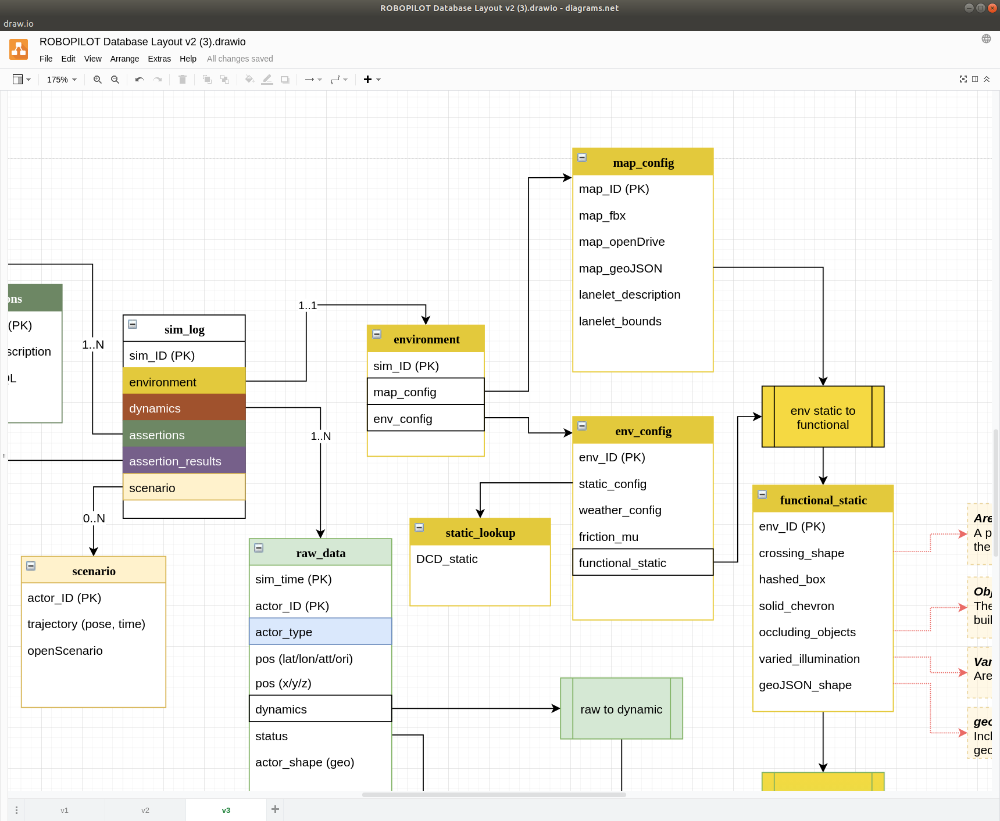
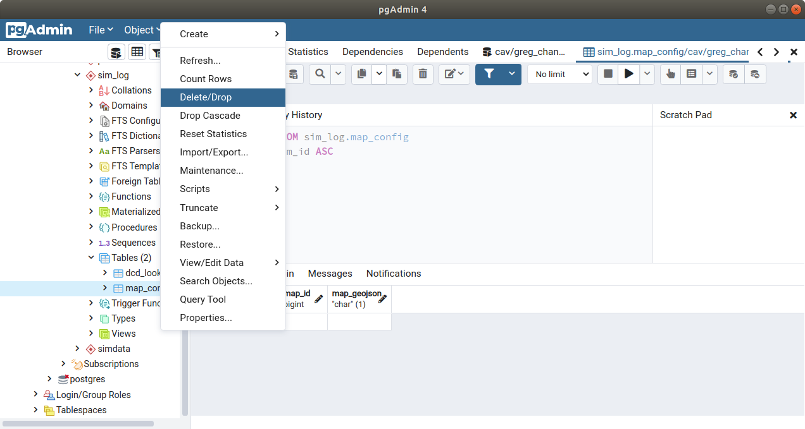
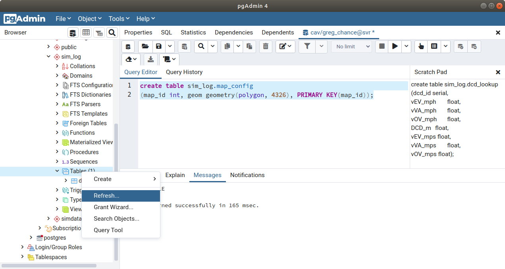
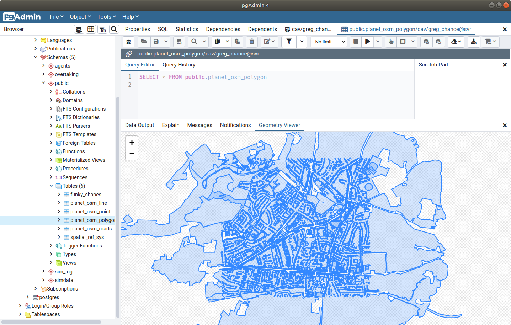
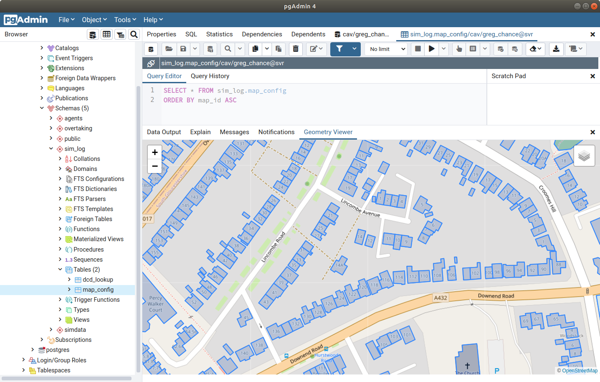

# Generating Map Data

Here we will add some map data from OSM (Open Street Maps) following the layout in the database structure. The OSM data is stored in a table called map_config.



If not done already then create the top level schema.

``` sql
CREATE SCHEMA sim_log;
```

Create a table called "map_config" under the "sim_log" schema. 

``` sql
create table sim_log.map_config
(map_id int, geom geometry(polygon, 4326), PRIMARY KEY(map_id));
```

If at any time you get an error saying the table already exists you may want to carfully decide to drop the existing table. This can be done in pgAdmin by using the drop function in the context menu.



If you now run the SQL to generate the table you may need to refresh the folder structure to see your newly generated table.



Load in the sample OSM data (or get your own from osm.com) and use the linux command line to load this into your database. Here we use the handy osm2pgsql library.

``` linux
osm2pgsql -d cav -H localhost -U greg_chance -P 5432 -S /usr/local/share/osm2pgsql/default.style --hstore assertion_case_study/downend_road.osm
```

This will write the OSM data to a databsed called "cav" on the localhost for user "greg_chance" on port "5432". Unless specified to a schema the data will go to the public space on your database.



Many unnecessary features are included in this data which will result in a messy rendered map. We can trim the data down to just the useful polygons and storing these in the map_config table using something like this.

```sql
insert into sim_log.map_config (map_id, geom) 
SELECT osm_id, 
ST_Transform(way,4326) 
FROM public.planet_osm_polygon as P 
where p.landuse is NULL 
and (p.amenity <> 'university' OR p.amenity is null) 
and (p.amenity <> 'hospital' OR p.amenity is null) 
and (p.amenity <> 'parking' OR p.amenity is null) 
and (p.amenity <> 'school' OR p.amenity is null)	
```

This should leave you with major buildings but remove large land area polygons.

