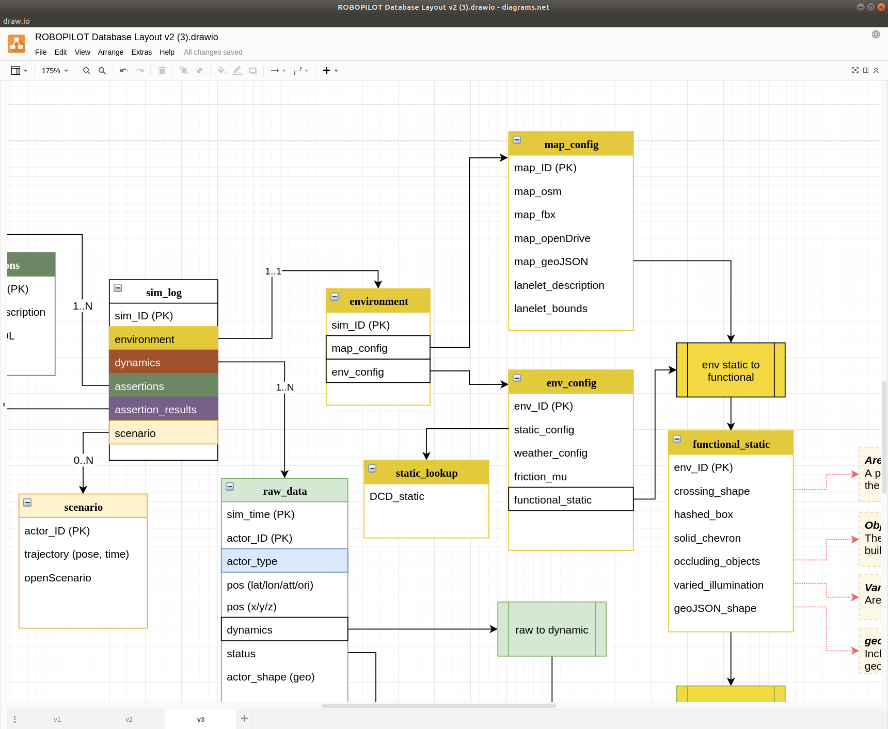

# Generating Map Data

Here we will add some map data from OSM (Open Street Maps) following the layout in the database structure. The OSM data is stored in a table called map_config.



If not done already then create the top level schema.

``` sql
CREATE SCHEMA sim_log;
```

Create a table called "map_config" under the "sim_log" schema. 

``` sql
create table sim_log.map_config
(map_id int, geom geometry(polygon, 4326), PRIMARY KEY(map_id));
```

If at any time you get an error saying the table already exists you may want to carfully decide to drop the existing table. This can be done in pgAdmin by using the drop function in the context menu.


If you now run the SQL to generate the table you may need to refresh the folder structure to see your newly generated table.


