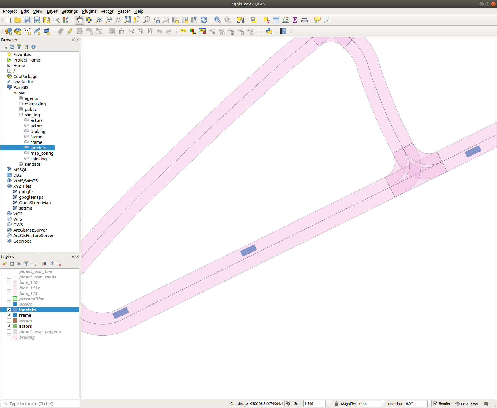

# Filter Data in Time

If you just want to look at a single time point in the history of the simulation log we can build a query that will filter for a specific time.

First creat a table that we can store the new data in, call this "frame" as it represents a single time frame.

``` sql 
create table sim_log.frame (agent_id int, agent_type int, sim_time float, 
PRIMARY KEY (agent_id,sim_time), geom geometry(POLYGON))
```

Then create a filter statement that will allow us to take the actor states from a single time. 

``` sql
insert into sim_log.frame
(agent_id, agent_type, sim_time, geom)
SELECT 
g1.agent_id, g1.agent_type, g1.sim_time, g1.geom
FROM
sim_log.actors g1
WHERE g1.sim_time = 81513.6
```

Now lets observe this new data in Qgis.



Now add in the road network and buildings. 