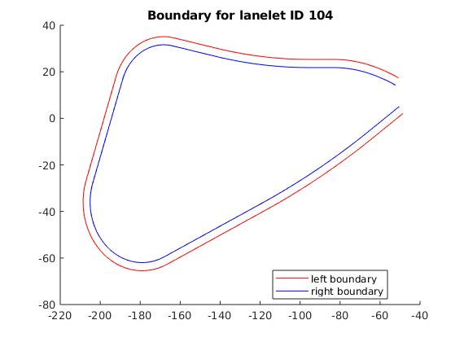
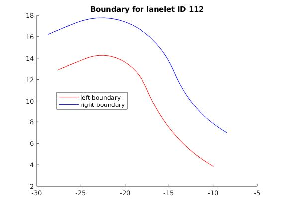

# CAV-Database

Set the filename of your lanelets data. This must be converted from xml to txt using this method ... Abanoub please add link here! :)

Use the plot all function to view all individual lanelets.

To plot individual lane ID set 'laneletID' and run 'filter for lanelet ID + plot'

To plot a lanelet , which is good for identifying sequential read errors or gaps in the polygon, use 'plot by point'

