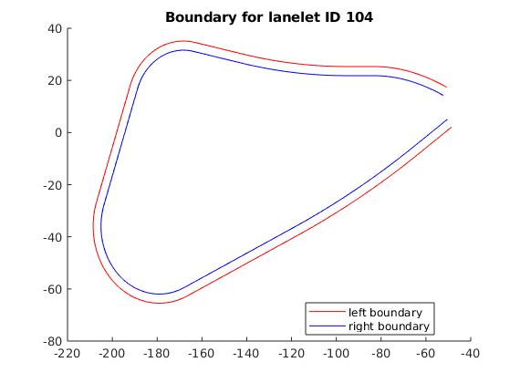
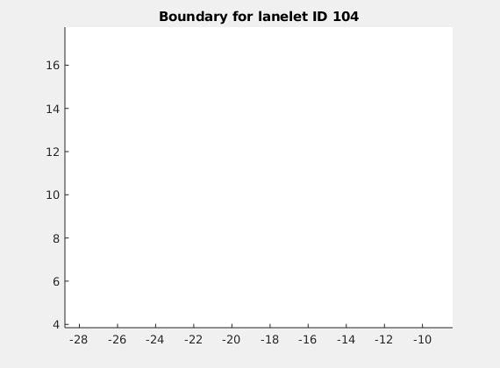
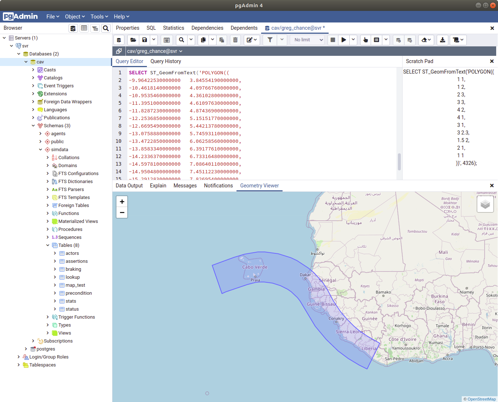

# Exporting Lanelets to GIS

Set the filename of your lanelets data. This must be converted from xml to txt using this method ... Abanoub please add link here!

Use the plot all function to view all individual lanelets. 

## Single lanelet
To plot individual lane ID set 'laneletID' and run 'filter for lanelet ID + plot'.

## Lanelet to GIS
To use this data in a GIS format the data must be rearranged. The principle is this: start with the leftbound data then concatenate and reverse the order of the rightbound data and then repeat the first datapoint at the end. The data must be fed to GIS sequentially without crossing or generating loops within loops resulting in error messages like 'ERROR:  geometry contains non-closed rings'.

To check data is sequential you can plot the lanelet element wise, which is good for identifying sequential read errors or gaps in the polygon, use 'plot by point'.

## GIS Testing
To check the data, you can test with the 'coord' array data which is formatted with the above corrections. Drop this into a postgis polygon function using pgAdmin or similar to view the polygon layout before applying the geo-reference.

