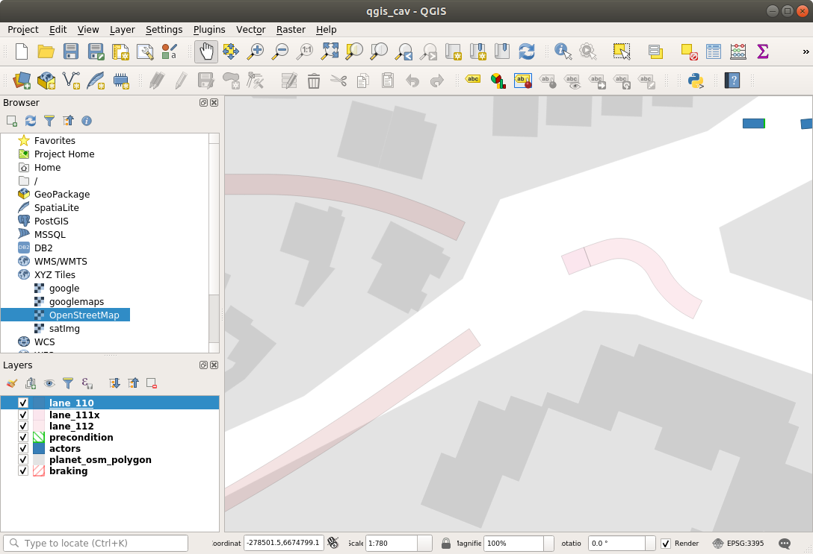

# Exporting Lanelets to GIS

Set the filename of your lanelets data. This must be converted from xml to txt using this method ... Abanoub please add link here!

Use the plot all function to view all individual lanelets. 


## Single lanelet
To plot individual lane ID set 'laneletID' and run 'filter for lanelet ID + plot'.


## Lanelet to GIS
To use this data in a GIS format the data must be rearranged. The principle is this: start with the leftbound data then concatenate and reverse the order of the rightbound data and then repeat the first datapoint at the end. The data must be fed to GIS sequentially without crossing or generating loops within loops resulting in error messages like 'ERROR:  geometry contains non-closed rings'.

To check data is sequential you can plot the lanelet element wise, which is good for identifying sequential read errors or gaps in the polygon, use 'plot by point'.


## GIS Testing
To check the data, you can test with the 'coord' array data which is formatted with the above corrections. Drop this into a postgis polygon function using pgAdmin or similar to view the polygon layout before applying the geo-reference.


## Build GPS String
Using this section of the code we can now transform the X and Y coordinates to GIS friendly longitude and latitude using the lat_long_convert script. This requires the minimum longitude/latitude and min point latitude of the area you are considering in your map. These can be approximated from the geoReference values in the openDrive file.

        ```Matlab
        SRID = 4326;
        top = "SELECT ST_GeomFromText('POLYGON((";
        tail = sprintf("))', %4.0f)",SRID);
        SQL_query = strcat(top, GPS_str, tail);
        ```

## SQL Query in QGIS
Add a virtual layer: Layer -> Add -> Virtual Layer. Go to the query box and add the SQL statement generated in the previous step. Test and Add. We can now see the polygon shape that can be used for assertion testing. This is assuming you have already set up your database with a postgis extension enabled.




## Long Strings
For very long lanelets you may get strings being truncated. There is an SQL file writer for writing to a text file 'SQL_lanelets.txt'.

## Run in C++/Qt Creator
Next is to run all of this in C++ and write the lanelet geometry directly to a database table so that all the lanelets can be viewed on a single layer.
